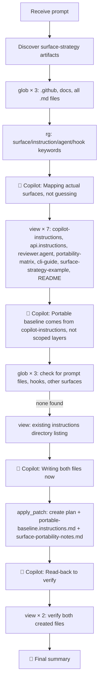

# Lesson 07 — Surface Strategy — Run Analysis

> **Session ID:** `b5e6470b-0e11-4a17-a3d3-f8859a8d4e54`
> **Started:** 14/03/2026, 17:09:21 · **Duration:** 1m 53s
> **Model:** GPT-5.4 · **Reasoning:** medium

---

## 1. Thinking Trajectory

## 2. Context at Each Stage

| Phase                 | Time          | Context Loaded                                 | Purpose                                                                                                                                                            |
| --------------------- | ------------- | ---------------------------------------------- | ------------------------------------------------------------------------------------------------------------------------------------------------------------------ |
| **Surface discovery** | 0s–19s        | 3× `glob` + 1× `rg`                            | Map .github folder, docs, all markdown files, patterns                                                                                                             |
| **Deep reading**      | 19s–1m 23s    | 7× `view` of key context files                 | Read copilot-instructions.md (baseline), api.instructions.md (scoped), reviewer.agent.md, portability-matrix.md, cli-guide.md, surface-strategy-example.md, README |
| **Absence checking**  | 1m 23s–1m 39s | 3× `glob` for prompts/hooks/extras + 1× `view` | Confirm no prompt files, hooks, or MCP config present                                                                                                              |
| **Implementation**    | 1m 39s–1m 45s | 1× `apply_patch` (3 files created)             | Create session plan + both output files                                                                                                                            |
| **Verification**      | 1m 45s–1m 53s | 2× `view` (read-back)                          | Verify both files match conventions                                                                                                                                |

## 3. Tool Calls Timeline

| #   | Tool          | Target                                     | Result                                                           |
| --- | ------------- | ------------------------------------------ | ---------------------------------------------------------------- |
| 1   | `glob`        | `.github/**/*`                             | 3 files: copilot-instructions, agent, instruction                |
| 2   | `glob`        | `docs/**/*`                                | 3 files: surface-strategy-example, portability-matrix, cli-guide |
| 3   | `glob`        | `**/*.md`                                  | 8 total markdown files                                           |
| 4   | `rg`          | surface/instruction/agent/hook patterns    | Multi-file hits                                                  |
| 5   | `view`        | `.github/copilot-instructions.md`          | Universal baseline (66 lines)                                    |
| 6   | `view`        | `.github/instructions/api.instructions.md` | Route-scoped rules                                               |
| 7   | `view`        | `.github/agents/reviewer.agent.md`         | Reviewer agent definition                                        |
| 8   | `view`        | `docs/portability-matrix.md`               | Surface compatibility reference                                  |
| 9   | `view`        | `docs/cli-guide.md`                        | CLI usage notes                                                  |
| 10  | `view`        | `docs/surface-strategy-example.md`         | Lesson target and constraints                                    |
| 11  | `view`        | `README.md`                                | Lesson overview (85 lines)                                       |
| 12  | `glob`        | Check for prompt files                     | None found                                                       |
| 13  | `glob`        | Check for hooks                            | None found                                                       |
| 14  | `glob`        | Check for additional surfaces              | None found                                                       |
| 15  | `view`        | Instructions directory                     | Existing layout                                                  |
| 16  | `apply_patch` | Create 3 files (plan + 2 outputs)          | ✅ all created                                                   |
| 17  | `view`        | `portable-baseline.instructions.md`        | 63 lines — verify                                                |
| 18  | `view`        | `surface-portability-notes.md`             | 113 lines — verify                                               |

**Total: ~18 tool calls** (6 glob, 1 rg, 9 view, 1 apply_patch, 1 store_memory implicit in plan)

## 4. Assumptions & Decisions

| #   | Decision                                                                           | Validation                                                                       |
| --- | ---------------------------------------------------------------------------------- | -------------------------------------------------------------------------------- |
| 1   | Used `applyTo: "**"` for portable baseline                                         | ✅ Matches prompt requirement for cross-surface scope                            |
| 2   | Extracted only universal guidance from copilot-instructions.md                     | ✅ Excluded route templates and agent checklists                                 |
| 3   | Identified `.github/copilot-instructions.md` as the canonical cross-surface source | ✅ Confirmed by README ("Universal baseline"), cli-guide, and portability-matrix |
| 4   | Noted absence of prompt files, hooks, MCP config                                   | ✅ Verified via `glob` — none present                                            |
| 5   | Included portability risk, false positive, hard negative, and recommendations      | ✅ All four required analysis items present                                      |
| 6   | Listed "Node.js 20 LTS" in portable baseline                                       | ✅ Matches lesson's copilot-instructions.md                                      |
| 7   | Referenced `pino` as logging library                                               | ✅ Consistent with other lessons' context files                                  |
| 8   | Documented agent portability disagreement and resolved it                          | ✅ Cited portability-matrix.md as canonical over README/agent note               |

## 5. Constraint Compliance

| #   | Constraint                                         | Status | Evidence                                        |
| --- | -------------------------------------------------- | ------ | ----------------------------------------------- |
| 1   | Discover artifacts rather than assuming fixed list | ✅     | 6 glob + 1 rg discovery phase                   |
| 2   | Create `portable-baseline.instructions.md`         | ✅     | File created at `.github/instructions/`         |
| 3   | Use `applyTo: "**"` scope                          | ✅     | YAML frontmatter in created file                |
| 4   | Extract cross-surface-portable subset only         | ✅     | No route templates or agent checklists included |
| 5   | Create `docs/surface-portability-notes.md`         | ✅     | 113-line analysis document                      |
| 6   | Document portable vs surface-specific              | ✅     | 7-row comparison table                          |
| 7   | Include one portability risk                       | ✅     | Scoped instructions assumed to apply on CLI     |
| 8   | Include one false positive                         | ✅     | Missing reviewer checklist on CLI               |
| 9   | Include one hard negative                          | ✅     | Must-follow rule only in agent file             |
| 10  | Include placement recommendations                  | ✅     | 4 placement rules at end of document            |
| 11  | Follow discovered instruction architecture         | ✅     | Matches existing `.instructions.md` pattern     |
| 12  | No shell commands                                  | ✅     | None used                                       |
| 13  | No SQL                                             | ✅     | None used                                       |

## 6. Files Created / Modified

| File                                                     | Action  | Lines | Description                               |
| -------------------------------------------------------- | ------- | ----- | ----------------------------------------- |
| `.github/instructions/portable-baseline.instructions.md` | Created | 63    | Cross-surface portable instruction subset |
| `docs/surface-portability-notes.md`                      | Created | 113   | Portability analysis with risk taxonomy   |

## 7. Session Metadata

| Field            | Value                    |
| ---------------- | ------------------------ |
| CLI version      | Copilot CLI v1.0.5       |
| Node.js          | v24.11.1                 |
| Platform         | win32                    |
| Model            | GPT-5.4                  |
| Reasoning        | medium                   |
| Denied tools     | `powershell`, `sql`      |
| Discovery time   | ~1m 39s (88% of session) |
| Writing time     | ~14s (12% of session)    |
| Self-corrections | 0                        |
| Files read       | 11 unique files          |

## 8. What This Lesson Proves

1. **Copilot understands the instruction hierarchy**: It correctly identified that `.github/copilot-instructions.md` is the universal baseline and that scoped instructions, agents, and docs form additional layers. The extracted portable subset excluded route-specific and agent-specific guidance.

2. **Absence is informative**: The model explicitly checked for prompt files, hooks, and MCP config — confirming their absence before concluding which layers are available for portability analysis.

3. **Analysis quality is high**: The portability notes document includes a concrete risk (scoped instructions assumed universal), false positive (CLI missing reviewer checklist), and hard negative (must-follow rule only in agent file). These are practical, not generic.

4. **Discovery dominates even for analysis tasks**: 88% of the session was reading and discovery. The actual write was a single `apply_patch` creating all three files (plan + 2 outputs) in one atomic operation.

5. **Layer cross-referencing is accurate**: The model noted a disagreement between `README.md` and `portability-matrix.md` about agent file portability, and resolved it by treating the dedicated compatibility reference as canonical.
