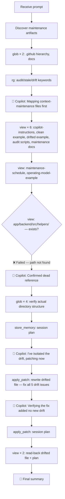

# Lesson 08 — Operating Model — Run Analysis

> **Session ID:** `a2aa1094-bdb8-4309-988f-2bdae84b6e1e`
> **Started:** 14/03/2026, 17:34:03 · **Duration:** 1m 33s
> **Model:** GPT-5.4 · **Reasoning:** medium

---

## 1. Thinking Trajectory

## 2. Context at Each Stage

| Phase                      | Time          | Context Loaded                                                                 | Purpose                                             |
| -------------------------- | ------------- | ------------------------------------------------------------------------------ | --------------------------------------------------- |
| **Surface discovery**      | 0s–13s        | 2× `glob` + 1× `rg` (60 hits)                                                  | Map .github, docs, audit/drift references           |
| **Convention reading**     | 13s–35s       | 6× `view`: copilot-instructions, clean example, drifted example, audit scripts | Read the clean baseline and identify drift items    |
| **Additional docs**        | 35s–50s       | `view`: maintenance-schedule, operating-model-example                          | Load maintenance cadence and assessment constraints |
| **Dead path verification** | 50s–1m 24s    | 1× ❌ `view` (helpers dir fails) + 4× `glob`                                   | Confirm `app/backend/src/helpers/` is deleted       |
| **Implementation**         | 1m 24s–1m 29s | 2× `apply_patch` (fix drifted file + plan)                                     | Apply all corrections in single rewrite             |
| **Verification**           | 1m 29s–1m 33s | 2× `view` (read-back)                                                          | Confirm 53-line clean result                        |

## 3. Tool Calls Timeline

| #   | Tool          | Target                                             | Result                                                                 |
| --- | ------------- | -------------------------------------------------- | ---------------------------------------------------------------------- |
| 1   | `glob`        | `.github/**/*`                                     | 5 files: copilot-instructions, audit scripts, clean + drifted examples |
| 2   | `glob`        | `docs/**/*`                                        | 2 files: maintenance-schedule, operating-model-example                 |
| 3   | `rg`          | audit_context/stale_refs/drift patterns            | 60 matches across project                                              |
| 4   | `view`        | `.github/copilot-instructions.md`                  | Project-level instructions                                             |
| 5   | `view`        | `.github/examples/clean/copilot-instructions.md`   | Clean reference (target style)                                         |
| 6   | `view`        | `.github/examples/drifted/copilot-instructions.md` | Drifted example (to fix)                                               |
| 7   | `view`        | `.github/scripts/audit_context.py`                 | Context audit script                                                   |
| 8   | `view`        | `.github/scripts/detect_stale_refs.py`             | Stale reference detector                                               |
| 9   | `view`        | `docs/maintenance-schedule.md`                     | Maintenance cadence                                                    |
| 10  | `view`        | `docs/operating-model-example.md`                  | Lesson target / assessment constraints                                 |
| 11  | ❌ `view`     | `app/backend/src/helpers/`                         | **Failed** — path does not exist                                       |
| 12  | `glob`        | Check for helpers directory                        | Not found                                                              |
| 13  | `glob`        | Check actual src structure                         | Confirmed no helpers                                                   |
| 14  | `glob`        | Check rules directory                              | Confirmed exists                                                       |
| 15  | `glob`        | Check services directory                           | Confirmed exists                                                       |
| 16  | `apply_patch` | Create session plan                                | ✅                                                                     |
| 17  | `apply_patch` | Rewrite drifted file (full replacement)            | Modified 1 file                                                        |
| 18  | `view`        | Drifted file (read-back)                           | 53 lines — clean                                                       |
| 19  | `view`        | Session plan (read-back)                           | 6 lines                                                                |

**Total: ~19 tool calls** (6 glob, 1 rg, 9 view, 1 ❌ view, 2 apply_patch)

## 4. Assumptions & Decisions

| #   | Decision                                                                       | Validation                                                              |
| --- | ------------------------------------------------------------------------------ | ----------------------------------------------------------------------- |
| 1   | Changed `Node.js 18` → `Node.js 20 LTS`                                        | ✅ Matches clean example and project convention                         |
| 2   | Changed `winston` → `pino`                                                     | ✅ Matches clean example logging library                                |
| 3   | Removed `console.log()` permission, added "never `console.log()`"              | ✅ Resolves contradiction with structured logging rule                  |
| 4   | Removed `app/backend/src/helpers/` reference                                   | ✅ Directory confirmed deleted via failed `view` + `glob`               |
| 5   | Removed inline route code snippet                                              | ✅ Over-specified inline code belongs in scoped instructions            |
| 6   | Added directory paths to architecture layers (e.g., `app/backend/src/routes/`) | ✅ Matches clean example's convention of showing actual paths           |
| 7   | Added `(California SMS restriction)` to project description                    | ✅ Consistent with other lessons                                        |
| 8   | Changed audit ordering to "BEFORE persistence" with fail-closed semantics      | ✅ Matches clean example's stronger wording                             |
| 9   | Kept Prisma ORM and Azure Container Apps references                            | ✅ Not identified as drift — present in both clean and drifted versions |
| 10  | Updated banner from "intentionally contains drift" to "repaired version"       | ✅ Signals the fix was applied                                          |

## 5. Constraint Compliance

| #   | Constraint                                         | Status | Evidence                                  |
| --- | -------------------------------------------------- | ------ | ----------------------------------------- |
| 1   | Discover artifacts rather than assuming fixed list | ✅     | Glob + rg discovery phase                 |
| 2   | Update stale Node.js version                       | ✅     | `Node.js 18` → `Node.js 20 LTS`           |
| 3   | Update stale logging library                       | ✅     | `winston` → `pino`                        |
| 4   | Remove contradictory console.log rules             | ✅     | `console.log()` → "never `console.log()`" |
| 5   | Fix dead file path references                      | ✅     | Removed `app/backend/src/helpers/`        |
| 6   | Remove over-specified inline code                  | ✅     | Route snippet removed                     |
| 7   | Align with clean example conventions               | ✅     | Matches style, tone, and structure        |
| 8   | Apply fixes directly in file                       | ✅     | Single `apply_patch` rewrite              |
| 9   | No shell commands                                  | ✅     | None used                                 |
| 10  | No SQL                                             | ✅     | None used                                 |

## 6. Files Created / Modified

| File                                               | Action   | Lines | Description                                      |
| -------------------------------------------------- | -------- | ----- | ------------------------------------------------ |
| `.github/examples/drifted/copilot-instructions.md` | Modified | 53    | Fixed 5 drift issues; aligned with clean example |

## 7. Session Metadata

| Field              | Value                                                                                |
| ------------------ | ------------------------------------------------------------------------------------ |
| CLI version        | Copilot CLI v1.0.5                                                                   |
| Node.js            | v24.11.1                                                                             |
| Platform           | win32                                                                                |
| Model              | GPT-5.4                                                                              |
| Reasoning          | medium                                                                               |
| Denied tools       | `powershell`, `sql`                                                                  |
| Discovery time     | ~1m 24s (90% of session)                                                             |
| Writing time       | ~9s (10% of session)                                                                 |
| Self-corrections   | 0                                                                                    |
| Failed tool calls  | 1 (`view` on deleted helpers directory)                                              |
| Drift issues fixed | 5 (Node version, logging library, console.log contradiction, dead path, inline code) |

## 8. What This Lesson Proves

1. **Failed tool calls provide signal**: The ❌ `view` on `app/backend/src/helpers/` confirmed the dead reference. The model used the failure constructively rather than retrying or guessing.

2. **Copilot can diff against a reference**: By reading both the clean and drifted examples, the model identified all five drift categories (stale Node.js, wrong logging library, contradictory `console.log` rule, dead helpers path, over-specified inline code) and fixed each one.

3. **Single-file modifications are surgical**: The entire fix was one `apply_patch` that replaced the full file content. Despite the "Replace all" approach, every change was intentional and traceable to a specific drift category.

4. **Discovery is even more dominant for maintenance tasks**: 90% of session time was reading and verifying. The fix itself took under 10 seconds — the hard part was understanding what needed changing.

5. **Context maintenance is learnable**: The session demonstrates that a model can detect staleness by cross-referencing the project's actual file structure against claimed references — exactly the skill the lesson teaches human developers.
