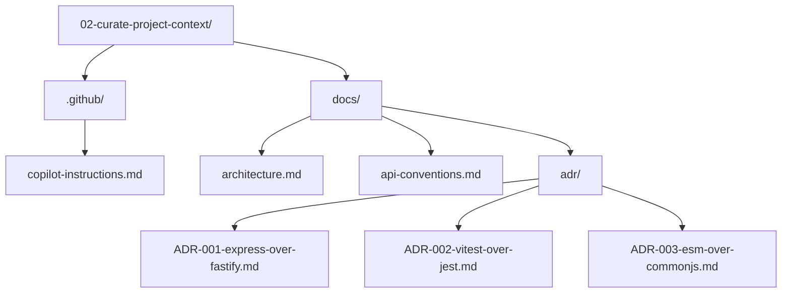

# Lesson 02 — Curate Project Context

> **Template app:** `apps/complex/` (Loan Workbench API)
> **Topic:** Building the shared context layer — `.github/` for behavioral guidance and `/docs/` for knowledge context.

## Setup

```bash
python default.py --clean
cd src && npm install
```

See [SETUP.md](SETUP.md) for full details and validation scenarios.

Then overlay the `.github/` and `docs/` directories from this lesson folder.

## What This Lesson Demonstrates

Context is not one thing — it has two halves:

| Layer     | Location   | What It Contains                             | Activation                         |
| --------- | ---------- | -------------------------------------------- | ---------------------------------- |
| Behavior  | `.github/` | HOW the AI should behave (rules, style)      | Auto-loaded by Copilot on session  |
| Knowledge | `/docs/`   | WHAT the AI should know (architecture, ADRs) | Loaded when referenced or searched |

**Behavior without knowledge**: The AI follows coding conventions but doesn't
understand the system architecture, so it suggests structurally incorrect code.

**Knowledge without behavior**: The AI understands the architecture but ignores
coding style rules, so it generates code that doesn't match the codebase.

**Both together**: The AI produces code that is both architecturally correct
AND stylistically consistent.

## Files in This Overlay

| Path                                       | Purpose                           |
| ------------------------------------------ | --------------------------------- |
| `.github/copilot-instructions.md`          | Project-level behavioral guidance |
| `docs/architecture.md`                     | System architecture knowledge     |
| `docs/api-conventions.md`                  | API design standards              |
| `docs/adr/ADR-001-express-over-fastify.md` | Framework decision record         |
| `docs/adr/ADR-002-vitest-over-jest.md`     | Test framework decision record    |
| `docs/adr/ADR-003-esm-over-commonjs.md`    | Module system decision record     |

---

## Scenarios

### Scenario 1 — No Context at All (Baseline)

**Goal**: Establish the baseline — what happens with zero project context.

**Prompt** (no `.github/`, no `docs/`):

```
Add a new route handler for deleting loan applications.
Include proper error handling and validation.
```

**What the AI produces**:

- Uses `require()` instead of ESM `import` (no module convention known)
- Writes `var` instead of `const` (no coding style known)
- Uses `console.log("Deleted application")` (no structured logging known)
- Returns a 200 with `{ success: true }` (no API convention known)
- No audit trail before deletion (no fail-closed semantics known)
- No role check (no security model known)
- No state machine check (allows deleting finalized applications)
- Might suggest Fastify patterns if the AI defaults to it

**Accumulated errors**: 8+ convention violations in a single handler.

---

### Scenario 2 — Behavior Only (No Knowledge)

**Goal**: Show that behavioral rules without architectural knowledge produce
stylistically correct but structurally wrong code.

**Setup**: Only `.github/copilot-instructions.md` in the project (no `docs/`).

**Prompt**:

```
Add a route for preference management. Let users save their
notification channel preferences (email, SMS) per event type.
```

**Expected output**: The AI follows coding conventions:

- Uses ESM imports ✅
- Uses `const` ✅
- Structured logging ✅
- `async` route handler ✅

But makes structural mistakes:

- Puts business logic directly in the route handler (should be in `src/rules/`)
- No mention of fail-closed audit (rules reference `/docs/architecture.md` but
  that file doesn't exist)
- No awareness of the state machine or delegated sessions
- No California SMS restriction (that's domain knowledge in the architecture doc)

**Teaching point**: Coding style is correct, but the code doesn't fit the
architecture. It would pass lint but fail code review.

---

### Scenario 3 — Knowledge Only (No Behavior)

**Goal**: Show that architectural knowledge without behavioral rules produces
architecturally correct but stylistically inconsistent code.

**Setup**: Only `docs/` in the project (no `.github/copilot-instructions.md`).

**Prompt**:

```
#file:docs/architecture.md

Add a route for preference management. Follow the architecture
described in the attached document.
```

**Expected output**: The AI follows the architecture:

- Separates rules into `src/rules/` ✅
- Calls audit service before persistence ✅
- Applies middleware chain ✅
- Understands the three-layer pattern ✅

But violates coding conventions:

- Might use CommonJS (`require()`) — no module convention specified
- Might use `let` or `var` — no variable convention specified
- Might use `console.log()` — no logging convention specified
- Might use Jest instead of Vitest — no test framework specified
- Error responses might include stack traces — no error convention specified

**Teaching point**: The architecture is right, but the code doesn't match the
codebase style. It would pass architecture review but fail style review.

---

### Scenario 4 — Both Halves Together

**Goal**: Show the full picture — behavior + knowledge producing correct code.

**Prompt** (with both `.github/` and `docs/`):

```
#file:docs/architecture.md
#file:docs/api-conventions.md

Add a route for preference management. Users should save their
notification channel preferences (email, SMS) per event type.
```

**Expected output**: The AI produces code that is both correct AND consistent:

- ESM imports, `const`, `async`, structured logging ✅ (behavior)
- Business logic in `src/rules/`, service calls in `src/services/` ✅ (architecture)
- Audit-first persistence pattern ✅ (architecture)
- Role middleware applied ✅ (architecture)
- Error responses follow API conventions (codes, no stack traces) ✅ (conventions)
- 404 not 403 for non-pilot users ✅ (conventions)

**Teaching point**: This is the target state. Both halves of the context system
are providing complementary information — behavior tells HOW to write code,
knowledge tells WHAT the code should do.

---

### Scenario 5 — ADR Prevents Bad Suggestion

**Goal**: Show how Architecture Decision Records prevent the AI from suggesting
already-rejected alternatives.

**Prompt** (with ADRs available):

```
#file:docs/adr/ADR-001-express-over-fastify.md
#file:docs/adr/ADR-002-vitest-over-jest.md

I'm adding a new set of integration tests. What test framework
should I use? Should I also consider switching to Fastify for
better performance?
```

**Expected output**: The AI should:

- Recommend Vitest (citing ADR-002)
- Say "Express is the chosen framework" (citing ADR-001)
- Explain WHY Fastify was rejected (not just that it was)
- NOT suggest Jest, even though it's more popular

**Without ADRs**: The AI would likely suggest Jest (more popular) and might
recommend Fastify for performance (a reasonable suggestion in isolation).
The ADRs prevent the AI from re-litigating decisions that have already been
made and documented.

**Teaching point**: ADRs aren't just for humans — they're critical context for
AI. Without ADR-001, the AI might spend time suggesting a Fastify migration
that was already rejected. ADRs save time by preventing this loop.

---

### Scenario 6 — Cross-Reference Between Behavior and Knowledge

**Goal**: Show how behavior instructions reference docs and vice versa.

**Prompt**:

```
I'm new to this project. What's the architecture? Where should
I put business logic vs route handling?
```

**Expected output**: The AI should:

1. Reference `.github/copilot-instructions.md` for the quick summary
   ("Three-layer architecture: routes, rules, services")
2. Point to `docs/architecture.md` for the detailed explanation
3. Explain the cross-reference: instructions say WHERE to find deep knowledge,
   docs provide the deep knowledge itself

The cross-reference chain:

```
copilot-instructions.md says:
  "See /docs/architecture.md for the full architecture overview"

architecture.md provides:
  Full request flow, component responsibilities, security model
```

**Teaching point**: Instructions are the entry point. Docs are the depth.
Instructions don't try to contain all knowledge — they point to it. This
prevents instruction bloat (an anti-pattern covered in Lesson 08).

---

### Scenario 7 — GitHub CLI Parity

**Goal**: Show that `.github/copilot-instructions.md` works across surfaces —
including the GitHub CLI.

**CLI usage**:

```bash
# Install GitHub Copilot CLI (standalone)
npm install -g @githubnext/github-copilot-cli

# In the project root (where .github/ exists):
copilot -p "add a route handler for deleting applications" --allow-all
copilot -p "explain src/middleware/auth.ts" --allow-all
```

**Expected behavior**: The `copilot` CLI auto-loads
`.github/copilot-instructions.md` from the current repository. This means:

- The CLI suggestion will use ESM imports (from behavioral guidance)
- The CLI suggestion will follow coding conventions (from behavioral guidance)
- The CLI explanation will understand the middleware pattern (from instructions)

**What does NOT work in CLI**:

- `docs/` files are not auto-indexed — CLI cannot search them
- `#file:` attachments are not available in CLI
- Custom instructions (`.instructions.md`) are VS Code only
- Agents, skills, hooks, and prompts are VS Code only

**Teaching point**: `.github/copilot-instructions.md` is the most portable
context artifact — it works in VS Code, CLI, coding agent, and code review.
This is why it's the first file you create. Everything else layers on top.

---

### Scenario 8 — Incremental Context Building

**Goal**: Show the recommended order for building context incrementally.

**Step 1** — Create `.github/copilot-instructions.md` (Day 1):

- Project description, tech stack, build commands
- Top 5-10 coding conventions
- Architecture summary (2-3 sentences)
- References to docs (even if docs don't exist yet)

**Step 2** — Create `docs/architecture.md` (Day 2-3):

- System overview, request flow, component responsibilities
- Security model, data model

**Step 3** — Create first ADR (Week 1):

- Document the most recent technology decision your team made
- Include the rejected alternative and why
- Include an "AI Guidance" section

**Step 4** — Create `docs/api-conventions.md` (Week 1):

- Status code usage, response format, naming conventions

**Step 5** — Verify context loads:

- Open VS Code, start a Copilot Chat conversation
- Ask about the project architecture — confirm it references your docs
- Ask to generate code — confirm it follows your conventions
- Try `copilot -p "describe this project" --allow-all` — confirm CLI also picks up instructions

**Teaching point**: Context is built incrementally, not all at once. Start with
the most impactful file (instructions), then add knowledge docs as the project
matures. Each file multiplies the value of the others.

---

## Scenario Summary

| #   | Scenario              | Context Available    | Key Insight                                         |
| --- | --------------------- | -------------------- | --------------------------------------------------- |
| 1   | No context            | Nothing              | 8+ errors in a single handler                       |
| 2   | Behavior only         | `.github/` only      | Style correct, architecture wrong                   |
| 3   | Knowledge only        | `docs/` only         | Architecture correct, style wrong                   |
| 4   | Both halves           | `.github/` + `docs/` | Correct AND consistent                              |
| 5   | ADR prevents bad idea | ADRs                 | AI doesn't re-litigate rejected decisions           |
| 6   | Cross-reference       | Both with refs       | Instructions point to docs, docs provide depth      |
| 7   | GitHub CLI parity     | `.github/` only      | Instructions are the most portable context artifact |
| 8   | Incremental building  | Progressive          | Build context over days, not all at once            |

## Connection to Later Lessons

This lesson creates the **foundation** that all subsequent lessons build on:

- **Lesson 03** adds layered instructions (`.instructions.md` files with `applyTo` scoping)
- **Lesson 04** adds prompts and specs (planning workflows that reference docs)
- **Lesson 05** adds agents and skills (role-separated workflows using doc context)
- **Lesson 06** adds hooks and MCP (guardrails that enforce what docs describe)
- **Lesson 07** explores how this foundation works across different surfaces
- **Lesson 08** covers maintaining this context over time
- **Lesson 09** synthesizes everything into the full delivery loop

The `.github/copilot-instructions.md` and `docs/` created here are literally
the files that later lessons reference. This is not an isolated exercise — it's
the first layer of a cumulative context stack.

## Teaching Outcome

Learners should understand that:

1. **Context has two halves** — behavior (`.github/`) and knowledge (`/docs/`).
2. **Both halves are needed** — behavior alone produces stylish but wrong code;
   knowledge alone produces correct but inconsistent code.
3. **ADRs prevent AI from re-litigating decisions** — rejected alternatives are
   documented, not re-suggested.
4. **Cross-references connect the halves** — instructions point to docs for depth.
5. **`.github/copilot-instructions.md` is the most portable artifact** — it works
   in VS Code, CLI, coding agent, and code review.
6. **Context is built incrementally** — start with instructions, add docs as
   the project matures.
7. **Each file multiplies the value of the others** — instructions + docs + ADRs
   together produce far better output than any single file.

## Folder Layout


