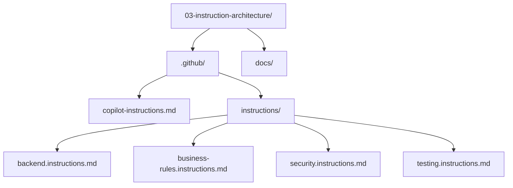

# Lesson 03 — Instruction Architecture

> **Template app:** `apps/complex/` (Loan Workbench API)
> **Topic:** Writing layered custom instructions that scope rules to repos, paths, technologies, and concerns.

## Setup

```bash
python default.py --clean
cd src && npm install
```

See [SETUP.md](SETUP.md) for full details and validation scenarios.

Then overlay the `.github/` and `docs/` from this lesson folder.

## What This Lesson Demonstrates

The Loan Workbench has backend routes, business rules, middleware, and tests —
each with different coding conventions. A single global instruction file cannot
address all of them without flooding every request with irrelevant guidance.

This lesson shows **layered instructions** that automatically activate based on
the file being edited:

| Editing                              | Active Instructions                                                                      |
| ------------------------------------ | ---------------------------------------------------------------------------------------- |
| `src/backend/src/routes/*.ts`        | `copilot-instructions.md` + `backend.instructions.md`                                    |
| `src/backend/src/rules/*.ts`         | `copilot-instructions.md` + `backend.instructions.md` + `business-rules.instructions.md` |
| `src/backend/src/middleware/auth.ts` | `copilot-instructions.md` + `backend.instructions.md` + `security.instructions.md`       |
| `src/backend/tests/*.test.ts`        | `copilot-instructions.md` + `testing.instructions.md`                                    |

### Why This Matters

Without scoped instructions:

- Backend rules leak into test files (e.g., "always use audit-service" in test helpers).
- Security rules interfere with business logic (e.g., over-validating internal service calls).
- Business-rule constraints don't appear when editing generic routes.

With scoped instructions:

- Each file type gets precisely the guidance it needs.
- Copilot generates code that respects the relevant subset of rules.

## Files in This Overlay

| Path                                                  | `applyTo`                       | Purpose                             |
| ----------------------------------------------------- | ------------------------------- | ----------------------------------- |
| `.github/copilot-instructions.md`                     | all files                       | Project-wide conventions            |
| `.github/instructions/backend.instructions.md`        | `src/backend/src/**/*.ts`       | Express API patterns                |
| `.github/instructions/business-rules.instructions.md` | `src/backend/src/rules/**`      | Business rule authoring conventions |
| `.github/instructions/security.instructions.md`       | `src/backend/src/middleware/**` | Auth and security patterns          |
| `.github/instructions/testing.instructions.md`        | `src/backend/tests/**`          | Test conventions and anti-patterns  |
| `docs/architecture.md`                                | —                               | Referenced by instructions          |

---

## Scenarios

### Scenario 1 — Instruction Context Changes Output (Routes Layer)

**Goal**: Show that Copilot follows route-layer conventions when editing `src/routes/`.

**Active instructions**: `copilot-instructions.md` + `backend.instructions.md`

**Open file**: `src/routes/notifications.ts`

**Prompt** (in Copilot Chat):

```
Add a DELETE /notifications/preferences/:event endpoint that
resets a single event to defaults for the current user.
```

**Expected behavior**: The generated code should:

- Use `Router.delete()` with `requireRole()` middleware
- Use `blockDelegatedWrites` middleware (delegated sessions can't mutate)
- Call `writeAuditEntry()` before deleting preferences
- Return 204 on success, 404 if the event is not found
- NOT include business-rule validation logic inline (that belongs in `src/rules/`)

**Why**: `backend.instructions.md` tells Copilot that routes orchestrate, not
decide. Audit-first writes are mandatory. Role checks use middleware.

---

### Scenario 2 — Business Rule Layer Has Different Context

**Goal**: Show that the same question produces domain-specific code when editing
rule files, because `business-rules.instructions.md` activates.

**Active instructions**: `copilot-instructions.md` + `backend.instructions.md` + `business-rules.instructions.md`

**Open file**: `src/rules/state-rules.ts`

**Prompt** (in Copilot Chat):

```
Add a New York restriction: email for decline events is
under review (LEGAL-305). Block email for decline on NY loans.
```

**Expected behavior**: The generated code should:

- Be a **pure function** that takes data and returns a decision (no I/O)
- Include a `// LEGAL-305` source reference comment
- Return a structured `{ allowed: false, reason: string }` result
- Handle case-insensitive state codes (`NY`, `ny`, `Ny`)
- Include `// FALSE POSITIVE` and `// HARD NEGATIVE` annotation comments

**Why**: `business-rules.instructions.md` requires pure functions, legal ticket
references, structured results, and edge-case annotations. Without this
instruction file, the AI would write inline route logic with no documentation.

---

### Scenario 3 — Security Layer Activates for Middleware

**Goal**: Show that security-specific guidance activates only when editing middleware.

**Active instructions**: `copilot-instructions.md` + `backend.instructions.md` + `security.instructions.md`

**Open file**: `src/middleware/auth.ts`

**Prompt** (in Copilot Chat):

```
Add rate limiting for the preference save endpoint —
max 10 saves per minute per user.
```

**Expected behavior**: The generated code should:

- Be a standalone middleware function (composable, one concern)
- Use `req.session.userId` from the auth context (not reparse headers)
- Return 429 with a safe error message (no internal state leakage)
- NOT mention business rules or audit (those are different instruction layers)

**Why**: `security.instructions.md` says middleware is thin and composable, uses
session context, and error messages must not leak internal details.

---

### Scenario 4 — Test Layer Replaces Backend Rules

**Goal**: Show that when editing test files, testing conventions activate
**instead of** backend conventions.

**Active instructions**: `copilot-instructions.md` + `testing.instructions.md`

**Open file**: `tests/notifications.test.ts`

**Prompt** (in Copilot Chat):

```
Add a test that verifies the California SMS restriction
applies case-insensitively (CA, ca, Ca all blocked).
```

**Expected behavior**: The generated code should:

- Use `describe`/`it` pattern with behavior-focused names
- Test through the public API (route handler), NOT mock `checkStateRestriction()`
- Have one assertion per `it()` block
- Include a `// FALSE POSITIVE` comment if testing a non-obvious case
- NOT call `writeAuditEntry()` directly (that's a backend/route concern)

**Why**: `testing.instructions.md` says never mock business rules, test through
route handlers, and use behavior-focused names. Without this file, tests would
mock internal functions and use generic names.

---

### Scenario 5 — File Attachment for Cross-Layer Understanding

**Goal**: Show how to explicitly attach instruction files for context when asking
architectural questions (not editing a specific file).

**Prompt** (in Copilot Chat with file attachments):

```
#file:.github/copilot-instructions.md
#file:.github/instructions/backend.instructions.md
#file:.github/instructions/security.instructions.md
#file:docs/architecture.md

I'm adding an endpoint that lets compliance reviewers export
audit logs as CSV. Which instruction rules apply? What middleware
should I use? Where should the export logic live?
```

**Expected output**: The AI references specific rules from each instruction file:

- Global: "pass errors to express `next()`, audit mutations"
- Backend: "routes orchestrate, services handle I/O"
- Security: "compliance reviewers are read-only in middleware auth"
- Architecture: "audit queries go through audit-service"

---

### Scenario 6 — Demonstrating the "Without Instructions" Failure

**Goal**: Show what happens when you temporarily remove instruction files.

**Step 1**: Rename `.github/instructions/` to `.github/instructions-disabled/`

**Prompt** (in `src/rules/state-rules.ts`):

```
Add a Texas restriction: SMS for any event type is blocked
for applications originated before 2025 (LEGAL-410).
```

**Expected output without instructions**: The AI writes inline code, possibly
with side effects (logging, HTTP responses), no legal ticket reference, no
structured result, no edge-case annotations.

**Step 2**: Rename the folder back. Ask the same prompt.

**Expected output with instructions**: Pure function, structured result,
`// LEGAL-410` reference, `// FALSE POSITIVE` / `// HARD NEGATIVE` annotations.

**Teaching point**: The instruction files are not decorative. They materially
change what Copilot produces.

---

## Scenario Summary

| #   | Location             | What Changes                                             | Key Instruction File             |
| --- | -------------------- | -------------------------------------------------------- | -------------------------------- |
| 1   | `src/routes/`        | Route uses middleware, audit-first, delegates to rules   | `backend.instructions.md`        |
| 2   | `src/rules/`         | Pure function, legal ref, structured result, annotations | `business-rules.instructions.md` |
| 3   | `src/middleware/`    | Composable, session-based, safe error messages           | `security.instructions.md`       |
| 4   | `tests/`             | Behavior-named, no mocks, one assertion per test         | `testing.instructions.md`        |
| 5   | Cross-layer          | Explicit file attachment for architectural questions     | All files via `#file:`           |
| 6   | Removed instructions | Demonstrating degraded output without context            | (none — removed)                 |

## Teaching Outcome

Learners should understand that:

1. **One large instruction file doesn't scale** — it causes irrelevant guidance.
2. **`applyTo` patterns** let you scope rules to specific file paths.
3. **Layered instructions compose** — global + path-specific activate together.
4. **The right context changes the output** even when the prompt is the same.
5. **File attachments (`#file:`)** let you bring cross-layer context into any conversation.
6. **Removing instructions demonstrably degrades output** — they are not optional.

## Folder Layout


