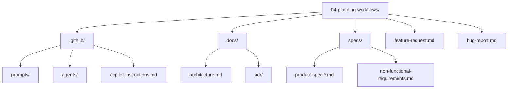

# Lesson 04 — Planning Workflows

> **Template app:** `apps/complex/` (Loan Workbench API)
> **Topic:** Separating planning from implementation using prompt files, read-only planning agents, and rich project context.

## Setup

```bash
python default.py --clean
cd src && npm install
```

See [SETUP.md](SETUP.md) for full details and validation scenarios.

## What This Lesson Demonstrates

This lesson shows that **the same feature request produces materially different
plans** depending on what context is available to the planner.

### Without Context

A planner working from just `feature-request.md` and the source code produces
a shallow CRUD decomposition — "add a settings page, add an API route, save to
DB." It misses:

- Mandatory escalation notification rules
- California decline SMS restriction
- Delegated-session write blocks
- Audit fail-closed semantics
- Feature-flag gating
- Degraded-mode SMS→email fallback

### With Context

When the planner agent reads `specs/`, `docs/`, and ADRs **before** generating
the plan, those constraints surface as explicit tasks, open questions, and
acceptance criteria.

## Files in This Overlay

| Path                                             | Purpose                                                |
| ------------------------------------------------ | ------------------------------------------------------ |
| `.github/copilot-instructions.md`                | Project-wide context (stack, domain, architecture)     |
| `.github/prompts/plan-feature.prompt.md`         | Reusable prompt for feature decomposition              |
| `.github/prompts/investigate-bug.prompt.md`      | Reusable prompt for bug investigation                  |
| `.github/prompts/triage-incident.prompt.md`      | Reusable prompt for incident triage                    |
| `.github/agents/planner.agent.md`                | Read-only planning agent                               |
| `docs/architecture.md`                           | System architecture overview                           |
| `docs/adr/ADR-003-frontend-state.md`             | State management design decision                       |
| `specs/product-spec-notification-preferences.md` | Full product spec with edge cases                      |
| `specs/non-functional-requirements.md`           | NFRs with false-positive and hard-negative annotations |
| `feature-request.md`                             | Sample feature request referencing specs               |
| `bug-report.md`                                  | Sample bug where missing context causes misdiagnosis   |

---

## Scenarios

### Scenario 1 — Shallow Planning (No Specs Attached)

**Goal**: Show the default planning output when the AI has only source code.

**Prompt** (in Copilot Chat — no file attachments):

```
Plan the implementation for notification preferences in the Loan Workbench.
Look at the source code to understand the current system.
```

**Expected output**: A shallow 3-5 task plan:

1. Add a settings page
2. Add GET/PUT API endpoints
3. Save preferences to the store
4. Add basic validation

**What's missing**: The plan won't mention California SMS restrictions, mandatory
event rules, delegated session blocks, audit fail-closed semantics, feature flag
gating, role defaults, or degraded-mode fallback. These constraints only exist
in the specs — not in the existing source code.

---

### Scenario 2 — Deep Planning (Specs + NFRs Attached)

**Goal**: Show how attaching spec and NFR files transforms the plan.

**Prompt** (in Copilot Chat with file attachments):

```
#file:specs/product-spec-notification-preferences.md
#file:specs/non-functional-requirements.md
#file:docs/architecture.md
#file:feature-request.md

Plan the implementation for the feature described in the
feature request. Read all attached files before generating
the plan. For each task, trace it to a specific FR, NFR,
or special condition in the product spec.
```

**Expected output**: A detailed 12-15 task plan that includes:

- **FR-1**: Preference matrix CRUD (email/SMS × 4 event types)
- **FR-2**: Mandatory event validation (at least one channel enabled)
- **FR-3**: Role-based defaults on first access
- **FR-4**: California SMS decline restriction (LEGAL-218)
- **FR-5**: Degraded delivery fallback (SMS→email without modifying stored prefs)
- **FR-6**: Audit trail capture with delegated-for field
- **SC-1**: Finalized applications still allow preference updates
- **SC-2**: Delegated sessions blocked from writes
- **SC-3**: Portfolio context multi-state restriction summary
- **NFR-1**: ≤150ms p95 overhead (no sync operations in save path)
- **NFR-2**: Fail-closed audit (write must succeed before mutation persists)
- **NFR-5**: Structured observability metrics
- **NFR-6**: Feature flag gating with 404 (not 403)
- Open questions about edge cases from spec's "Open Questions" section

**Teaching point**: The plan went from 4 generic tasks to 15+ specific,
traceable tasks — all because the specs were attached.

---

### Scenario 3 — Using the Planning Prompt File

**Goal**: Show that prompt files are reusable workflow assets, not throwaway messages.

**Prompt** (via prompt file):

```
/plan-feature Add notification preferences per the product spec.
Include special handling for California loans and delegated sessions.
```

**What this does**: The `plan-feature.prompt.md` file instructs the planner agent to:

1. Read `docs/architecture.md` and `docs/adr/` before planning
2. Read `specs/product-spec-notification-preferences.md` for requirements
3. Read `specs/non-functional-requirements.md` for constraints
4. Search `src/` for existing related code
5. Separate product decisions from inferred implementation choices
6. Flag false-positive and hard-negative patterns

**Expected output**: A structured plan with explicit spec traceability,
similar to Scenario 2 but with the additional depth of the planner agent's
investigation (it reads the source code to identify existing patterns).

---

### Scenario 4 — Bug Investigation with Cross-Reference

**Goal**: Show how the planner uses specs to correctly diagnose a bug that
touches multiple independent rules.

**Context**: The `bug-report.md` describes a real-world bug: "Delegated session +
California SMS toggle appears enabled for California loans. Save shows success
but reverts on refresh."

**Prompt** (with file attachments):

```
#file:bug-report.md
#file:specs/product-spec-notification-preferences.md
#file:specs/non-functional-requirements.md
#file:docs/architecture.md

Investigate this bug report. Find the root cause by
cross-referencing the bug symptoms against the product spec.
Classify whether this is a bug, a false positive, or a
hard negative.
```

**Expected output**: The AI identifies that this bug touches **four independent
rules simultaneously**:

1. **Delegated session** → write blocked by SC-2
2. **California SMS restriction** → decline SMS blocked by FR-4/LEGAL-218
3. **Optimistic UI** → UI shows success but API rejects (ADR-003 rollback gap)
4. **Audit fail-closed** → if audit service was slow, the save may have failed at NFR-2

**Without specs**: The AI would guess "it's a save endpoint bug" and suggest
checking the PUT handler. With specs, it correctly identifies the four-rule
intersection.

---

### Scenario 5 — Incident Triage Using NFRs

**Goal**: Show how the triage-incident prompt uses NFR context to assess blast
radius and root cause.

**Prompt** (via prompt file or with attachments):

```
#file:specs/non-functional-requirements.md
#file:docs/architecture.md

/triage-incident Pilot users report that preference saves
intermittently fail with 500 errors. The error rate correlates
with audit-service deployment windows.
```

**Expected output**: The AI should:

- Reference **NFR-2** (fail-closed audit): "If the audit service is unavailable
  during deployment, ALL preference saves will fail with 503. This is by design."
- Assess blast radius: "Only pilot users are affected (NFR-6 feature flag gating).
  Non-pilot users get 404 and cannot reach this endpoint."
- Identify the root cause: "Audit service deployment causes brief outage → fail-closed
  semantics correctly rejects saves → 503 returned to client."
- Recommend: "This is **working as designed** (NFR-2). The fix is to reduce audit
  service deployment downtime, not to make saves fire-and-forget."

**Teaching point**: Without NFR-2 context, the AI would suggest "add retry logic"
or "make audit writes fire-and-forget" — both of which **violate the compliance
requirement**.

---

### Scenario 6 — False Positive Detection

**Goal**: Show how the planner identifies "bugs" that are actually correct behavior.

**Prompt** (with file attachments):

```
#file:specs/product-spec-notification-preferences.md
#file:src/backend/src/rules/state-rules.ts
#file:src/backend/src/services/notification-service.ts

A user reported that during an SMS provider outage, they
received notifications via email even though their preference
was set to SMS-only. Is this a bug?
```

**Expected output**: The AI should classify this as a **FALSE POSITIVE** (not a bug):

- Reference **FR-5** (degraded delivery): "SMS→email fallback is intentional"
- Reference the key constraint: "Fallback does NOT modify stored preferences"
- Explain: "The user's preference is still SMS. During outage, delivery falls
  back to email. When SMS is restored, delivery returns to SMS. This is by design."
- Cite the code: `notification-service.ts` handles this in `deliverNotification()`

**Without spec context**: The AI would likely say "yes, this is a preference bug —
the delivery should match the stored preference." That's the intuitive but
**wrong** answer.

---

### Scenario 7 — Hard Negative Detection

**Goal**: Show how the planner identifies cases where the code allows something
it should block.

**Prompt** (with file attachments):

```
#file:specs/product-spec-notification-preferences.md
#file:specs/non-functional-requirements.md
#file:src/backend/src/rules/mandatory-events.ts

A user disabled all notification channels for the
manual-review-escalation event. The save succeeded.
Is this correct?
```

**Expected output**: The AI should classify this as a **HARD NEGATIVE** (allowed but shouldn't be):

- Reference **FR-2** (mandatory events): "At least one channel must remain enabled
  for mandatory events"
- The save should have been rejected with a 400 error
- Check `validateMandatoryEventChange()` — if it's not being called in the route,
  that's the bug
- This is dangerous because mandatory escalation notifications won't fire

**Teaching point**: Hard negatives are the opposite of false positives — the system
allows something that should be blocked. These are harder to catch because nothing
visibly breaks.

---

## Advanced: Iterative Planning (4-Iteration Arc)

This advanced scenario spans **lessons 04 → 05 → 06** and shows how a single
feature evolves through four iterations of change requests and NFR updates.
The key insight: **with proper context, each iteration is handled correctly;
without context, errors compound at every step.**

> This is **Iteration 1** of the arc. See Lesson 05 for Iterations 2-3 and
> Lesson 06 for Iteration 4.

### Iteration 1 — Plan the Initial Feature

**Change request**: "Add notification preferences so loan officers can choose
how they receive alerts (email, SMS, or both) for each event type."

#### WITHOUT Context

**Prompt**:

```
Plan the implementation for notification preferences.
Users should be able to choose email or SMS for each event type.
```

**AI produces a 4-task plan**:

1. Add a `preferences` table with `userId`, `eventType`, `channel` columns
2. Add `GET /preferences` and `PUT /preferences` endpoints
3. Add a settings UI page
4. Save preferences and send notifications per preference

**Accumulated debt after Iteration 1**: The plan has no mention of:

- Mandatory events that cannot be fully disabled (FR-2)
- California SMS decline restriction (FR-4 / LEGAL-218)
- Delegated session write blocks (SC-2)
- Audit-first persistence (NFR-1)
- Role defaults on first access (FR-3)
- Feature flag gating with 404 behavior (NFR-5)
- Degraded delivery fallback (FR-5)

This isn't just "missing details" — it's **7 missing constraints that will
become bugs in future iterations.**

#### WITH Context

**Prompt**:

```
#file:specs/product-spec-notification-preferences.md
#file:specs/non-functional-requirements.md
#file:docs/architecture.md
#file:feature-request.md

/plan-feature Add notification preferences per the product spec.
Read all attached files before generating the plan.
```

**AI produces a 16-task plan** with spec traceability:

1. **FR-1**: Preference matrix CRUD (email/SMS × 4 event types)
2. **FR-2**: Mandatory event validation — at least one channel enabled
3. **FR-3**: Role defaults on first access (underwriter, analyst-manager, compliance)
4. **FR-4**: California SMS decline restriction (LEGAL-218)
5. **FR-5**: Degraded delivery fallback (SMS→email, no preference mutation)
6. **FR-6**: Audit trail with delegated-for field
7. **SC-1**: Finalized applications — preferences still editable
8. **SC-2**: Delegated sessions — blocked from writes
9. **SC-3**: Portfolio context — multi-state restriction summary
10. **NFR-1**: Fail-closed audit (write before persist)
11. **NFR-3**: Async delivery — no sync I/O in save path
12. **NFR-4**: Role-scoped audit queries
13. **NFR-5**: Feature flag gating (404 not 403)
14. **NFR-6**: Additive schema changes only
15. **NFR-7**: Structured JSON logging
16. Open questions from spec's edge cases section

**Accumulated debt after Iteration 1**: Zero. Every constraint is a tracked task.

#### Comparison Table — After Iteration 1

| Aspect                    | Without Context | With Context               |
| ------------------------- | --------------- | -------------------------- |
| Tasks in plan             | 4               | 16                         |
| Constraints covered       | 0 of 7          | 7 of 7                     |
| Traceability              | None            | FR-X, NFR-X, SC-X per task |
| Open questions surfaced   | 0               | 3+                         |
| Technical debt introduced | 7 hidden bugs   | 0                          |

---

## Scenario Summary

| #   | Scenario          | Context Used                      | Key Insight                                |
| --- | ----------------- | --------------------------------- | ------------------------------------------ |
| 1   | Shallow planning  | Source code only                  | Plan misses 10+ constraints                |
| 2   | Deep planning     | Specs + NFRs + architecture       | Plan traces to specific requirements       |
| 3   | Prompt file       | `plan-feature.prompt.md`          | Reusable workflow, not throwaway message   |
| 4   | Bug investigation | Bug report + specs + architecture | Four-rule intersection found               |
| 5   | Incident triage   | NFRs + architecture               | "Working as designed" correctly identified |
| 6   | False positive    | Specs + source code               | Correct behavior misreported as bug        |
| 7   | Hard negative     | Specs + rule code                 | Allowed behavior that should be blocked    |

## Teaching Outcome

Learners should see that:

1. **Planning prompts are reusable workflow assets** — not throwaway chat messages.
2. **Read-only planning agents stay out of the code** while producing actionable plans.
3. **Specs and NFRs change the plan**, not just the prompt wording.
4. **False positives and hard negatives** surface naturally when the planner has access to business rules.
5. **Open questions in the plan** should reference specific spec sections, not generic uncertainty.
6. **File attachments (`#file:`)** are the mechanism for bringing spec context into any conversation.
7. **The same bug report gets different diagnoses** depending on what context the agent has.

## Folder Layout


