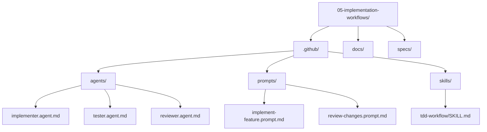

# Lesson 05 — Implementation Workflows

> **Template app:** `apps/complex/` (Loan Workbench API)
> **Topic:** Agents for roles, skills for reusable workflows, TDD handoffs, and least-privilege separation.

## Setup

```bash
python default.py --clean
cd src && npm install
```

See [SETUP.md](SETUP.md) for full details and validation scenarios.

## What This Lesson Demonstrates

Implementation is not one monolithic AI action. The Loan Workbench has routes,
business rules, middleware, tests, and audit services. Asking a single generic
agent to "build a feature" across all of those concerns produces unfocused code.

This lesson shows **role-separated agents** that divide implementation into
constrained sub-workflows:

| Agent         | Role                | Can Read | Can Write       | Can Execute            |
| ------------- | ------------------- | -------- | --------------- | ---------------------- |
| `implementer` | Write code          | All      | `src/**` only   | Terminal (build, lint) |
| `tester`      | Write and run tests | All      | `tests/**` only | Terminal + test runner |
| `reviewer`    | Read-only review    | All      | Nothing         | Nothing                |

### Why This Matters

Without role separation:

- One agent writes code AND reviews it — no independent check.
- Tests get written as an afterthought, not as a driving constraint.
- The agent accumulates tools it doesn't need (deployment, admin ops).

With role separation:

- The **tester** writes failing tests first (TDD handoff).
- The **implementer** makes only the code changes needed to pass them.
- The **reviewer** validates without the ability to "fix" things silently.

## Files in This Overlay

| Path                                          | Purpose                                        |
| --------------------------------------------- | ---------------------------------------------- |
| `.github/agents/implementer.agent.md`         | Write-capable implementation agent             |
| `.github/agents/tester.agent.md`              | TDD-focused testing agent                      |
| `.github/agents/reviewer.agent.md`            | Read-only review agent                         |
| `.github/prompts/implement-feature.prompt.md` | Feature implementation with plan reference     |
| `.github/prompts/review-changes.prompt.md`    | Code review against specs and NFRs             |
| `.github/skills/tdd-workflow/SKILL.md`        | Reusable TDD handoff skill                     |
| `docs/implementation-playbook.md`             | Role separation guide referenced by agents     |
| `specs/non-functional-requirements.md`        | NFRs agents must respect during implementation |

---

## Scenarios

### Scenario 1 — Single Agent (No Role Separation)

**Goal**: Show the failure mode when one agent owns everything.

**Prompt** (in Copilot Chat — no agent specified):

```
Add a new `fraud-alert` mandatory notification event to the
Loan Workbench. Write the business rule, update the route
handler, add tests, and review your own changes.
```

**Expected output**: The AI writes code, tests, AND reviews it — all in one pass.
Typical problems:

- Tests are shaped to match the implementation (not driving it)
- The test mocks `writeAuditEntry` but doesn't verify fail-closed semantics
- The "review" is just the agent saying "looks good" about code it just wrote
- No independent check catches that California SMS restriction wasn't considered

**Teaching point**: A single agent has no adversarial tension. It will always
agree with itself.

---

### Scenario 2 — TDD Handoff: Tester Writes Failing Tests First

**Goal**: Show how the tester agent writes tests that **define** behavior
before any implementation exists.

**Prompt** (with file attachments):

```
@tester
#file:specs/product-spec-notification-preferences.md
#file:specs/non-functional-requirements.md
#file:src/backend/src/rules/mandatory-events.ts

Write failing tests that verify: when a new `fraud-alert`
mandatory event is added, users without it in their
preferences get it auto-enabled on next GET.

Include at least:
1. A happy-path test (fraud-alert appears in GET response)
2. A FALSE POSITIVE test (fraud-alert setting is NOT
   overwritten if user already has it configured)
3. A HARD NEGATIVE test (user cannot disable all channels
   for fraud-alert, since it's mandatory)
```

**Expected output**: The tester produces a test file with Vitest `describe`/`it` blocks:

- Each test has a behavior-focused name (not generic like "test fraud alert")
- Edge cases are annotated with `// FALSE POSITIVE` and `// HARD NEGATIVE` comments
- Tests fail because the implementation doesn't exist yet
- The tester runs `npx vitest run` to confirm failure for the **right reason**
  (missing rule, not syntax error)

**Handoff output from tester**:

```
Failing tests:
  - "auto-enables fraud-alert for users without it" — tests/notifications.test.ts
  - "does not overwrite existing fraud-alert config" — tests/notifications.test.ts
  - "blocks disabling all channels for fraud-alert" — tests/notifications.test.ts

Files that need changes:
  - src/backend/src/rules/mandatory-events.ts — add fraud-alert to MANDATORY_EVENTS
  - src/backend/src/routes/notifications.ts — wire in auto-enable on GET

Relevant specs:
  - FR-2: Mandatory events must have at least one channel enabled
  - NFR-1: Audit trail for preference changes (auto-enable counts as change)
```

---

### Scenario 3 — Implementer Makes Tests Pass

**Goal**: Show how the implementer works from failing tests with minimal changes.

**Prompt** (with file attachments):

```
@implementer
#file:tests/notifications.test.ts
#file:src/backend/src/rules/mandatory-events.ts
#file:src/backend/src/routes/notifications.ts
#file:docs/implementation-playbook.md

The tester wrote 3 failing tests for the `fraud-alert`
mandatory event. Make minimal changes to pass all 3 tests.

Rules from your agent definition:
- Do NOT modify test files
- Do NOT run tests (tester owns execution)
- Call writeAuditEntry() BEFORE persisting any change
- Check canTransition() before state changes
```

**Expected output**: The implementer:

1. Adds `"fraud-alert"` to the `MANDATORY_EVENTS` array in `mandatory-events.ts`
2. Adds auto-enable logic to the GET route in `notifications.ts`
3. Ensures `writeAuditEntry()` is called when auto-enabling
4. Lists every file changed and what was changed
5. States which tests should now pass
6. Hands off to `@reviewer`

**Handoff output from implementer**:

```
Changed files:
  - src/backend/src/rules/mandatory-events.ts — added "fraud-alert" to MANDATORY_EVENTS
  - src/backend/src/routes/notifications.ts — auto-enable logic on GET

Tests that should pass:
  - "auto-enables fraud-alert for users without it"
  - "does not overwrite existing fraud-alert config"
  - "blocks disabling all channels for fraud-alert"

NFRs touched:
  - NFR-1: Audit entry written before persistence
```

**Important**: Note that the implementer does NOT run tests. It hands back to
the tester for verification, which is the third step.

---

### Scenario 4 — Reviewer Validates Against Specs

**Goal**: Show how the read-only reviewer catches issues that the implementer missed.

**Prompt** (with file attachments):

```
@reviewer
#file:src/backend/src/rules/mandatory-events.ts
#file:src/backend/src/routes/notifications.ts
#file:specs/non-functional-requirements.md
#file:specs/product-spec-notification-preferences.md
#file:docs/implementation-playbook.md

Review the changes to mandatory-events.ts and notifications.ts.
Walk through the full NFR checklist (NFR-1 through NFR-7).
Check for false-positive and hard-negative patterns.
```

**Expected output**: The reviewer produces a structured review:

```
## Review Summary
- Files reviewed: mandatory-events.ts, notifications.ts
- Verdict: REQUEST_CHANGES

## Issues Found
1. [HIGH] Auto-enable writes audit entry but does not check
   session.delegatedFor — delegated sessions could trigger
   auto-enable writes. — notifications.ts:L42 — SC-2
2. [MEDIUM] Auto-enable for California loans should NOT
   auto-enable SMS channel for fraud-alert if the event type
   is "decline" — needs clarification per LEGAL-218.
3. [LOW] No structured log entry for auto-enable action.
   — NFR-7: Observability requires structured JSON logging.

## Observations
- NFR-1: Fail-closed semantics preserved ✅
- NFR-3: No sequential I/O added ✅
- NFR-5: Feature flag gating not applicable here ✅
- NFR-6: Schema change is additive ✅
```

**Teaching point**: The reviewer caught two issues that the implementer missed —
the delegated session edge case and the California SMS intersection. This is
exactly why the reviewer is a separate, independent agent.

---

### Scenario 5 — Using the TDD Workflow Skill

**Goal**: Show that skills package reusable multi-step workflows that any
agent can invoke.

**Prompt** (with file attachments):

```
@tester
#file:.github/skills/tdd-workflow/SKILL.md
#file:specs/product-spec-notification-preferences.md
#file:specs/non-functional-requirements.md

Use the TDD workflow skill to add support for a
`portfolio-reassignment` notification event. Requirements:
- SMS disabled by default for this event type
- Email enabled by default
- Not a mandatory event (can be fully disabled)
- Must respect California SMS restriction
```

**Expected output**: The tester follows the skill's 6-step workflow:

**Step 1 (Understand)**: Reads specs, identifies happy-path and edge cases
**Step 2 (Red)**: Writes failing tests:

- `"defaults portfolio-reassignment to email-only"`
- `"allows user to fully disable portfolio-reassignment"` (not mandatory)
- `"blocks SMS enable for California decline loans"` — FALSE POSITIVE test
  (this event is reassignment, not decline — SMS should be allowed even in CA)

**Step 3 (Hand off to implementer)**: Structured handoff with failing test list
**Step 4 (Verify)**: Runs `npx vitest run` after implementation
**Step 5 (Hand off to reviewer)**: Sends changed files + applicable NFRs
**Step 6 (Report)**: Summary of the TDD cycle

**Teaching point**: The skill defines the process. Different agents execute
different steps. The skill itself doesn't "do" anything — it's a workflow
recipe that structures the handoffs.

---

### Scenario 6 — Role Boundary Violation

**Goal**: Show what happens when an agent tries to exceed its permissions.

**Prompt**:

```
@reviewer
#file:src/backend/src/rules/mandatory-events.ts

The fraud-alert validation is missing. Add a check in
mandatory-events.ts that blocks disabling all channels
for mandatory events.
```

**Expected output**: The reviewer should **refuse**, because its agent definition
says `tools: codebase` (read-only). Correct response:

```
I cannot modify files — I'm a read-only reviewer. I can
identify the issue and describe the fix needed:

Issue: mandatory-events.ts does not block disabling all
channels for mandatory events.

Recommended fix: Add a check in validateMandatoryEventChange()
that returns an error when all channels are disabled for any
event in the MANDATORY_EVENTS array.

File: src/backend/src/rules/mandatory-events.ts
Function: validateMandatoryEventChange()

Please ask @implementer to apply this change.
```

**Teaching point**: The reviewer **refuses to fix it** even though it knows how.
This is the design working correctly — the reviewer maintains independence.
If it could silently fix things, there would be no independent review trail.

---

### Scenario 7 — Cross-Agent Spec Reference

**Goal**: Show how all three agents reference the same specs but use them
differently.

**Prompt to tester**:

```
@tester
#file:specs/non-functional-requirements.md

Write a test for NFR-2: degraded-mode SMS→email fallback.
The test should verify that after fallback delivery, the
stored preference is still SMS (not changed to email).
```

**Prompt to implementer** (after test fails):

```
@implementer
#file:specs/non-functional-requirements.md
#file:src/backend/src/services/notification-service.ts

The NFR-2 fallback test is failing. Implement SMS→email
fallback in notification-service.ts without modifying
stored preferences.
```

**Prompt to reviewer** (after implementation):

```
@reviewer
#file:specs/non-functional-requirements.md
#file:src/backend/src/services/notification-service.ts
#file:tests/notifications.test.ts

Review the NFR-2 fallback implementation. Specifically check:
is there any code path that modifies stored preferences as
a side effect of delivery fallback?
```

**Expected behavior**: Each agent uses the same NFR-2 spec but at a different
stage:

- **Tester**: Uses it to define test expectations (preference unchanged after fallback)
- **Implementer**: Uses it to guide implementation constraints (no preference mutation)
- **Reviewer**: Uses it to verify compliance (no side effects in fallback path)

---

## Advanced: Iterative Implementation (4-Iteration Arc)

This continues the iterative arc from **Lesson 04 (Iteration 1)**. Here we
handle two mid-development change requests showing how context-rich agents
navigate evolving requirements while context-poor agents compound errors.

> **Prerequisite**: Read the Iteration 1 scenario in Lesson 04 first.
> Iteration 4 continues in Lesson 06.

---

### Iteration 2 — Change Request: Portfolio Preference Aggregation

**Change request**: "Analyst-managers need a portfolio view showing a rollup
of notification preferences across their team members."

This arrives **after** the initial notification preferences feature is
already implemented.

#### WITHOUT Context

**Prompt**:

```
Add a portfolio view endpoint that aggregates notification
preferences across all users. Analyst-managers need to see
what channels their team uses.
```

**What the AI does**:

1. Adds `GET /portfolio/preferences` that queries all users' preferences
2. Returns a flat array of every user's preferences
3. No role check — any authenticated user can call it
4. No aggregation logic — just dumps raw preference records

**New bugs introduced**:

- **NFR-4 violation**: Returns ALL users' preferences regardless of caller's
  role. Underwriters can see compliance reviewers' data.
- **Data leakage**: Individual user IDs and preference details exposed to
  anyone with a valid session.
- **No scoping**: Should only show preferences for the analyst-manager's
  assigned team, not the entire organization.

**Cumulative debt**: 7 bugs from Iteration 1 + 3 new = **10 hidden bugs**.

#### WITH Context

**Prompt** (full TDD workflow):

```
@tester
#file:specs/product-spec-notification-preferences.md
#file:specs/non-functional-requirements.md
#file:src/backend/src/middleware/auth.ts
#file:src/backend/src/models/types.ts

Write failing tests for portfolio preference aggregation.
Requirements:
- Only analyst-managers can access the endpoint (NFR-4)
- Only shows preferences for the manager's assigned team
- Returns aggregated counts, not individual user data
- Delegated sessions cannot access this endpoint
```

**Tester writes 4 tests**:

```typescript
describe("GET /portfolio/preferences", () => {
  it("returns aggregated channel counts for manager's team", ...);
  it("returns 403 for underwriter role", ...); // NFR-4
  it("returns 403 for delegated sessions", ...); // SC-2
  it("does not include individual user IDs in response", ...); // Data safety
});
```

**Implementer makes them pass** with:

- `requireRole('analyst-manager')` middleware
- `blockDelegatedWrites` middleware (read endpoint, but delegated sessions
  still blocked per policy)
- Team-scoped query using `session.userId` to find managed users
- Aggregated response: `{ event: "approval", emailCount: 5, smsCount: 3 }`
  — no individual user IDs

**Reviewer validates**: "NFR-4 satisfied. No data leakage. Role scoping
correct. APPROVE."

**Cumulative debt**: Still **0**.

---

### Iteration 3 — NFR Change: Audit Retention Extension + GDPR Export

**NFR change**: "Legal requires audit retention extended from 90 days to 2 years
for preference changes. Additionally, we need a GDPR data export endpoint
for users to download their own audit history."

This is a **non-functional requirement change** — it modifies NFR-1 (audit
integrity) and adds a new compliance requirement.

#### WITHOUT Context

**Prompt**:

```
Extend audit retention to 2 years and add a GDPR data
export endpoint for users.
```

**What the AI does**:

1. Changes a `RETENTION_DAYS` constant from `90` to `730`
2. Adds `GET /audit/export` endpoint
3. Returns all audit records as a JSON download
4. No role scoping on the export

**New bugs introduced**:

- **NFR-4 violation (again)**: The export endpoint returns ALL audit records,
  not just the requesting user's. Any user can download the full audit log.
- **Missing format**: GDPR exports typically require structured CSV/JSON with
  specific fields (data categories, processing purposes). Raw audit dump
  doesn't satisfy GDPR Article 20.
- **No rate limiting**: Export endpoint can be called repeatedly, creating
  a data exfiltration vector.
- **Retention change breaks tests**: The `90` value was referenced in existing
  tests from Iteration 1 that the AI doesn't know about (because no tests
  were written for audit in Iteration 1).

**Cumulative debt**: 10 bugs from Iteration 2 + 4 new = **14 hidden bugs**.

#### WITH Context

**Prompt** (using TDD skill):

```
@tester
#file:specs/non-functional-requirements.md
#file:src/backend/src/services/audit-service.ts
#file:docs/security-policy.md
#file:src/backend/src/middleware/auth.ts

Use the TDD workflow skill. NFR-1 is changing:
- Retention extended from 90 days to 2 years
- New GDPR Article 20 export endpoint needed

Write failing tests covering:
1. Retention period enforced at 730 days
2. Export only returns requesting user's own records
3. Export response includes GDPR-required fields
4. Rate limiting on export endpoint (max 3/hour)
5. Delegated sessions cannot trigger export for another user
```

**Tester writes 5 tests**, each referencing specific NFRs and GDPR articles.

**Implementer makes them pass** with:

- Updated retention constant + migration note for existing data
- User-scoped export query: `WHERE userId = session.userId`
- GDPR-compliant response format with data categories
- Rate limiter middleware on the export endpoint
- `blockDelegatedWrites` on export (prevents delegation abuse)

**Reviewer validates**:

```
## Review Summary
- Verdict: REQUEST_CHANGES

## Issues Found
1. [MEDIUM] Retention change is not additive — old audit
   entries should be re-evaluated against new 2-year policy.
   Add migration note. — NFR-6 (backward compatibility)

## Observations
- NFR-1: Fail-closed semantics preserved ✅
- NFR-4: Export scoped to requesting user ✅
- SC-2: Delegated sessions blocked ✅
- GDPR Article 20: Fields present ✅
```

The reviewer catches a backward-compatibility concern that neither tester
nor implementer surfaced. **This is why three agents matter.**

**Cumulative debt**: Still **0**, plus one reviewer-flagged migration note
that becomes a tracked action item.

---

### Iteration Summary — After 3 Iterations

| Metric                    | Without Context | With Context  |
| ------------------------- | --------------- | ------------- |
| Total bugs accumulated    | 14              | 0             |
| NFR violations            | 6               | 0             |
| Data leakage vectors      | 3               | 0             |
| Spec traceability         | None            | Every task    |
| Independent review        | None            | Every change  |
| Tests covering edge cases | 0 annotated     | 12+ annotated |

**The compounding effect**: Each iteration without context adds bugs that
interact with bugs from previous iterations. By Iteration 3, the audit
export leaks data that was already incorrectly scoped in Iteration 2,
which was built on an unvalidated foundation from Iteration 1. Context-rich
development avoids this because each iteration is independently validated
against the same source of truth.

> **Iteration 4** (bulk compliance update with guardrail enforcement)
> continues in **Lesson 06**.

---

## Scenario Summary

| #   | Scenario                    | Agent(s) | Context Used                | Key Insight                                               |
| --- | --------------------------- | -------- | --------------------------- | --------------------------------------------------------- |
| 1   | Single agent (anti-pattern) | None     | Source code only            | No adversarial tension → self-validated code              |
| 2   | TDD: failing tests first    | Tester   | Specs + source + rules      | Tests define behavior before code exists                  |
| 3   | Implementer makes pass      | Impl.    | Tests + rules + playbook    | Minimal changes, no test modification                     |
| 4   | Reviewer validates          | Reviewer | All specs + NFRs + playbook | Independent check catches delegated session + CA SMS edge |
| 5   | TDD workflow skill          | Tester   | Skill + specs + NFRs        | Skills package reusable workflows, not just prompts       |
| 6   | Role boundary violation     | Reviewer | Source code                 | Read-only agent refuses writes → independent review trail |
| 7   | Cross-agent spec reference  | All 3    | Same NFR-2 used three ways  | Same spec, different usage at each stage                  |

## Anti-Patterns vs. Correct Patterns

| Anti-Pattern               | Why It's Wrong                              | Correct Pattern                   |
| -------------------------- | ------------------------------------------- | --------------------------------- |
| One agent does everything  | No independent validation                   | Three-agent role separation       |
| Implementer runs own tests | "Tests pass" because adjusted to match code | Tester owns execution             |
| Reviewer pushes fixes      | No independent review trail                 | Reviewer flags, implementer fixes |
| Skipping the red step      | No proof test catches defect                | Always start with failing test    |
| Batching unrelated changes | Review scope explosion                      | One feature per TDD cycle         |

## Teaching Outcome

Learners should understand that:

1. **Agents define roles**, not just tool sets — each has a clear responsibility boundary.
2. **Skills package reusable workflows** that any agent can invoke.
3. **TDD handoffs** enforce discipline: test first, then implement, then review.
4. **Least privilege** means removing capabilities agents don't need, not just adding ones they do.
5. **Three agents > one generalist** for implementation quality.
6. **File attachments (`#file:`)** bring the same specs into any agent conversation — tester, implementer, and reviewer all reference the same source of truth.
7. **Handoff protocols** are structured outputs — not "go ask the other agent." Each handoff includes failing tests, file lists, and spec references.

## Folder Layout


