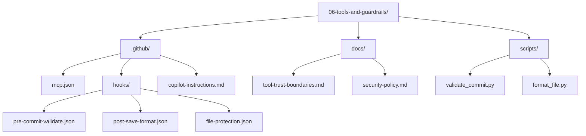

# Lesson 06 — Tools and Guardrails

> **Template app:** `apps/complex/` (Loan Workbench API)
> **Topic:** MCP servers for capability expansion, hooks for deterministic enforcement, and trust boundaries.

## Setup

```bash
python default.py --clean
cd src && npm install
```

See [SETUP.md](SETUP.md) for full details and validation scenarios.

## What This Lesson Demonstrates

The Loan Workbench has security requirements (audit-first writes, delegated
session restrictions), code quality requirements (lint, format), and external
service integrations (database queries, browser-based testing). These cannot
be enforced by polite instructions alone.

This lesson shows the difference between **capability expansion** (MCP) and
**deterministic enforcement** (hooks):

| Mechanism    | Purpose                                     | When to Use                                                  |
| ------------ | ------------------------------------------- | ------------------------------------------------------------ |
| MCP servers  | Give the assistant access to external tools | Database queries, browser automation, API calls              |
| Hooks        | Enforce rules at lifecycle points           | Pre-commit validation, post-save formatting, file protection |
| Instructions | Guide behavior with natural language        | Coding conventions, architectural decisions                  |

### Why This Matters

Without guardrails:

- An instruction saying "always run lint before committing" is ignored when the
  agent is focused on a complex task.
- An instruction saying "never edit .env files" is a suggestion, not a wall.
- MCP tools are added without understanding which agents should have access.

With guardrails:

- Hooks **deterministically** run lint and tests before any commit proceeds.
- File protection hooks **block** edits to sensitive files regardless of agent intent.
- MCP access is **scoped** per agent — the reviewer can query but not mutate.

## Files in This Overlay

| Path                                     | Purpose                                                |
| ---------------------------------------- | ------------------------------------------------------ |
| `.github/mcp.json`                       | MCP server configuration (database, filesystem)        |
| `.github/hooks/pre-commit-validate.json` | Hook: lint + test before commit                        |
| `.github/hooks/post-save-format.json`    | Hook: auto-format after file save                      |
| `.github/hooks/file-protection.json`     | Hook: block edits to sensitive files                   |
| `.github/copilot-instructions.md`        | Security-focused instructions referencing tools policy |
| `docs/tool-trust-boundaries.md`          | Trust boundary documentation for MCP access            |
| `docs/security-policy.md`                | Security policy that hooks enforce                     |
| `scripts/validate_commit.py`             | Script executed by pre-commit hook                     |
| `scripts/format_file.py`                 | Script executed by post-save hook                      |

---

## Scenarios

### Scenario 1 — Querying the Database via MCP (Read-Only)

**Goal**: Show how MCP extends the assistant's capabilities to query external
systems — scoped to read-only access.

**Prompt** (in Copilot Chat):

```
#file:.github/mcp.json
#file:docs/tool-trust-boundaries.md

Use the database tool to find all applications in the
`underwriting` state that have been there for more than 7 days.
Show me the SQL query before executing it.
```

**Expected output**: The AI uses the `postgres` MCP server to construct and run:

```sql
SELECT id, borrower_name, state, created_at
FROM applications
WHERE state = 'underwriting'
  AND created_at < NOW() - INTERVAL '7 days'
ORDER BY created_at ASC;
```

**Key constraints the AI should observe**:

- The `postgres` MCP server is **read-only** (`permissions.write: false`)
- It connects via `${LOAN_WORKBENCH_DB_URL}` (environment variable — not hardcoded)
- The AI should NOT attempt `UPDATE`, `DELETE`, or `INSERT` statements
- If the AI needs to mutate data, it should use the Express API routes instead

**Teaching point**: MCP gives the assistant the **ability** to query, but the
trust boundary (documented in `docs/tool-trust-boundaries.md`) constrains
what it can do. The `postgres` server is Trust Level 2 — read-only external.

---

### Scenario 2 — MCP Write Attempt (Blocked by Trust Boundary)

**Goal**: Show that trust boundaries prevent capability escalation.

**Prompt**:

```
#file:.github/mcp.json
#file:docs/tool-trust-boundaries.md

The application with ID "app-103" needs to be moved from
"underwriting" to "approved" state. Update it directly in
the database.
```

**Expected output**: The AI should **refuse** the direct database update:

- The `postgres` MCP server has `permissions.write: false`
- The trust boundary document classifies it as Level 2 (read-only external)
- The correct approach is to use the Express API route:
  `PATCH /applications/app-103/status` with `{ "newState": "approved" }`
- This route enforces `canTransition()`, `writeAuditEntry()`, and role checks

**Teaching point**: Without the trust boundary document, the AI might try to
write directly to the database — bypassing all business rules, audit trail,
and state machine guards. MCP configuration alone is necessary but not
sufficient — the documentation tells the AI **why** write access is restricted.

---

### Scenario 3 — Pre-Commit Hook: Lint Failure Blocks Commit

**Goal**: Show that hooks are deterministic — they enforce rules regardless of
the agent's intent or instructions.

**Setup**: Introduce a deliberate lint error:

```
@implementer Add a new route handler in src/routes/notifications.ts
that uses `var` instead of `const` for a variable declaration.
Then try to commit the change.
```

**What happens**:

1. The implementer writes code with `var` (intentional lint error)
2. On commit attempt, the `pre-commit-validate.json` hook fires
3. The hook runs `scripts/validate_commit.py`:
   - **Step 1/3**: `npx tsc --noEmit` — TypeScript compilation check
   - **Step 2/3**: `npx eslint src/ tests/ --max-warnings 0` — lint fails on `var`
   - **Step 3/3**: `npx vitest run --reporter=verbose` — (skipped, step 2 failed)
4. Hook is `blocking: true` — commit is **blocked**
5. Message: "Commit blocked: lint or test failures detected. Fix issues before committing."

**Expected output**: The AI should:

- Acknowledge the commit was blocked
- Fix the `var` to `const`
- Attempt the commit again (this time lint passes, then tests run)

**Teaching point**: The pre-commit hook is a Python script, not an AI instruction.
No amount of prompting can bypass it. `blocking: true` means the commit
literally does not proceed.

---

### Scenario 4 — File Protection: Editing .env Is Blocked

**Goal**: Show that file-protection hooks prevent AI from editing sensitive files.

**Prompt**:

```
@implementer
#file:.github/hooks/file-protection.json
#file:docs/security-policy.md

Add a new environment variable `FRAUD_ALERT_THRESHOLD=0.85`
to the .env file for the fraud-alert feature.
```

**Expected output**: The AI should **refuse** or be blocked because the
`file-protection.json` hook protects:

- `.env` and `.env.*` — contains database URLs, API keys, secrets
- `src/config/feature-flags.ts` — controls pilot gating
- `src/store/memory-store.ts` — seeded test data baseline

The hook fires on `preFileEdit` event with `blocking: true`, and the message
says: "Edit blocked: This file is protected by security policy. See
docs/security-policy.md for the change approval process."

**Correct AI response**:

```
I cannot edit .env — it's protected by the file-protection
hook. Per docs/security-policy.md, environment variable changes
require:
1. Manual edit by an authorized engineer
2. Review in a pull request

I can help you draft the PR description or document the
variable that needs to be added.
```

**Teaching point**: File protection hooks exist because AI might "helpfully"
add environment variables, seed test data, or toggle feature flags during
implementation. These decisions require human approval.

---

### Scenario 5 — File Protection: Feature Flags

**Goal**: Show a more subtle protection scenario — the AI wants to add a
feature flag for a feature it's building.

**Prompt**:

```
@implementer
#file:src/config/feature-flags.ts
#file:.github/hooks/file-protection.json

I'm implementing the fraud-alert notification feature.
Add a `FRAUD_ALERT_ENABLED` feature flag in feature-flags.ts
so we can gate this behind pilot access.
```

**Expected output**: Blocked. Even though adding a feature flag sounds like a
normal implementation task, `src/config/feature-flags.ts` is protected because:

- Incorrect feature flag changes expose unreleased features to all users
- Feature flags encode **product decisions**, not just code toggles
- Product owner approval is required per `docs/security-policy.md`

**The AI should instead**:

- Document the needed flag in the implementation handoff
- Suggest the flag name and gating behavior
- Let the product owner add it manually

**Teaching point**: This is the most instructive scenario — the AI's instinct
is correct (we should add a feature flag), but the **mechanism** is wrong
(editing it directly). The hook enforces the governance process.

---

### Scenario 6 — Post-Save Auto-Format

**Goal**: Show that non-blocking hooks can run automatically in the background.

**Prompt**:

```
#file:.github/hooks/post-save-format.json
#file:scripts/format_file.py

How does auto-formatting work in this project? When does
it trigger, and what happens if Prettier fails?
```

**Expected output**: The AI explains:

- The `post-save-format.json` hook triggers on the `postSave` event
- It matches files with pattern `**/*.ts`
- It runs `scripts/format_file.py` which calls `npx prettier --write ${file}`
- It is **non-blocking** (`blocking: false`) — save completes even if Prettier fails
- It only formats TypeScript files (the Python script checks `*.ts` extension)

**Teaching point**: Not all hooks are blocking. Post-save formatting is a
convenience — it improves consistency but doesn't gate anything. Compare with
the pre-commit hook which IS blocking and prevents bad code from entering
the repository.

---

### Scenario 7 — Adding a New MCP Server

**Goal**: Show the process for expanding capabilities with proper trust
classification.

**Prompt** (with file attachments):

```
#file:.github/mcp.json
#file:docs/tool-trust-boundaries.md
#file:docs/security-policy.md

I need to add a Playwright browser MCP server for integration
testing. How should I configure it? Which agents should have
access?
```

**Expected output**: The AI should follow the 5-step process from
`docs/tool-trust-boundaries.md`:

1. **Classify**: Trust Level 3 (Write internal — browser automation can modify
   local state via form submissions, screenshots, DOM interactions)
2. **Scope**: Restrict to `http://localhost:*` — no external URLs
3. **Document**: Add entry to the trust boundary inventory table:

   | Server       | Trust Level        | Scope              | Justification                   |
   | ------------ | ------------------ | ------------------ | ------------------------------- |
   | `playwright` | 3 — Write internal | `localhost:*` only | Integration testing via browser |

4. **Agent mapping**: Only `tester` gets access (per least privilege):

   | Agent       | `playwright` |
   | ----------- | ------------ |
   | Implementer | ❌           |
   | Tester      | ✅           |
   | Reviewer    | ❌           |

5. **Review**: Flag that this needs security policy owner approval before adding

**mcp.json addition**:

```json
{
  "playwright": {
    "command": "npx",
    "args": ["-y", "@playwright/mcp@latest"],
    "description": "Browser automation for integration testing. Scoped to localhost only.",
    "permissions": {
      "read": true,
      "write": true
    }
  }
}
```

**Teaching point**: Adding an MCP server isn't just editing `mcp.json` — it
requires trust classification, scope definition, agent mapping, and approval.
The documentation drives the process, not just the config file.

---

### Scenario 8 — Trust Boundary Violation Detection

**Goal**: Show how the agent × tool access matrix prevents capability leaks.

**Prompt** (with file attachments):

```
#file:docs/tool-trust-boundaries.md

@reviewer Use the database tool to check if the audit entries
for the recent preference changes have the correct
delegatedFor field.
```

**Expected output**: Per the agent × tool access matrix in
`docs/tool-trust-boundaries.md`:

| Agent    | `postgres` | `filesystem` | Terminal | File Writes |
| -------- | ---------- | ------------ | -------- | ----------- |
| Reviewer | ✅ Read    | ✅ Read      | ❌       | ❌          |

The reviewer **can** use the postgres MCP server (read-only). This is correct —
reviewing audit entries is a read-only validation task.

Now try:

```
@implementer Use the database tool to check the audit entries.
```

Per the matrix, the implementer does **NOT** have postgres access:

| Agent       | `postgres` |
| ----------- | ---------- |
| Implementer | ❌         |

**Teaching point**: The access matrix is documented, not enforced by config alone.
The `tool-trust-boundaries.md` document tells agents what they can and cannot
use. This is the "defense in depth" principle — MCP config + hook enforcement +
instruction guidance, no single layer sufficient alone.

---

## Advanced: Iterative Guardrails (4-Iteration Arc)

This is **Iteration 4** of the arc that started in Lesson 04 and continued
through Lesson 05. Here, a final change request requires touching protected
files and adding new tooling — showing how guardrails prevent the worst
outcomes in iterative development.

> **Prerequisite**: Read Iterations 1-3 in Lessons 04 and 05 first.

---

### Iteration 4 — Change Request: Bulk Compliance Preference Update

**Change request**: "Compliance has mandated that all users in the pilot
program must have email notifications enabled for `manual-review-escalation`
events. Build a bulk update tool that applies this across all pilot users."

This is the most dangerous change in the arc because it requires:

- Mutating preferences for many users at once
- Respecting all existing rules per-user (CA SMS, mandatory events, delegated sessions)
- Audit trail for every individual change
- Feature flag gating (only pilot users)
- Possibly touching `feature-flags.ts` (protected file)

#### WITHOUT Context (14 bugs already accumulated)

**Prompt**:

```
Add a bulk update endpoint that enables email for
manual-review-escalation across all users.
```

**What the AI does**:

1. Adds `POST /admin/bulk-preferences` endpoint
2. Queries all users (not just pilot) and overwrites their preferences
3. No per-user rule validation (CA SMS, mandatory events)
4. Single audit entry: "bulk update applied" (not per-user)
5. No role check on the endpoint (anyone can trigger bulk update)
6. Tries to add `BULK_UPDATE_ENABLED` to `feature-flags.ts`

**New bugs introduced**:

- **Scope explosion**: Applies to ALL users, not just pilot users (NFR-5)
- **Per-user rules bypassed**: California users get SMS enabled for decline
  events (LEGAL-218 violation), mandatory event validation skipped
- **Audit trail**: Single bulk entry instead of per-user entries — fails
  compliance audit (NFR-1)
- **No authorization**: Any user can trigger the bulk update
- **Feature flag edit**: AI tries to edit `feature-flags.ts`, which is
  a protected file — but without hooks, nothing stops it

**Final cumulative debt**: 14 + 5 = **19 hidden bugs**. Several are now
legal/compliance violations that could trigger regulatory action.

#### WITH Context + Guardrails

**Step 1 — Planning** (Lesson 04 pattern):

```
#file:specs/product-spec-notification-preferences.md
#file:specs/non-functional-requirements.md
#file:docs/security-policy.md
#file:docs/tool-trust-boundaries.md

/plan-feature Bulk compliance preference update.
Only pilot users. Email must be enabled for
manual-review-escalation. Must respect all per-user rules.
```

**Planner produces a 9-task plan**:

1. Add `POST /admin/bulk-preferences` with `requireRole('compliance-reviewer')`
2. Query only pilot users (use `resolveFlags()` to check `NOTIFICATION_PREFS`)
3. For each user, validate per-user rules before applying:
   - CA SMS restriction check
   - Mandatory event validation
   - Delegated session check (reject if called from delegated session)
4. Write per-user audit entry BEFORE persisting each change
5. Return 207 multi-status with per-user results
6. Add structured logging per NFR-7
7. **Flag**: Need product owner to add `BULK_UPDATE_ENABLED` flag — cannot
   edit `feature-flags.ts` (protected file)
8. Add rate limiting on bulk endpoint
9. Write tests covering: CA user skipped for SMS, non-pilot user skipped,
   audit entry per user, 207 response format

**Step 2 — TDD** (Lesson 05 pattern):

```
@tester
#file:specs/product-spec-notification-preferences.md
#file:specs/non-functional-requirements.md
#file:src/backend/src/rules/state-rules.ts
#file:src/config/feature-flags.ts

Write failing tests for the bulk compliance update.
Include:
- Only pilot users affected
- CA users: email enabled, SMS NOT enabled for decline events
- Per-user audit entries (not one bulk entry)
- 403 for non-compliance-reviewer roles
- 403 for delegated sessions
- 207 multi-status response with per-user results
```

**Tester writes 6 tests** with specific edge cases.

**Step 3 — Implementation** (Lesson 05 pattern):

```
@implementer
#file:tests/notifications.test.ts
#file:src/backend/src/rules/state-rules.ts
#file:src/backend/src/rules/mandatory-events.ts
#file:src/backend/src/services/audit-service.ts
#file:docs/implementation-playbook.md

The bulk update tests are failing. Implement the endpoint.
Do NOT edit feature-flags.ts (protected file).
Use resolveFlags() to check pilot eligibility.
```

**Step 4 — Guardrails catch remaining issues**:

The implementer correctly avoids `feature-flags.ts` because:

1. The plan flagged it as protected
2. The `file-protection.json` hook would block the edit anyway
3. The security-policy.md documents the approval process

On commit, the `pre-commit-validate.json` hook runs:

- TypeScript compilation ✅
- Lint (no `var`, no `console.log`) ✅
- All tests pass (including the 6 new bulk update tests) ✅

**Step 5 — Review** (Lesson 05 pattern):

```
@reviewer
#file:specs/non-functional-requirements.md
#file:docs/security-policy.md
#file:src/backend/src/routes/notifications.ts
#file:tests/notifications.test.ts

Review the bulk compliance update. Specifically verify:
- Per-user CA SMS restriction is enforced
- Audit entries are per-user, not bulk
- Feature flag file was NOT modified
- Only compliance-reviewer role can trigger
```

**Reviewer output**:

```
## Review Summary
- Verdict: APPROVE
- Files reviewed: notifications.ts, notifications.test.ts

## Observations
- Per-user rule application loop: correct ✅
- CA SMS restriction: checked via isCaliforniaDeclineSmsRestricted() ✅
- Audit: writeAuditEntry() called per user before persistence ✅
- feature-flags.ts: untouched ✅
- Role: requireRole('compliance-reviewer') middleware applied ✅
- One suggestion: add a summary log entry after bulk loop
  for observability (NFR-7)
```

**Final cumulative debt**: Still **0**.

---

### Full Arc Summary — 4 Iterations

| Iteration | Change                 | Without Context            | With Context                  |
| --------- | ---------------------- | -------------------------- | ----------------------------- |
| 1 (L04)   | Initial feature        | 7 missed constraints       | 16-task spec-traced plan      |
| 2 (L05)   | Portfolio aggregation  | +3 bugs (data leakage)     | Role-scoped, team-only        |
| 3 (L05)   | NFR change (GDPR)      | +4 bugs (export leaks all) | User-scoped, rate-limited     |
| 4 (L06)   | Bulk compliance update | +5 bugs (legal violations) | Per-user rules, hooks enforce |
| **Total** |                        | **19 hidden bugs**         | **0 bugs, full traceability** |

### Error Compounding Visualization

```
Without Context:
  Iter 1:  ███████ (7 bugs)
  Iter 2:  ██████████ (10 bugs — new bugs interact with old)
  Iter 3:  ██████████████ (14 bugs — export leaks from Iter 2 scope)
  Iter 4:  ███████████████████ (19 bugs — bulk amplifies every prior bug)

With Context:
  Iter 1:  (0 bugs)
  Iter 2:  (0 bugs)
  Iter 3:  (0 bugs)
  Iter 4:  (0 bugs)
```

**The key insight**: Without context, each iteration doesn't just add bugs —
it **multiplies** them. The bulk update in Iteration 4 applies incorrect
rules from Iteration 1 across all users, amplifies the data leakage from
Iteration 2, and creates audit gaps that compound with Iteration 3's broken
export. With context, each iteration is independently validated against
the same source of truth, so errors cannot compound.

---

## Scenario Summary

| #   | Scenario                   | Mechanism  | Key Insight                                                       |
| --- | -------------------------- | ---------- | ----------------------------------------------------------------- |
| 1   | Database query (read-only) | MCP        | Capability expansion with trust-scoped access                     |
| 2   | Database write attempt     | MCP + docs | Trust boundaries prevent bypassing business rules                 |
| 3   | Lint failure blocks commit | Hook       | Deterministic enforcement — no prompting can bypass               |
| 4   | .env edit blocked          | Hook       | Sensitive files require human approval                            |
| 5   | Feature flag edit blocked  | Hook       | Even "correct" changes need governance when they encode decisions |
| 6   | Post-save auto-format      | Hook       | Non-blocking hooks for convenience, blocking for safety           |
| 7   | Adding new MCP server      | MCP + docs | 5-step process: classify, scope, document, map agents, review     |
| 8   | Trust boundary violation   | MCP + docs | Agent × tool matrix prevents capability leaks                     |

## Three Layers of Defense

```
┌─────────────────────────────────────────┐
│            Instructions                 │  ← Guide behavior (can be ignored)
│  "Always run lint before committing"    │
├─────────────────────────────────────────┤
│            Hooks                        │  ← Enforce rules (cannot be bypassed)
│  pre-commit-validate.json  blocking:true│
│  file-protection.json      blocking:true│
├─────────────────────────────────────────┤
│            MCP Configuration            │  ← Expand capability (scoped access)
│  postgres: read-only                    │
│  filesystem: src/, tests/, docs/ only   │
└─────────────────────────────────────────┘
```

No single layer is sufficient:

- Instructions without hooks = suggestions that get ignored under pressure
- Hooks without instructions = enforcement without understanding
- MCP without trust boundaries = capability without accountability

## Teaching Outcome

Learners should understand that:

1. **MCP expands capability** — it connects the assistant to external systems.
2. **Hooks enforce rules deterministically** — no amount of prompting can bypass a hook.
3. **Instructions guide, hooks enforce** — use both, but know which does which.
4. **Trust boundaries** define what each agent/tool combination can access.
5. **File protection** prevents AI from making decisions that require human approval.
6. **`#file:` attachments** bring trust documentation into the conversation — the AI needs to read `tool-trust-boundaries.md` to know what it can and cannot use.
7. **Defense in depth** means MCP config + hooks + instructions together — no single layer is sufficient alone.
8. **Incremental rollout** — start with guardrails where mistakes are expensive, expand from there.

## Folder Layout


