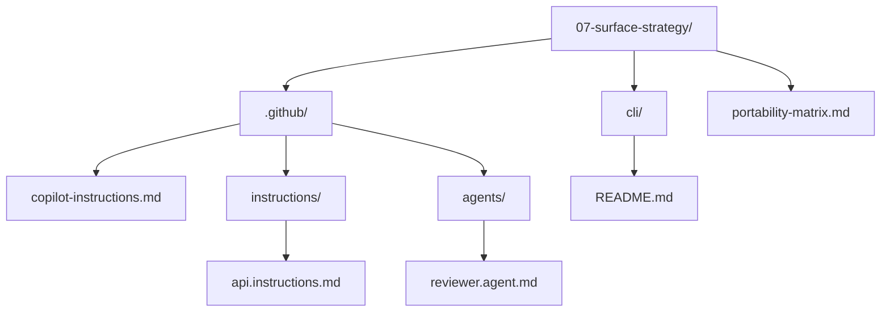

# Lesson 07 — Surface Strategy

> **Template app:** `apps/complex/` (Loan Workbench API)
> **Topic:** Making context portable across VS Code, CLI, Coding Agent, and Code Review.
> **Lesson type:** Reading (reference-and-framework-driven)

## Setup

```bash
python default.py --clean
cd src && npm install
```

See [SETUP.md](SETUP.md) for full details and validation scenarios.

## What This Lesson Demonstrates

Not all Copilot context works on all surfaces. The context artifacts created
in Lessons 02–06 have different levels of portability:

- `.github/copilot-instructions.md` → works **everywhere**
- `.instructions.md` with `applyTo` → VS Code + Coding Agent only
- `.agent.md` → VS Code Chat + Coding Agent only
- `.prompt.md` → VS Code Chat + Coding Agent only
- Hooks → VS Code only
- Skills → VS Code Chat only

This lesson teaches learners to design context **foundation-first** — starting
with the most portable layer and adding surface-specific enhancements.

## Files in This Overlay

| Path                                       | Purpose                             |
| ------------------------------------------ | ----------------------------------- |
| `.github/copilot-instructions.md`          | Portable foundation (all surfaces)  |
| `.github/instructions/api.instructions.md` | Path-scoped rules (VS Code + agent) |
| `.github/agents/reviewer.agent.md`         | Review agent (VS Code Chat only)    |
| `cli/README.md`                            | GitHub CLI configuration guide      |
| `portability-matrix.md`                    | Feature × surface reference matrix  |

---

## Scenarios

### Scenario 1 — Portable Foundation (All Surfaces)

**Goal**: Verify that `.github/copilot-instructions.md` works on all surfaces.

**VS Code Chat**:

```
Add a route for archiving loan applications.
```

**VS Code Inline**: Start typing in `src/routes/applications.ts`:

```typescript
router.delete('/api/v1/applications/:id',
```

**GitHub CLI**:

```bash
copilot -p "add a route for archiving loan applications" --allow-all
```

**Expected**: All three surfaces produce code that:

- Uses ESM imports ✅
- Uses `const` ✅
- Uses `async` handler ✅
- Uses structured error responses ✅

**Teaching point**: The portable foundation provides baseline consistency
across ALL surfaces without any additional configuration.

---

### Scenario 2 — Path-Scoped Enhancement (VS Code Only)

**Goal**: Show how `.instructions.md` with `applyTo` adds extra context
when editing specific files.

**VS Code Chat** (editing `src/routes/applications.ts`):

```
#file:.github/instructions/api.instructions.md

Add a route handler for PATCH /api/v1/applications/:id/status.
```

**Expected**: The AI follows the full route handler template from
`api.instructions.md`:

- Exact middleware chain order (authenticate → authorize → handler) ✅
- Validation with schema.parse ✅
- Audit before persistence ✅
- Specific error code format ✅

**GitHub CLI** (same prompt):

```bash
copilot -p "add a route handler for PATCH /api/v1/applications/:id/status" --allow-all
```

**Expected**: The CLI produces a handler that follows `copilot-instructions.md`
conventions (ESM, const, async) but is NOT aware of the detailed route handler
template from `api.instructions.md` — because path-scoped instructions don't
load in CLI.

**Teaching point**: Path-scoped instructions are a VS Code + Coding Agent
enhancement. CLI users get the foundation only. Design critical rules as
portable (in `copilot-instructions.md`) and enhancement rules as path-scoped.

---

### Scenario 3 — Agent Invocation (VS Code Chat Only)

**Goal**: Show how agents provide role-specific workflows in VS Code Chat.

**VS Code Chat**:

```
@reviewer Review the following changes to applications.ts.
Check for architecture compliance and convention adherence.

#file:src/backend/src/routes/applications.ts
```

The reviewer agent applies its full checklist:

- Architecture compliance (routes → rules → services) ✅
- Convention compliance (ESM, const, structured logging) ✅
- Security (no stack traces, role checks) ✅
- Test coverage (Vitest, annotations) ✅

**GitHub CLI**: No equivalent — agents are not available in CLI.

**Coding Agent**: Can use the agent — it supports `.agent.md` files.

**Code Review**: No equivalent — review suggestions use `copilot-instructions.md`
only, not custom agents.

**Teaching point**: Agents are a power tool for VS Code Chat and Coding Agent.
For teams that rely on CLI or code review, put the equivalent checklist in
`docs/` so it's accessible as a reference.

---

### Scenario 4 — The CLI Workflow

**Goal**: Show the full GitHub CLI Copilot workflow for the Loan Workbench.

See `cli/README.md` for the complete guide. Key demonstrations:

**Get a code suggestion**:

```bash
cd /path/to/loan-workbench
copilot -p "add a bulk status update route that handles
partial failures and returns results per application" --allow-all
```

**Explain unfamiliar code**:

```bash
copilot -p "explain src/rules/smsRestriction.ts" --allow-all
```

**Generate git commands**:

```bash
copilot -p "squash last 3 commits with message 'feat: add bulk status update'" --allow-all
```

**Expected**: CLI suggestions follow `copilot-instructions.md` conventions
but lack the depth of VS Code suggestions (no path-scoped rules, no agent
review, no doc attachments).

**Teaching point**: CLI is ideal for quick terminal-based tasks. Use VS Code
for complex, multi-file work where full context is needed.

---

### Scenario 5 — Portability Test Protocol

**Goal**: Demonstrate the systematic way to verify context works across surfaces.

**Test new context**: After adding a new rule to `copilot-instructions.md`
(e.g., "All new endpoints must include rate limiting middleware"):

1. **VS Code Chat**: Ask to add a new endpoint → verify rate limiting included
2. **VS Code Inline**: Start typing a new handler → verify rate limiting suggested
3. **CLI**: `copilot -p "add a new endpoint" --allow-all` → verify rate limiting mentioned
4. **Coding Agent**: Describe a task → verify rate limiting applied

If it fails on any surface, the rule is not portable — it may need to be in
`copilot-instructions.md` (most portable) instead of a surface-specific file.

**Teaching point**: Always test new context on your team's active surfaces.
A rule in `.instructions.md` that nobody on CLI can see is worse than the
same rule in `copilot-instructions.md` that everyone can see.

---

### Scenario 6 — Surface Mismatch Failure

**Goal**: Show what happens when a workflow depends on a surface-specific feature
that the current surface doesn't support.

**VS Code Chat** (works):

```
@reviewer Review the PATCH status handler for architecture compliance.

#file:src/backend/src/routes/applications.ts
#file:docs/architecture.md
```

This works — the reviewer agent has access to both files and its checklist.

**GitHub CLI** (fails):

```bash
copilot -p "review the PATCH status handler in
src/routes/applications.ts for architecture compliance" --allow-all
```

This does NOT invoke the reviewer agent. It does NOT load `architecture.md`.
The suggestions are generic, based only on the code and
`copilot-instructions.md`.

**Teaching point**: Don't design critical workflows that only work on one
surface. If architecture review is essential, put the checklist in a portable
location (`copilot-instructions.md` summary + `docs/` detail) AND use the
agent as an enhancement for VS Code users.

---

### Scenario 7 — Designing for Your Team's Surfaces

**Goal**: Walk through the decision framework for placing new context.

**Scenario**: Your team uses VS Code (primary) and CLI (secondary).
You want to add a new rule: "All database queries must use parameterized
statements, never string concatenation."

**Decision tree**:

1. Does this need to work for CLI users? → YES (security is critical everywhere)
2. Does this need path activation? → Could scope to `src/services/` but CLI
   won't see it
3. **Decision**: Put in `.github/copilot-instructions.md` (portable)

**Alternative scenario**: You want to add a rule: "When editing CSS files,
use BEM naming convention."

**Decision tree**:

1. Does this need to work for CLI users? → NO (CLI doesn't suggest CSS)
2. Does this need path activation? → YES (only CSS files)
3. **Decision**: Use `.instructions.md` with `applyTo: "**/*.css"`

See `portability-matrix.md` for the full decision framework and reference tables.

---

### Scenario 8 — The Foundation-First Strategy

**Goal**: Show the recommended approach for building context from scratch.

**Day 1** — Create `.github/copilot-instructions.md`

- Works on ALL surfaces immediately
- Contains: project description, tech stack, top conventions, references
- **Test**: VS Code + CLI both pick it up

**Week 1** — Add `docs/architecture.md` + ADRs

- Works in VS Code (via `#file:`), partially in CLI (via semantic search)
- Contains: deep architecture knowledge, technology decisions
- **Test**: VS Code Chat shows awareness of architecture

**Week 2** — Add `.instructions.md` files

- Works in VS Code + Coding Agent
- Contains: path-scoped rules for specific file types
- **Test**: Inline completions follow path-specific patterns

**Month 1** — Add agents + prompts

- Works in VS Code Chat + Coding Agent
- Contains: role-separated workflows, repeatable processes
- **Test**: Agent invocations produce structured, checklist-driven output

**Month 2** — Add hooks + MCP

- Works in VS Code only
- Contains: automated enforcement, external tool access
- **Test**: Pre-commit hooks catch convention violations automatically

**Teaching point**: Each layer adds capability but reduces portability. Start
at the foundation and verify each layer works on your team's active surfaces
before adding the next.

---

## Scenario Summary

| #   | Scenario                | Surfaces Tested   | Key Insight                                            |
| --- | ----------------------- | ----------------- | ------------------------------------------------------ |
| 1   | Portable foundation     | All               | `copilot-instructions.md` provides baseline everywhere |
| 2   | Path-scoped enhancement | VS Code vs CLI    | `.instructions.md` adds depth but only in VS Code      |
| 3   | Agent invocation        | VS Code Chat only | Agents are powerful but not portable                   |
| 4   | CLI workflow            | CLI               | Quick tasks; foundation context only                   |
| 5   | Portability test        | All               | Always verify new context on active surfaces           |
| 6   | Surface mismatch        | VS Code vs CLI    | Don't design critical workflows for one surface        |
| 7   | Design decisions        | Team-specific     | Use the decision framework to place context correctly  |
| 8   | Foundation-first        | Progressive       | Start portable, layer upward, verify each layer        |

## Connection to Previous and Later Lessons

| Lesson | Connection                                                               |
| ------ | ------------------------------------------------------------------------ |
| 02     | Created the foundation: `.github/copilot-instructions.md` + `docs/`      |
| 03     | Added `.instructions.md` files — path-scoped (VS Code + Coding Agent)    |
| 04     | Added `.prompt.md` files — repeatable workflows (VS Code + Coding Agent) |
| 05     | Added `.agent.md` and `SKILL.md` — roles (VS Code Chat + Coding Agent)   |
| 06     | Added hooks and `mcp.json` — automation (VS Code only)                   |
| **07** | **Maps all artifacts to surfaces — portability framework**               |
| 08     | Maintaining all these artifacts over time                                |
| 09     | Full delivery loop showing how surfaces integrate                        |

## Teaching Outcome

Learners should understand that:

1. **`.github/copilot-instructions.md` is the ONLY universal artifact** — it
   works on all five Copilot surfaces.
2. **Each additional layer adds power but reduces portability** — design
   accordingly.
3. **Foundation-first design** — start with the most portable context and layer
   upward.
4. **GitHub CLI is a viable secondary surface** — for quick terminal tasks using
   the foundation context.
5. **Always verify on your team's active surfaces** — a rule nobody can see is
   worse than a simpler rule everyone can see.
6. **Critical rules must be portable** — security, architecture, and coding
   conventions belong in `copilot-instructions.md`, not in surface-specific files.
7. **Agents and hooks are power tools, not foundations** — use them as
   enhancements for surfaces that support them.

## Folder Layout


