# Lesson 08 — Operating Model

> **Template app:** `apps/complex/` (Loan Workbench API)
> **Topic:** Maintaining, measuring, and cleaning up AI context over time.
> **Lesson type:** Reading (checklist/reference-driven)

## Setup

```bash
python default.py --clean
cd src && npm install
```

See [SETUP.md](SETUP.md) for full details and validation scenarios.

## What This Lesson Demonstrates

Context is not "set and forget." Like code, documentation, and infrastructure,
AI context drifts over time:

- Technologies get upgraded (Node 18 → 20, winston → pino)
- Directories get renamed or deleted
- Rules become contradictory as new conventions are added
- Instruction files grow beyond useful size
- Agents reference tools that are no longer installed
- Features are decommissioned but their context remains

This lesson teaches learners to:

1. **Detect** drift with automated scripts
2. **Prevent** drift with maintenance cadences
3. **Measure** context health with leading and lagging indicators
4. **Fix** common anti-patterns (with before/after examples)

## Files in This Overlay

| Path                                       | Purpose                                |
| ------------------------------------------ | -------------------------------------- |
| `scripts/audit_context.py`                 | Full context health audit (8 checks)   |
| `scripts/detect_stale_refs.py`             | Dead reference detection               |
| `checklists/maintenance-schedule.md`       | Weekly/monthly/quarterly cadence       |
| `examples/drifted/copilot-instructions.md` | Anti-pattern example (5 anti-patterns) |
| `examples/clean/copilot-instructions.md`   | Clean version after audit              |

---

## Scenarios

### Scenario 1 — Run the Context Health Audit

**Goal**: See the audit script detect multiple issues in the drifted example.

**Setup**: Copy the drifted example into place:

```bash
cp examples/drifted/copilot-instructions.md .github/copilot-instructions.md
```

**Run**:

```bash
python scripts/audit_context.py
```

**Expected output**:

```
── 1. Foundation ──
⚠ WARNING: .github/copilot-instructions.md is 310 lines (max recommended: 200)

── 6. Cross-Reference Integrity ──
⚠ WARNING: copilot-instructions.md references 'docs/deployment.md' but it doesn't exist
⚠ WARNING: copilot-instructions.md references 'docs/knex-to-prisma.md' but it doesn't exist
⚠ WARNING: copilot-instructions.md references 'src/helpers/README.md' but it doesn't exist

── 8. Anti-Pattern Detection ──
✗ ERROR: copilot-instructions.md is 310 lines — split into .instructions.md files

Summary: Warnings: 4 | Errors: 1
ACTION REQUIRED: Fix 1 error(s) before proceeding.
```

**Teaching point**: The audit script catches both structural (too large) and
referential (dead links) issues automatically. Run it weekly.

---

### Scenario 2 — Before/After Cleanup

**Goal**: Compare the drifted and clean versions to learn what to fix.

**Side-by-side comparison**:

```bash
diff examples/drifted/copilot-instructions.md examples/clean/copilot-instructions.md
```

**Anti-patterns fixed**:

| #   | Anti-Pattern                 | Drifted                                           | Clean                                           |
| --- | ---------------------------- | ------------------------------------------------- | ----------------------------------------------- |
| 1   | Bloated file (310 lines)     | Full route template, notification rules inline    | Summary + references. 60 lines.                 |
| 2   | Contradictory rules          | "structured logging" AND "use console.log()"      | "structured JSON logging — never console.log()" |
| 3   | Stale tech references        | Node 18, winston, knex, AWS ECS                   | Node 20, pino, Prisma, Azure Containers         |
| 4   | Dead file references         | `/docs/deployment.md`, `/src/helpers/`            | Only references to files that exist             |
| 5   | Overly specific global rules | Route template, notification policy, test details | "See .instructions.md" for path-specific        |

**Teaching point**: Cleanup is not just about fixing errors — it's about
restoring the two principles: **copilot-instructions.md is a summary**
(brief, portable), and **details live in scoped files** (.instructions.md,
docs/, ADRs).

---

### Scenario 3 — The Stale Technology Problem

**Goal**: Show what happens when outdated tech references remain in context.

**Setup**: Use the drifted `copilot-instructions.md` that says "winston" and "knex".

**Prompt**:

```
Add structured logging to the new route handler.
```

**With drifted context**: AI generates:

```typescript
import winston from 'winston';
const logger = winston.createLogger({...});
logger.info('Route handler called');
```

This is WRONG — the project uses pino, not winston. But the instructions say
"structured JSON via winston" because nobody updated it after the migration.

**With clean context**: AI generates:

```typescript
import { logger } from "../services/logger.js";
logger.info({ action: "handler_called", path: req.path });
```

This is correct — pino is referenced, and the existing logger service is used.

**Teaching point**: Stale technology references cause immediate, concrete bugs.
The AI trusts the context you give it — if the context is wrong, the code is wrong.

---

### Scenario 4 — The Contradictory Rules Problem

**Goal**: Show what happens when rules contradict each other.

**Setup**: Use the drifted `copilot-instructions.md` that says both
"structured JSON logging" and "Use console.log() for debugging."

**Prompt**:

```
Add error logging to the state machine transition handler.
```

**With drifted context**: AI is confused — it may:

- Use `console.log()` (following the explicit instruction)
- Use structured logging (following the implicit convention)
- Mix both (one for errors, one for debug)
- Ask the user which one to use

The contradiction wastes time and produces inconsistent code.

**With clean context**: AI consistently uses structured logging:

```typescript
logger.error({
  action: "transition_failed",
  from: current,
  to: target,
  error: err.message,
});
```

No ambiguity. No wasted time.

**Teaching point**: Contradictions in context are worse than missing context.
With missing context, the AI makes a reasonable guess. With contradictions,
the AI makes an unpredictable choice.

---

### Scenario 5 — The Dead Reference Problem

**Goal**: Show what happens when instructions reference files that don't exist.

**Setup**: Use the drifted `copilot-instructions.md` that references
`/docs/deployment.md` (deleted) and `/src/helpers/` (deleted).

**Prompt**:

```
#file:docs/deployment.md

What's the deployment process for this project?
```

**Result**: The `#file:` reference fails or returns nothing — the file doesn't
exist. The AI either:

- Ignores the attachment and guesses (based on the stale "AWS ECS" reference)
- Tells the user the file doesn't exist
- Makes up a deployment process based on the project type

**With clean context**: The deployment reference is removed from instructions.
The AI relies on the accurate tech stack info (Azure Container Apps) and
doesn't send users on a wild goose chase looking for deleted files.

**Teaching point**: Dead references erode trust. Developers who encounter them
start distrusting ALL context — "if this reference is wrong, what else is wrong?"
Run `detect_stale_refs.py` monthly.

---

### Scenario 6 — The Bloated Instructions Problem

**Goal**: Show why instructions files should stay under 200 lines.

**Prompt** (with 310-line drifted instructions):

```
Add a new notification channel for push notifications.
```

**With drifted context**: The AI has to process 310 lines of instructions,
including a 50-line route handler template, 6 notification rules, 10 testing
conventions, and deployment details — most irrelevant to the task.

The AI may:

- Follow the inline notification rules but use the wrong logging library
- Apply the route handler template to a service file (wrong layer)
- Get confused by the volume and miss the California SMS rule

**With clean context**: The AI reads 60 lines of focused guidance, including:

- Tech stack (pino, Prisma) — correct
- Architecture (routes → rules → services) — relevant
- "See `.github/instructions/notifications.instructions.md`" — pointed guidance

The result is more accurate because the context is focused and correct.

**Teaching point**: Large context windows don't mean "put everything in one file."
Focused context produces better results than comprehensive context.
`copilot-instructions.md` is a SUMMARY — details go in scoped files.

---

### Scenario 7 — Measurement and Signals

**Goal**: Introduce metrics that track context health over time.

**Leading indicators** (predict problems before they surface):

```bash
# Instruction file size — should stay under 200 lines
wc -l .github/copilot-instructions.md

# Cross-reference integrity — should be 0 stale refs
python scripts/detect_stale_refs.py

# Context freshness — should be 0 files older than 90 days
find .github docs -mtime +90 -name '*.md' | wc -l
```

**Lagging indicators** (confirm problems after they happen):

Track these in your team retrospectives:

- How often do developers override AI suggestions with "no, do it THIS way"?
- How many PRs contain patterns documented as rejected (e.g., Jest instead of Vitest)?
- How long does it take new team members to get useful suggestions?

See `checklists/maintenance-schedule.md` for the full metrics framework
and maintenance cadence.

**Teaching point**: If you can't measure it, you can't improve it.
Context health is measurable — use the signals to catch drift before
it causes production bugs.

---

### Scenario 8 — Operating Model Integration

**Goal**: Show how the operating model fits into the team's existing workflow.

**Integration points**:

| Team Process           | Context Maintenance Hook                                |
| ---------------------- | ------------------------------------------------------- |
| Sprint planning        | Review context health audit at the start of each sprint |
| PR review              | Check if `.github/` or `docs/` changes are needed       |
| Post-incident review   | Did stale context contribute to the incident?           |
| Onboarding             | New member runs audit script on day 1                   |
| Tech debt backlog      | Add context cleanup items alongside code debt           |
| Dependency upgrades    | Update `copilot-instructions.md` tech stack section     |
| Architecture decisions | Create a new ADR — don't just update instructions       |

**CI integration** (optional):

```yaml
# .github/workflows/context-audit.yml
name: Context Health
on:
  push:
    paths:
      - ".github/**"
      - "docs/**"
jobs:
  audit:
    runs-on: ubuntu-latest
    steps:
      - uses: actions/checkout@v4
      - run: python scripts/audit_context.py
```

**Teaching point**: Context maintenance is not a separate activity — it's
integrated into the processes your team already runs. The audit script runs
in CI; the maintenance checklist maps to existing sprint ceremonies.

---

## Scenario Summary

| #   | Scenario             | Anti-Pattern                | Key Insight                                          |
| --- | -------------------- | --------------------------- | ---------------------------------------------------- |
| 1   | Audit script run     | Multiple                    | Automated detection catches what humans miss         |
| 2   | Before/after cleanup | All 5 patterns              | Side-by-side comparison shows exactly what to fix    |
| 3   | Stale technology     | Wrong library references    | AI trusts context — wrong context = wrong code       |
| 4   | Contradictory rules  | console.log vs structured   | Contradictions are worse than gaps                   |
| 5   | Dead references      | Deleted files still linked  | Erodes trust in ALL context                          |
| 6   | Bloated instructions | 310 lines in one file       | Focused context beats comprehensive context          |
| 7   | Measurement signals  | No metrics                  | Can't improve what you can't measure                 |
| 8   | Process integration  | Maintenance as separate job | Embed context maintenance in existing team processes |

## Connection to Previous and Later Lessons

| Lesson | Connection                                                                   |
| ------ | ---------------------------------------------------------------------------- |
| 02     | Context created there needs maintenance NOW — this lesson explains how       |
| 03     | Instruction layering from L03 can drift — scoped files reference wrong paths |
| 04     | Prompt files reference variables that may be renamed                         |
| 05     | Agent tool lists need periodic review — tools get removed/renamed            |
| 06     | Hooks reference patterns that may change — keep guard conditions current     |
| 07     | Surface portability decisions may shift as new features ship                 |
| **08** | **This lesson: the maintenance, measurement, and cleanup framework**         |
| 09     | Capstone includes the operating model as part of the mature stage            |

## The Eight Anti-Patterns

Referenced from the course CONTENT.md:

| #   | Anti-Pattern            | Detection Method                    | Fix                                       |
| --- | ----------------------- | ----------------------------------- | ----------------------------------------- |
| 1   | Bloated instructions    | `wc -l` > 200                       | Split into `.instructions.md` + `docs/`   |
| 2   | Contradictory rules     | Manual review                       | Resolve to one consistent rule            |
| 3   | Over-privileged agents  | `tools:` missing in frontmatter     | Add explicit tool restrictions            |
| 4   | Stale technology refs   | Audit script tech check             | Update when dependencies change           |
| 5   | Dead references         | `detect_stale_refs.py`              | Remove or fix broken paths                |
| 6   | Overly specific globals | Rule in global that's path-specific | Move to `.instructions.md` with `applyTo` |
| 7   | Missing ADRs            | Technology choice undocumented      | Write ADR with AI Guidance section        |
| 8   | No maintenance cadence  | No audit schedule exists            | Adopt the checklists in this lesson       |

## Teaching Outcome

Learners should understand that:

1. **Context drifts** — like code and documentation, AI context goes stale.
2. **Automated audits catch drift** — run `audit_context.py` weekly.
3. **Contradictions are worse than gaps** — resolve conflicting rules immediately.
4. **Dead references erode trust** — fix or remove monthly.
5. **Focused context beats comprehensive context** — keep `copilot-instructions.md` under 200 lines.
6. **Context health is measurable** — track leading and lagging indicators.
7. **Maintenance is not a separate activity** — embed it in sprint ceremonies.
8. **Before/after examples teach the team** — show what drift looks like and how to fix it.

## Folder Layout

```mermaid
graph TD
    A["08-operating-model/"] --> B["scripts/"]
    A --> C["checklists/"]
    A --> D["examples/"]
    B --> E["audit_context.py"]
    B --> F["detect_stale_refs.py"]
    C --> G["maintenance-schedule.md"]
    D --> H["drifted/"]
    D --> I["clean/"]
    H --> J["copilot-instructions.md"]
    I --> K["copilot-instructions.md"]
```


