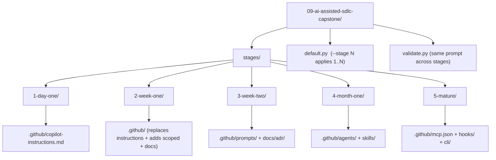

# Lesson 09 — AI-Assisted SDLC Capstone

> **Template app:** NEW — TaskFlow monorepo (React 19 + Express 5 + Prisma)
> **Topic:** Progressive context engineering from day one to maturity.
> **Lesson type:** Video (end-to-end walkthrough)

## What This Lesson Demonstrates

This capstone synthesizes ALL nine lessons into a single progressive arc.
Instead of the Loan Workbench, it uses a NEW project — **TaskFlow** — to
demonstrate that context engineering applies to any codebase, not just the
tutorial's example.

TaskFlow progresses through five stages, each adding context layers from the
corresponding course lessons:

| Stage | Timeline | Context Layers Added           | Lessons Covered |
| ----- | -------- | ------------------------------ | --------------- |
| 1     | Day 1    | `copilot-instructions.md` only | 01, 02          |
| 2     | Week 1   | + `.instructions.md` + `docs/` | 02, 03          |
| 3     | Week 2   | + `.prompt.md` + ADRs          | 04              |
| 4     | Month 1  | + `.agent.md` + `SKILL.md`     | 05              |
| 5     | Mature   | + `mcp.json` + hooks + CLI     | 06, 07, 08      |

**Key insight**: The SAME prompt produces progressively better output as
context layers accumulate. Each stage's output is better than the previous.

## Setup

Stages use a **cumulative delta** approach — each stage folder contains only
the files that are NEW or CHANGED relative to the previous stage. The
`default.py` script applies stages 1 through N cumulatively to build the
complete context at any point.

```bash
# Apply stages 1-3 (copies stage 1, then 2, then 3 over the workspace)
python default.py --stage 3 --clean

# Apply all 5 stages (full maturity)
python default.py --stage 5 --clean
```

See [SETUP.md](SETUP.md) for full details and validation scenarios.

There is no app source code in this lesson — the stages show only the
**context files** that would exist at each point in TaskFlow's evolution.
The focus is on the context, not the code.

## Validation

```bash
# Run the same prompt across all 5 stages, compare output quality
python validate.py --all --model gpt-5.4
```

## Files in This Lesson

### Stage 1 — Day One

| Path                                               | Purpose                                               |
| -------------------------------------------------- | ----------------------------------------------------- |
| `stages/1-day-one/.github/copilot-instructions.md` | Minimal: project name, tech stack, monorepo structure |

### Stage 2 — Week One (delta over stage 1)

| Path                                                              | Purpose                                               |
| ----------------------------------------------------------------- | ----------------------------------------------------- |
| `stages/2-week-one/.github/copilot-instructions.md`               | REPLACES stage 1: + conventions, architecture summary |
| `stages/2-week-one/.github/instructions/frontend.instructions.md` | Path-scoped: React 19 + Tailwind patterns             |
| `stages/2-week-one/.github/instructions/api.instructions.md`      | Path-scoped: Express 5 + Prisma patterns              |
| `stages/2-week-one/docs/architecture.md`                          | Full system architecture                              |

### Stage 3 — Week Two (delta over stages 1-2)

| Path                                                      | Purpose                              |
| --------------------------------------------------------- | ------------------------------------ |
| `stages/3-week-two/.github/prompts/add-feature.prompt.md` | Repeatable feature planning workflow |
| `stages/3-week-two/.github/prompts/fix-bug.prompt.md`     | Systematic debugging workflow        |
| `stages/3-week-two/docs/adr/001-zustand-over-redux.md`    | Technology decision with AI Guidance |

### Stage 4 — Month One (delta over stages 1-3)

| Path                                                      | Purpose                                   |
| --------------------------------------------------------- | ----------------------------------------- |
| `stages/4-month-one/.github/agents/planner.agent.md`      | Planning agent with read-only tools       |
| `stages/4-month-one/.github/agents/implementer.agent.md`  | Implementation agent with write tools     |
| `stages/4-month-one/.github/skills/tdd-workflow/SKILL.md` | TDD skill with TaskFlow-specific examples |

### Stage 5 — Mature (delta over stages 1-4)

| Path                                               | Purpose                                   |
| -------------------------------------------------- | ----------------------------------------- |
| `stages/5-mature/.github/mcp.json`                 | PostgreSQL + GitHub MCP servers           |
| `stages/5-mature/.github/hooks/copilot-hooks.json` | Pre-commit guards + post-save test runner |
| `stages/5-mature/cli/README.md`                    | GitHub CLI integration guide              |

---

## Scenarios

### Scenario 1 — Same Prompt, Five Stages

**Goal**: Show how the SAME prompt produces progressively better output
as context layers accumulate.

**The prompt** (identical at every stage):

```
Add a "task comments" feature. Users should be able to comment on
tasks with @mentions that notify the mentioned user.
```

**Stage 1 output** (instructions only):

- AI knows it's React + Express + Prisma ✅
- Creates files in wrong locations (no architecture known) ❌
- Uses Redux for state (no ADR known) ❌
- No validation schemas ❌
- No tests ❌

**Stage 2 output** (+ instructions + docs):

- Files in correct locations (architecture known) ✅
- Uses Zustand (instructions say so) ✅
- Follows controller pattern ✅
- Still no planning step ❌
- Still produces all code at once ❌

**Stage 3 output** (+ prompts + ADRs):

- Runs `/add-feature` prompt first → produces a PLAN ✅
- Plan references architecture.md ✅
- ADR-001 prevents Redux suggestion ✅
- Structured implementation order ✅
- Still no role separation ❌

**Stage 4 output** (+ agents + skills):

- @planner produces the plan (read-only) ✅
- @implementer writes the code (write tools) ✅
- TDD skill drives test-first development ✅
- Role separation prevents scope creep ✅
- Still manual enforcement ❌

**Stage 5 output** (+ hooks + MCP + CLI):

- Pre-commit hook blocks code with TODO/console.log ✅
- MCP server provides live database context ✅
- CLI generates quick snippets from terminal ✅
- Full automated enforcement ✅
- ALL layers working together ✅

**Teaching point**: Context engineering is cumulative. Each layer makes
every subsequent interaction more precise, more consistent, and more correct.

---

### Scenario 2 — The Full Delivery Loop

**Goal**: Walk through a complete feature delivery using all five stages
of context in the mature state.

**Feature request**: "Add task comments with @mentions and notifications."

**Step 1 — Curate** (Lessons 02-03):

- `.github/copilot-instructions.md` already describes TaskFlow
- `docs/architecture.md` already describes the data model
- Need to update architecture doc to include Comment model

**Step 2 — Plan** (Lesson 04):

```
/add-feature

Feature: Task comments with @mentions and notifications.
Users can comment on tasks. @mention syntax triggers a notification
to the mentioned user. Comments support markdown formatting.
```

The prompt file references architecture.md and produces a structured plan.

**Step 3 — Build** (Lesson 05):

```
@implementer Build the task comments feature based on the plan above.
Follow the TDD workflow — write tests first.
```

The implementer agent:

1. Creates Prisma schema for Comment model
2. Writes failing tests for comment API endpoints
3. Implements comment service
4. Implements comment controller and routes
5. Creates frontend Comment component + store
6. Adds WebSocket event for real-time comment updates
7. Runs all tests → green

**Step 4 — Validate** (Lesson 06):

- Pre-commit hook blocks any TODO or console.log left in code
- MCP PostgreSQL server lets the AI verify the schema migration
- Post-save hook runs tests automatically on save

**Step 5 — Ship**:

- All tests pass
- Architecture doc updated
- No hook violations
- PR ready for human review

**Teaching point**: The delivery loop is: Curate → Plan → Build → Validate → Ship.
Context engineering powers every step, not just code generation.

---

### Scenario 3 — Minimum Viable Context Stack

**Goal**: Help learners choose which stage is right for their project.

**Decision framework**:

| Team Size | Project Lifespan | Recommended Stage | Context Files |
| --------- | ---------------- | ----------------- | ------------- |
| Solo      | < 1 month        | Stage 1           | 1 file        |
| Solo      | 1-3 months       | Stage 2           | ~5 files      |
| 2-3 devs  | 3-6 months       | Stage 3           | ~8 files      |
| 4-8 devs  | 6+ months        | Stage 4           | ~12 files     |
| 8+ devs   | Ongoing          | Stage 5           | ~20 files     |

**Rule of thumb**: Start at Stage 1. Add layers when you notice the AI
making the same mistake twice. Don't pre-engineer context for problems
you don't have yet.

**Teaching point**: Context engineering is incremental. You don't need
Stage 5 on day one. You need Stage 1 on day one and a plan to expand.

---

### Scenario 4 — Diagnosing a Bug Across Stages

**Goal**: Show how debugging improves with progressive context.

**Bug**: "When a user changes a task's status from TODO to IN_PROGRESS,
the WebSocket event fires but the frontend doesn't update."

**Stage 1 diagnosis**: AI guesses at the cause — maybe a state update
issue? Maybe a WebSocket problem? No architecture context to narrow down.

**Stage 2 diagnosis**: AI knows the architecture — checks if the controller
emits the event AFTER the database write (correct pattern per architecture.md).
Can narrow to frontend store issue.

**Stage 3 diagnosis**: Using `/fix-bug` prompt, AI follows the systematic
diagnostic workflow: Locate → Root Cause → Impact → Fix → Test → Prevent.

**Stage 4 diagnosis**: @planner analyzes the bug across all three packages.
@implementer writes a test that reproduces it, then fixes it.

**Stage 5 diagnosis**: MCP PostgreSQL server lets the AI check the actual
database state. Hook auto-runs the test after the fix.

**Teaching point**: More context layers = faster, more accurate debugging.
The same bug takes 20 minutes to diagnose at Stage 1 and 5 minutes at Stage 5.

---

### Scenario 5 — Connection to the Loan Workbench Arc

**Goal**: Show that the lessons learned on the Loan Workbench apply to
any project — including TaskFlow.

**Parallels**:

| Loan Workbench Concept     | TaskFlow Equivalent                      |
| -------------------------- | ---------------------------------------- |
| Three-layer architecture   | Controller → Service → Prisma            |
| Fail-closed audit          | WebSocket events after successful writes |
| California SMS restriction | @mention notification rules              |
| Feature flag 404-not-403   | Not applicable (different domain)        |
| Role-based access          | ADMIN / MEMBER / VIEWER roles            |
| State machine              | Task status transitions                  |

**Key insight**: The domains are different, the tech stacks differ,
but the context engineering patterns are identical:

1. `.github/copilot-instructions.md` → portable foundation
2. `.instructions.md` → path-scoped rules
3. `docs/` → deep knowledge
4. `.prompt.md` → repeatable workflows
5. `.agent.md` → role separation
6. Hooks + MCP → automated enforcement

**Teaching point**: Context engineering is a transferable skill.
The specific rules change per project; the framework stays the same.

---

### Scenario 6 — The Four-Iteration Arc in TaskFlow

**Goal**: Connect back to the 4-iteration arc from Lessons 04-06.

**What if TaskFlow had been built without context?**

Apply the same analysis from the Loan Workbench arc:

| Iteration | Change Request                    | Without Context                                          | With Context                            |
| --------- | --------------------------------- | -------------------------------------------------------- | --------------------------------------- |
| 1         | Add task comments                 | Wrong file locations, Redux, no tests                    | Correct architecture, Zustand, tests    |
| 2         | Add @mention notifications        | No mention of notification rules, no WebSocket awareness | Architecture-aware, event-after-write   |
| 3         | Add GDPR data export for comments | Exports all data including deleted content               | Respects soft-delete, audit trail       |
| 4         | Bulk migrate task statuses        | Direct database UPDATE, no validation                    | State machine validation, audit logging |

**Estimated bugs**: 15+ without context, 0 with full context (Stage 4+).

**Teaching point**: The error compounding pattern from the Loan Workbench
applies to every project. Context prevents the same classes of errors
regardless of domain.

---

### Scenario 7 — Context Maintenance Preview

**Goal**: Show that even at maturity, context needs maintenance (Lesson 08).

After three months, TaskFlow has evolved:

- Migrated from Express 5 to Hono (faster, lighter)
- Added file attachments to comments
- Deprecated the `VIEWER` role

**Context drift without maintenance**:

- `copilot-instructions.md` still says "Express 5"
- `api.instructions.md` still shows Express middleware patterns
- `architecture.md` still describes three roles
- ADR for Hono migration doesn't exist

**Run the audit** (from Lesson 08):

```bash
python scripts/audit_context.py
```

**Expected**:

- Stale technology references (Express → Hono)
- Dead references (VIEWER role removed from code but in docs)
- Missing ADR (Express → Hono decision undocumented)

**Teaching point**: Context maturity is not a destination — it's a practice.
The operating model (Lesson 08) keeps the context healthy over time.

---

## Scenario Summary

| #   | Scenario                  | Stages Used  | Key Insight                                        |
| --- | ------------------------- | ------------ | -------------------------------------------------- |
| 1   | Same prompt, five stages  | 1→2→3→4→5    | Context is cumulative — each layer improves output |
| 2   | Full delivery loop        | All (mature) | Curate → Plan → Build → Validate → Ship            |
| 3   | Minimum viable stack      | Per team     | Don't pre-engineer — grow with the project         |
| 4   | Bug diagnosis             | 1→2→3→4→5    | More context = faster, more accurate diagnosis     |
| 5   | Loan Workbench connection | All          | Patterns are transferable across projects          |
| 6   | Four-iteration arc        | All          | Error compounding applies to every domain          |
| 7   | Maintenance preview       | 5 + L08      | Context maturity is a practice, not a destination  |

## Complete Context File Inventory (Stage 5)

At maturity, TaskFlow has these context files:

```
.github/
  copilot-instructions.md              ← Stage 1 (Lessons 01-02)
  instructions/
    frontend.instructions.md           ← Stage 2 (Lesson 03)
    api.instructions.md                ← Stage 2 (Lesson 03)
  prompts/
    add-feature.prompt.md              ← Stage 3 (Lesson 04)
    fix-bug.prompt.md                  ← Stage 3 (Lesson 04)
  agents/
    planner.agent.md                   ← Stage 4 (Lesson 05)
    implementer.agent.md               ← Stage 4 (Lesson 05)
  skills/
    tdd-workflow/SKILL.md              ← Stage 4 (Lesson 05)
  mcp.json                             ← Stage 5 (Lesson 06)
  hooks/
    copilot-hooks.json                 ← Stage 5 (Lesson 06)
docs/
  architecture.md                      ← Stage 2 (Lesson 02)
  adr/
    001-zustand-over-redux.md          ← Stage 3 (Lesson 04)
cli/
  README.md                            ← Stage 5 (Lesson 07)
```

Total: **14 context files** spanning all seven context surfaces taught
in the course.

## Teaching Outcome

Learners should understand that:

1. **Context engineering is progressive** — start with one file, grow over time.
2. **The same prompt gets better** — each layer makes interactions more precise.
3. **The delivery loop is the framework** — Curate → Plan → Build → Validate → Ship.
4. **Patterns are transferable** — the framework works on any tech stack.
5. **Minimum viable context is enough** — don't over-engineer day one.
6. **Maintenance is part of maturity** — context drift is inevitable, not optional.
7. **CLI is a first-class surface** — the portable foundation works everywhere.

## Folder Layout


