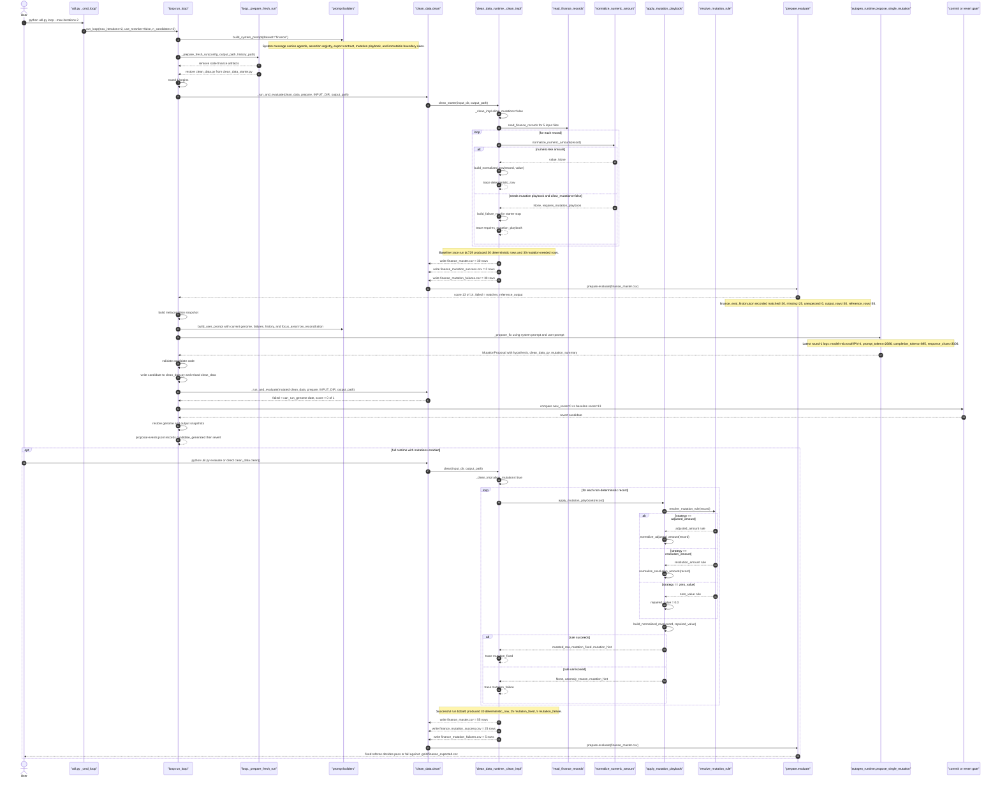
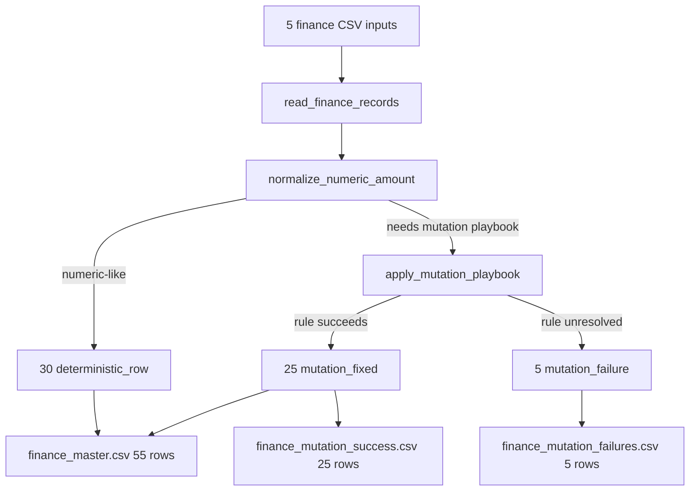
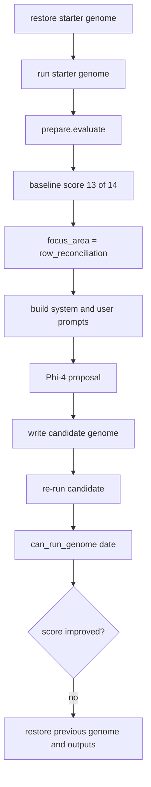
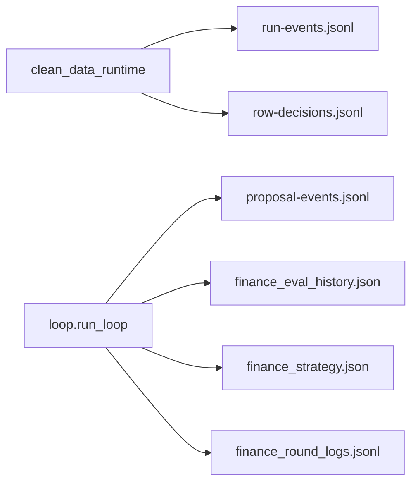
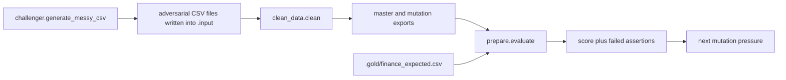
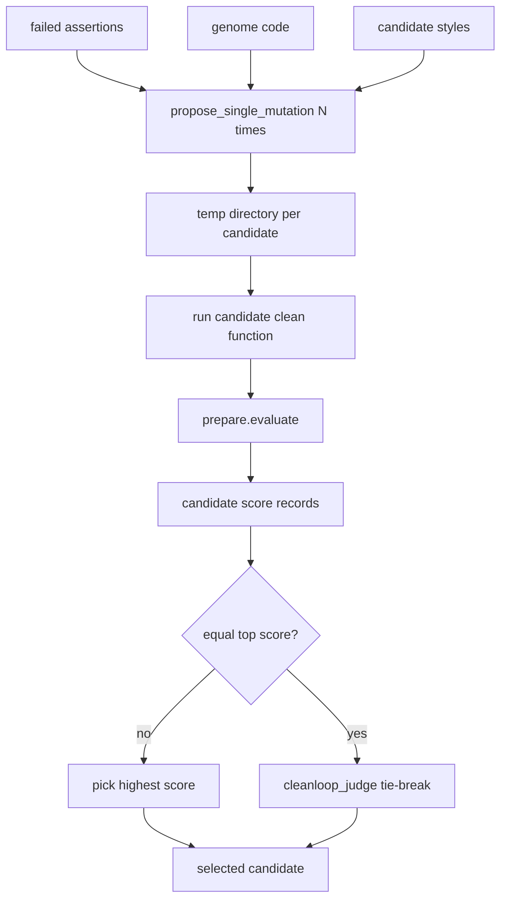
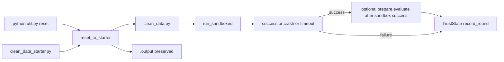

# Traced Execution Flow

This document reconstructs the real CleanLoop execution path from the shipped
runtime code and the current artifacts under `.output/`.

It is grounded in these files:

- `.output/finance_eval_history.json`
- `.output/finance_strategy.json`
- `.output/logs/finance_round_logs.jsonl`
- `.output/traces/run-events.jsonl`
- `.output/traces/row-decisions.jsonl`
- `.output/traces/proposal-events.jsonl`

## Reference Runs Used In This Diagram

- Starter baseline runtime: `dc729b9ec5574972b551e92bfc452c80`
  - `allow_mutations=false`
  - `30` `deterministic_row`
  - `30` `requires_mutation_playbook`
- Successful full runtime: `bcbafd7446364124808b4280c7865c36`
  - `allow_mutations=true`
  - `30` `deterministic_row`
  - `25` `mutation_fixed`
  - `5` `mutation_failure`
- Latest loop run: `1da2e0c0a3b741d4a4940beb8eaf248a`
  - `max_iterations=2`
  - `candidate_count=3`
  - `use_reranker=false`
  - both rounds reverted

## Run

### Commands

```powershell
python util.py reset
python util.py evaluate
python util.py loop --max-iterations 1
python util.py loop --max-iterations 1 --rerank --candidates 2
python util.py dashboard
python util.py sandbox --timeout 10
python util.py autonomy --rounds 5
```

### Output

```text
$ python util.py evaluate
Ran genome. Output: Y:\.sources\localm-tuts\courses\_examples\self-improving-agent\cleanloop\.output\finance_master.csv
    CleanLoop Evaluation: 13/14
    [FAIL] matches_reference_output: matched=30, missing=25, unexpected=0, output_rows=30, reference_rows=55

$ python util.py loop --max-iterations 1
[CURRENT_SCORE] Score 13/14
[REQUESTING_LLM_PROPOSAL] Requesting mutation proposal from model microsoft/Phi-4
[HYPOTHESIS_SELECTED] Implement deterministic normalization and a mutation playbook to reconcile missing and unexpected rows.
[REVERT_MUTATION] Reverted mutation with score 0/1
History saved to Y:\.sources\localm-tuts\courses\_examples\self-improving-agent\cleanloop\.output\finance_eval_history.json

$ python util.py loop --max-iterations 1 --rerank --candidates 2
    Reranker: generating 2 candidates...
[LLM_ATTEMPT] Attempt 1/2: AutoGen candidate 1: conservative
[LLM_ATTEMPT] Attempt 2/2: AutoGen candidate 2: value-first
[REVERT_MUTATION] Reverted mutation with score 13/14

$ python util.py dashboard
    Local URL: http://localhost:8501

$ python util.py sandbox --timeout 10
    [OK] Genome completed successfully

$ python util.py autonomy --rounds 5
Final: SUPERVISED (score: 0.48)
```

### Explanation

1. `reset` and `evaluate` recreate the starter baseline used by the `Lesson 02 Slice - Runtime Row Routing` diagram.
2. `loop --max-iterations 1` exercises the non-reranked path used by `Lesson 03 Slice - One Loop Round`. The key validation is the revert after a worse candidate.
3. `loop --max-iterations 1 --rerank --candidates 2` exercises the search branch used by `Lesson 06 Slice - Re-Ranker Search Path`.
4. `dashboard`, `sandbox`, and `autonomy` connect the observability and safety slices back to [Lesson 04](../lessons/04-observability-feedback.md) and [Lesson 07](../lessons/07-production-safety.md).

## Full Execution Diagram



## Lesson-Aligned Diagram Slices

These are smaller execution slices that map cleanly to the lesson flow.

### Lesson 02 Slice — Runtime Row Routing



### Lesson 03 Slice — One Loop Round



### Lesson 04 Slice — Artifact Feedback



### Lesson 05 Slice — Fixed Judge And Harder Arena



This slice combines two surfaces.

- The fixed judge path is already visible in current `.output` history and traces.
- The challenger path is defined in `challenger.py`, but the current `.output/`
  artifacts do not include a traced challenger run.

### Lesson 06 Slice — Re-Ranker Search Path



The current `.output` history shows `use_reranker=false` for the latest loop
run, so this slice is a code-path explanation derived from `reranker.py` and
`autogen_runtime.py`, not a traced artifact from the current log set.

### Lesson 07 Slice — Safety, Trust, And Recovery



The current architecture artifacts do not include saved sandbox runs or reset
audit files, so this slice is grounded in `sandbox.py`, `autonomy.py`, and
`reset_workflow.py` rather than in `.output/traces`.

## Actual Call Chain

1. `util.py::_cmd_loop()` calls `loop.run_loop()`.
2. `loop.run_loop()` calls `build_system_prompt()` once, then `_prepare_fresh_run()`.
3. Each round calls `_run_and_evaluate()`.
4. `_run_and_evaluate()` calls `clean_data.clean()` and then `prepare.evaluate()`.
5. In the starter baseline, `clean_data.clean()` delegates to `clean_data_runtime.clean_starter()`, which calls `_clean_impl(... allow_mutations=false)`.
6. `_clean_impl()` calls `read_finance_records()`, `normalize_numeric_amount()`, `build_normalized_row()`, `build_failure_row()`, and `write_rows()`.
7. In the mutation-enabled path, `_clean_impl()` also calls `apply_mutation_playbook()`.
8. `apply_mutation_playbook()` calls `resolve_mutation_rule()`, then either `normalize_adjusted_amount()` or `normalize_resolution_amount()` when the rule requires local business context.
9. After baseline evaluation, `loop.run_loop()` calls `_build_metacognition_snapshot()`, `build_user_prompt()`, and `_propose_fix()`.
10. `_propose_fix()` calls `autogen_runtime.propose_single_mutation()`, which calls `_run_structured_agent()` and returns a structured `MutationProposal`.
11. The loop validates and writes the candidate, re-runs `_run_and_evaluate()`, then commits or reverts based on the fixed score delta.

## What Each Message Sends

### System Prompt To The LLM

`build_system_prompt()` sends the operating contract:

- dataset agenda
- assertion registry
- export contract
- mutation playbook
- immutable boundary rules
- output format rule: one-line hypothesis plus full `clean_data.py`

### User Prompt To The LLM

`build_user_prompt()` sends round-specific evidence:

- current `clean_data.py`
- failed assertions
- passed assertions
- up to three previous attempts
- metacognition snapshot with `focus_area` and `guidance`

### Response From The LLM

`autogen_runtime.propose_single_mutation()` expects a structured payload:

- `hypothesis`
- `clean_data_py`
- `mutation_summary`

The current logs show the model returned code, but the selected candidate still
failed at runtime with `can_run_genome: 'date'`, so the selection gate rejected
it.

## Actual Counts That Matter

### Starter Baseline In The Current Loop

- input files scanned: `5`
- deterministic rows exported: `30`
- rows stopped for mutation work: `30`
- master rows written: `30`
- fixed referee score before mutation: `13/14`
- failing assertion: `matches_reference_output`
- missing rows against reference: `25`

### Full Mutation-Capable Runtime

- deterministic rows: `30`
- mutation-fixed rows: `25`
- mutation-failure rows: `5`
- master rows written: `55`
- mutation-success export rows: `25`
- mutation-failure export rows: `5`

## Why The Current Loop Reverts

The latest logged loop does not fail because the idea of mutation is wrong. It
fails because the generated candidate does not preserve the runtime contract of
the shipped genome.

The fixed judge never even gets to the full assertion suite after mutation. The
candidate first collapses at `_run_and_evaluate()` with `can_run_genome: 'date'`.
That turns the round into a hard revert instead of an incremental score test.
