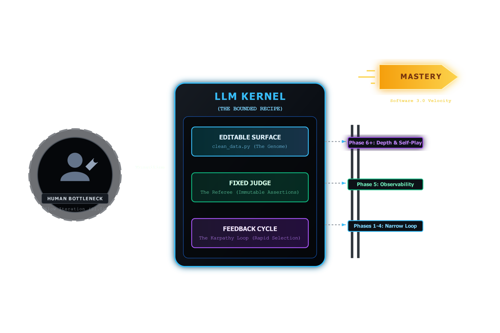
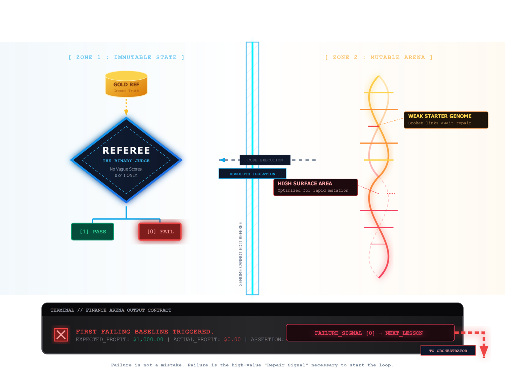
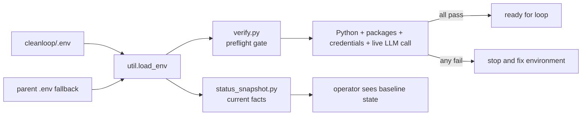

# Lesson 01 — The Mutation Engine

Lesson 01 explains the local command surface, provider resolution, and the verify gate.

This lesson is the preflight contract for the whole example. Before the learner
judges genome quality, CleanLoop first proves that the local runtime, package
set, credentials, and live model path are actually usable.

## Readiness Diagram







## Theory To Learn

### 1. Environment trust comes before mutation trust

If the local runtime is broken, later failures are ambiguous. You cannot tell
whether the genome is weak or the machine is misconfigured. Lesson 01 keeps
that uncertainty out of the loop.

### 2. `status` and `verify` solve different problems

`status` is descriptive. It tells you what dataset, model, Python version, and
row counts the example sees right now. `verify` is a gate. It decides whether
the environment is healthy enough to start the real lessons.

### 3. Provider resolution is part of the teaching surface

CleanLoop loads `cleanloop/.env` first and only falls back to the shared
example `.env` if needed. That keeps the example self-contained and makes the
active endpoint choice inspectable instead of hidden in global shell state.

### 4. A live LLM call is the only meaningful final check

Installed packages do not prove that the endpoint works. Correct credentials do
not prove that the provider will answer. The verify flow closes that gap with
one small completion request before the learner spends time in the mutation
loop.

## What This Gate Is Teaching You

When `verify` fails, the result is already a useful diagnosis.

- Python or package failures mean the runtime is not ready yet.
- Credential failures mean the loop would fail before any genome reasoning.
- LLM connectivity failures mean the example contract is incomplete even if the
  code imports cleanly.

## Code Anchors

- [Status snapshot builder](../../status_snapshot.py#L16)
- [Status CLI command](../../util.py#L357)
- [Verify entrypoint](../../verify.py#L168)

## Actual Example Detail

Before any mutation round, the learner should confirm that the five finance files are present and that `cleanloop/.env` resolves a working endpoint.

## Inline Coding

```python
snapshot = build_status_snapshot()
```

That one line gives the learner a stable view of row counts, Python version, model, and output presence.

## Read This In Order

1. Start at [status_snapshot.py#L16](../../status_snapshot.py#L16) to see which facts the CLI gathers.
2. Then read [util.py#L357](../../util.py#L357) to see how those facts are rendered for the learner.
3. Finish at [verify.py#L168](../../verify.py#L168) to see the hard gate before the loop starts.

## Run

### Commands

```powershell
python util.py status
python util.py verify
```

### Output

```text
$ python util.py status
Input Files:
	finance_invoices.csv               12 rows
	...
	finance_invoices_adjustments.csv   12 rows

Environment:
	Python:   3.11.9
	.env:     exists
	Model:    microsoft/Phi-4
	Dataset:  finance

$ python util.py verify
Required packages:
	[OK] All 7 packages installed
API credentials:
	[OK] Endpoint: https://models.github.ai/inference
LLM connectivity:
	[OK] LLM replied: hello

Result: 4/4 checks passed.

Ready for: python util.py loop
```

### Explanation

1. `python util.py status` confirms that the five finance fixture files are present, the local `.env` was found, and the example is pointed at a concrete model.
2. `python util.py verify` proves the preflight contract end to end. Validate that all four checks pass and that the final line says `Ready for: python util.py loop`.
3. If either command fails here, stop and fix the runtime before you study mutation behavior. Lesson 01 is about removing environment ambiguity first.

## Hands-On Exercises

### Exercise 1 - Add model provenance to the status view

- Difficulty: Easy
- Files: `status_snapshot.py`, `util.py`
- Task: Add a `model_source` field beside `model` so the status view shows whether the active model came from `MODEL_NAME`, `AZURE_OPENAI_DEPLOY_NAME`, or the default constant.
- Hints: The fallback chain already exists in `build_status_snapshot()`. Keep the logic in one place and only change the renderer after the snapshot shape is stable.
- Done when: `python util.py status` shows both the resolved model and where that value came from.
- Stretch: Also show which expected environment variables are still unset.

### Exercise 2 - Fail fast on empty fixture inputs

- Difficulty: Easy
- Files: `status_snapshot.py`, `verify.py`
- Task: Add a verification rule that fails when one of the shipped finance CSV files is missing or has zero data rows.
- Hints: Reuse `_count_rows()` and the dataset path helpers instead of scanning the directory twice.
- Done when: A broken or empty input file makes `python util.py verify` fail with the exact filename.
- Stretch: Add a status warning when the total fixture row count is not the expected 60 rows.

### Exercise 3 - Verify that the output directory is writable

- Difficulty: Medium
- Files: `verify.py`
- Task: Add one preflight check that proves `.output/` can be created and written before the learner starts the loop.
- Hints: Use a tiny probe file and clean it up even when the write fails.
- Done when: `python util.py verify` reports a dedicated pass or fail line for output write access.
- Stretch: Print a short fix hint when the path is blocked by permissions.

### Exercise 4 - Add a baseline fixture summary

- Difficulty: Medium
- Files: `status_snapshot.py`, `util.py`
- Task: Extend the status snapshot with `total_input_rows` and `fixture_matches_expected` so the learner can tell whether the starter fixture is intact.
- Hints: Build the aggregate from the existing `input_rows` dict. Do not hardcode the per-file counts in the renderer.
- Done when: `python util.py status` clearly shows whether the shipped baseline still matches the documented fixture.
- Stretch: Add one compact line that lists only the files whose row counts drifted.
