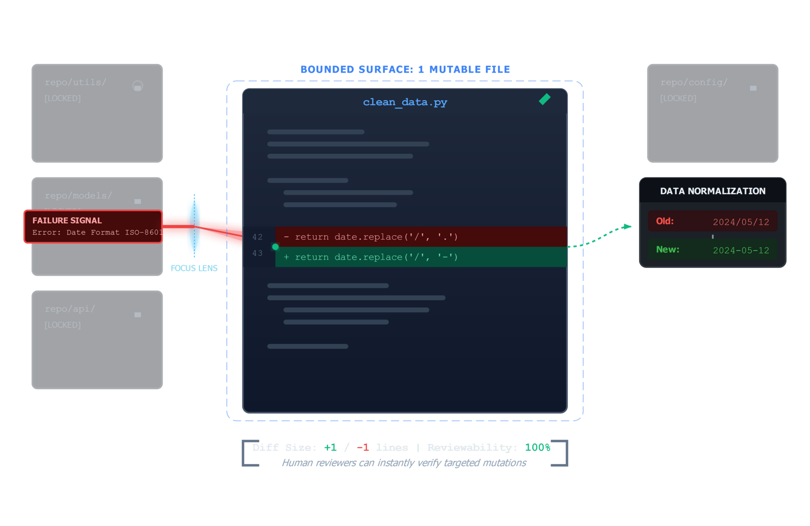
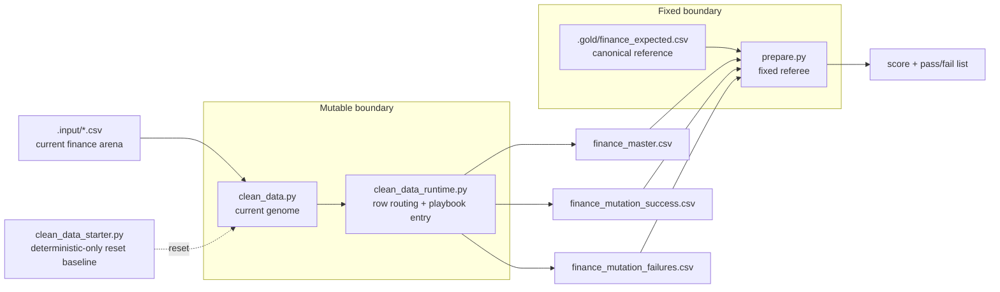

# Lesson 02 — Defining the Pipeline Genome

Lesson 02 is the heart of the example.

The key teaching move is not "the model writes code." The key move is that the

For the traced runtime slice with real artifact counts, see
[execution-flow.md](../architecture/execution-flow.md) under `Lesson 02 Slice — Runtime Row Routing`.
loop is allowed to mutate one bounded file while the data arena, exports, and
judge stay fixed. That boundary is what makes the system explainable.

## Boundary Diagram





## Theory To Learn

### 1. The genome is a bounded mutation surface

In CleanLoop, the genome is not the whole repo. It is the file the loop is
allowed to rewrite while the surrounding contract stays stable. Here that file
is `clean_data.py`, which delegates into the shared runtime and defines the
current cleaning behavior.

That narrow scope matters because every score change can be blamed on one code
surface. You do not need to ask whether the model also changed the judge, the
fixtures, or the export format.

### 2. The starter genome is weak on purpose

The shipped starter genome stops at the deterministic pass. If a row already
has a clean numeric amount, it can become a canonical export row. If the row
needs a repair rule, the starter genome pushes it into the failure path instead
of guessing.

That is why the baseline score starts low. The weak baseline is not a mistake.
It is the signal that the loop still has real work to do.

### 3. The fixed referee prevents score gaming

`prepare.py` reads the current exports and compares them against the canonical
reference in `.gold/finance_expected.csv`. The genome can try to improve its
output, but it cannot move the goalposts.

This split is the core theory behind a self-improving loop: mutable candidate,
immutable judge. If both changed at once, rollback, trust, and comparison would
collapse.

### 4. The three exports explain where capability ends

The pipeline does not only write one final CSV. It writes:

- `finance_master.csv` for rows that are good enough to join the canonical set
- `finance_mutation_success.csv` for rows repaired by bounded local rules
- `finance_mutation_failures.csv` for rows that still need help

Those three outputs make the genome legible. You can see what the deterministic
path handled, what the mutation playbook repaired, and what still sits outside
the genome's current capability.

## What The Baseline Score Is Teaching You

When you run `python util.py evaluate` against the starter genome, the failed
checks are not just red lights. They are a map of missing behavior.

- If deterministic rows pass, the schema and export path are already stable.
- If mutation-heavy rows fail, the genome boundary is doing its job by exposing
  the exact repair gap.
- If the judge stays fixed across rounds, score deltas become meaningful rather
  than cosmetic.

## What Learners Follow

- read the finance rows
- separate mutable code from fixed evaluation boundaries
- normalize direct numeric amounts
- apply the bounded mutation playbook to noisy amount tokens
- write master, success, and failure exports
- evaluate the result with the fixed referee

## Actual Records To Trace

- `INV-101`
- `INV-404`
- `INV-502`
- `INV-203`
- `INV-112`

## Code Anchors

- [Mutable genome wrapper](../../clean_data.py#L1)
- [Reset baseline wrapper](../../clean_data_starter.py#L1)
- [Runtime entrypoint](../../clean_data_runtime.py#L28)
- [Numeric normalization decision](../../mutation_playbook.py#L106)
- [Mutation playbook repair](../../mutation_playbook.py#L144)
- [Stable export writer](../../export_writer.py#L12)
- [Fixed referee](../../prepare.py#L324)

## Inline Coding

```python
value, anomaly_reason = normalize_numeric_amount(record)
```

That line decides whether a row stays deterministic, requires mutation, or must be routed to the failure dump.

## Read This In Order

1. Read [clean_data_runtime.py#L28](../../clean_data_runtime.py#L28) for the full row-routing flow.
2. Step into [mutation_playbook.py#L106](../../mutation_playbook.py#L106) when the amount token is the main question.
3. Step into [mutation_playbook.py#L144](../../mutation_playbook.py#L144) to see how repaired rows are built.
4. Finish with [export_writer.py#L12](../../export_writer.py#L12) to understand why the CSV output order stays stable.

## Run

### Commands

```powershell
python util.py status
python util.py verify
python util.py reset
python util.py evaluate
```

### Output

```text
$ python util.py status
Environment:
	Python:   3.11.9
	.env:     exists
	Model:    microsoft/Phi-4
	Dataset:  finance

$ python util.py verify
Result: 4/4 checks passed.
Ready for: python util.py loop

$ python util.py reset
Preserved cleanloop/.output sample artifacts
Restored clean_data.py from clean_data_starter.py

Ready to re-run: python util.py loop

$ python util.py evaluate
Ran genome. Output: Y:\.sources\localm-tuts\courses\_examples\self-improving-agent\cleanloop\.output\finance_master.csv
	CleanLoop Evaluation: 13/14
	[FAIL] matches_reference_output: matched=30, missing=25, unexpected=0, output_rows=30, reference_rows=55
```

### Explanation

1. Re-run the Lesson 01 preflight commands first so you know the dataset and provider state are unchanged.
2. `python util.py reset` restores the starter genome. Validate that it says the sample artifacts were preserved and that `clean_data.py` came from `clean_data_starter.py`.
3. `python util.py evaluate` is the key Lesson 02 command. Validate that the starter genome scores `13/14` and that the only failing assertion is `matches_reference_output` with `missing=25`. That is the visible boundary between deterministic handling and rows that still need the mutation playbook.

## Hands-On Exercises

### Exercise 1 - Support accounting parentheses

- Difficulty: Medium
- Files: `mutation_playbook.py`
- Task: Extend numeric normalization so a value like `(125.50)` is treated as `-125.5` instead of falling into the mutation path.
- Hints: Keep the change near `normalize_numeric_amount()` so deterministic numeric cleanup still happens before rule lookup.
- Done when: A copied input row with parentheses lands in `finance_master.csv` with a numeric negative value.
- Stretch: Also accept spaced variants such as `( 125.50 )`.

### Exercise 2 - Add one new mutation rule

- Difficulty: Medium
- Files: `mutation_playbook.py`, `.input/*.csv`
- Task: Create one synthetic anomaly row and teach the playbook how to repair it from local business context such as `adjusted_amount` or `resolution_amount`.
- Hints: Add the rule through the existing mutation-rule lookup instead of adding a one-off branch in the runtime.
- Done when: Your new row moves from `finance_mutation_failures.csv` into `finance_mutation_success.csv`.
- Stretch: Make the rule conditional on `status` so it cannot fire on unrelated rows.

### Exercise 3 - Improve failure hints

- Difficulty: Medium
- Files: `mutation_playbook.py`, `clean_data_runtime.py`
- Task: Replace one generic failure hint with a more specific operator hint that points to the exact missing field or bad token.
- Hints: Compare the current paths for `missing_adjusted_amount`, `missing_resolution_amount`, and `unparseable_date`.
- Done when: The failure export tells the learner what to inspect next instead of only saying that the row failed.
- Stretch: Tailor the hint to the row status as well as the anomaly type.

### Exercise 4 - Trace the repair strategy

- Difficulty: Hard
- Files: `mutation_playbook.py`, `clean_data_runtime.py`, `tracing.py`
- Task: Add a `repair_strategy` or `rule_name` field to mutation trace records so later tooling can group rows by the rule that fixed them.
- Hints: Return the extra field from `apply_mutation_playbook()` and write it with `trace.record_row_decision()`.
- Done when: `.output/traces/row-decisions.jsonl` shows which rule repaired each mutation success.
- Stretch: Record the same field for mutation failures so you can see which rules almost matched.
