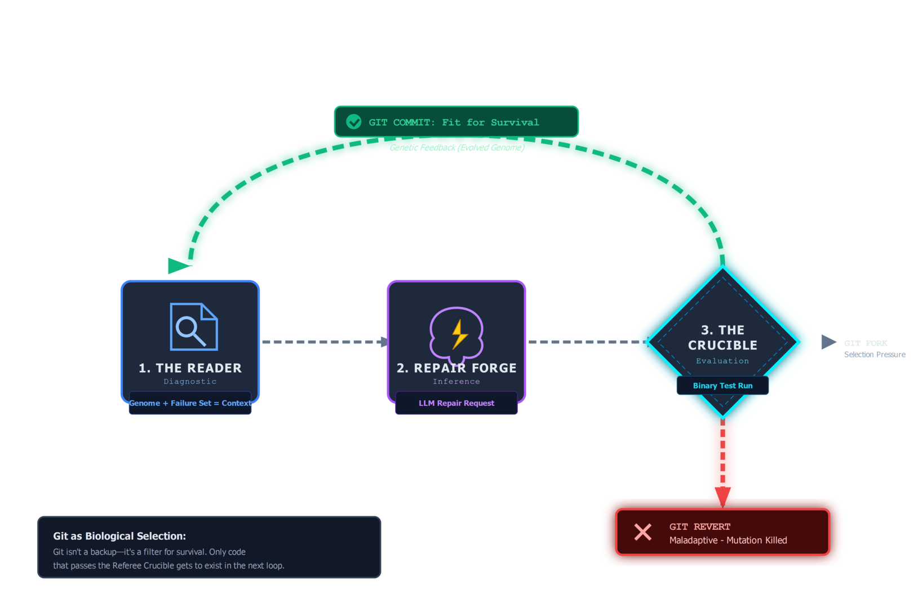
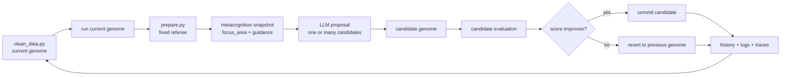

# Lesson 03 — The Orchestrator

Lesson 03 shows how one failed evaluation becomes the next mutation attempt.

The important theory is not that the loop keeps trying. It is that one round is

For the traced round-level slice with the real revert path from `.output/`, see
[execution-flow.md](../architecture/execution-flow.md) under `Lesson 03 Slice — One Loop Round`.
an atomic experiment with a fixed order: run, judge, compress the failures into
one focus area, test a candidate, then commit or revert.

## Orchestration Diagram





## Theory To Learn

### 1. One loop round is one controlled experiment

The loop changes one genome candidate against one stable judge. That makes each
round comparable to the last one. You can ask what changed, why it changed, and
whether the score movement was real.

### 2. Metacognition is compression, not magic

The metacognition snapshot does not solve the task. It compresses repeated
failures into one current focus area and one coaching hint. That keeps the next
prompt grounded in evidence instead of drifting across the whole failure list.

### 3. Commit or revert is the real selection rule

A self-improving loop is not just a proposal generator. It is a selection
system. Candidate code survives only if it improves the judged result. If not,
the loop restores the previous genome and keeps the baseline stable.

### 4. Logs turn iteration into learning

Without history, each round is just one transient chatty event. With structured
history, the learner can inspect score deltas, failures, actions, and strategy
shifts across rounds.

## What One Round Is Teaching You

When one candidate is rejected, that is still progress.

- The judge proved the change was not good enough.
- The revert path proved the loop can stay bounded after a bad idea.
- The history record preserves why the loop focused where it did.

## What Learners Follow

- start from the reset baseline instead of a drifting genome
- run one judged round against the same fixed referee
- compress the current failures into one focus area
- inspect the candidate proposal path and the selected hypothesis
- verify that commit or revert kept the loop bounded
- read the saved history and logs as the durable record of that round

## Actual Artifacts To Trace

- `.output/finance_eval_history.json`
- `.output/finance_strategy.json`
- `.output/logs/finance_round_logs.jsonl`
- `.output/traces/proposal-events.jsonl`
- `.output/traces/run-events.jsonl`

## Core Loop Steps

1. run genome
2. evaluate output
3. ask for one mutation proposal
4. re-run candidate
5. commit or revert

## Code Anchors

- [Loop entrypoint](../../loop.py#L702)
- [Artifact manifest](../../loop.py#L177)
- [Metacognition snapshot](../../loop.py#L277)
- [Exported round logs](../../loop.py#L332)
- [Structured console log appender](../../loop.py#L371)
- [Fresh-run reset](../../loop.py#L392)

The orchestration stays bounded on purpose. One genome changes. One judge scores it. One loop decides whether the candidate survives.

## Inline Coding

```python
loop.run_loop(
	max_iterations=args.max_iterations,
	use_reranker=args.rerank,
	n_candidates=args.candidates,
)
```

That call is the whole bounded recipe. The important teaching move is not more abstraction. It is understanding the order of decisions around one candidate.

## Read This In Order

1. Read [loop.py#L702](../../loop.py#L702) to see the full round order.
2. Step into [loop.py#L277](../../loop.py#L277) to see how repeated failures are compressed into one focus area.
3. Read [loop.py#L392](../../loop.py#L392) to see how every run is reset to a known baseline first.
4. Finish with [loop.py#L332](../../loop.py#L332) so you can connect one round to the saved history and logs.

## Run

### Commands

```powershell
python util.py status
python util.py verify
python util.py reset
python util.py evaluate
python util.py loop --max-iterations 1
```

### Output

```text
$ python util.py evaluate
Ran genome. Output: Y:\.sources\localm-tuts\courses\_examples\self-improving-agent\cleanloop\.output\finance_master.csv
	CleanLoop Evaluation: 13/14
	[FAIL] matches_reference_output: matched=30, missing=48, unexpected=0, output_rows=30, reference_rows=78

$ python util.py loop --max-iterations 1
[FRESH_START] Starting from the immutable starter genome for dataset finance
[CURRENT_SCORE] Score 13/14
[METACOGNITION] Focus row_reconciliation: Compare missing and unexpected rows to see which transformations are still dropping or inventing records.
[REQUESTING_LLM_PROPOSAL] Requesting mutation proposal from model microsoft/Phi-4
[HYPOTHESIS_SELECTED] Implement deterministic normalization and a mutation playbook to reconcile missing and unexpected rows.
[MUTATION_SCORE] Candidate scored 0/1
[REVERT_MUTATION] Reverted mutation with score 0/1
History saved to Y:\.sources\localm-tuts\courses\_examples\self-improving-agent\cleanloop\.output\finance_eval_history.json
```

### Explanation

1. The first four commands recreate the baseline from Lesson 02 so the round starts from a known `13/14` score.
2. `python util.py loop --max-iterations 1` runs one full controlled experiment. Validate the order: baseline run, metacognition focus, one LLM proposal, candidate re-evaluation, then explicit revert.
3. The important end-state check is not success. It is bounded control. Validate that the run writes `finance_eval_history.json`, `finance_strategy.json`, and `finance_round_logs.jsonl` and that the candidate was rejected because it failed to improve the judged score.

## Hands-On Exercises

### Exercise 1 - Export score delta into the structured logs

- Difficulty: Easy
- Files: `loop.py`
- Task: Add `score_delta` to the exported JSONL log payload so scripts and dashboards can chart improvement without recomputing it.
- Hints: Patch `_write_exported_logs()` instead of rebuilding the field in multiple consumers.
- Done when: Accepted and reverted rounds both emit log lines with an explicit delta.
- Stretch: Also export `before_score` so the change is obvious in one record.

### Exercise 2 - Track stalled rounds

- Difficulty: Medium
- Files: `loop.py`
- Task: Extend the metacognition snapshot with a `stalled_rounds` field when the same focus area repeats without a score increase.
- Hints: Look at the last few history entries plus the current `results` snapshot before you decide whether the loop is stalled.
- Done when: `.output/finance_strategy.json` reports both the focus area and how long the loop has been stuck there.
- Stretch: Change the coaching guidance after the second stalled round.

### Exercise 3 - Add an early-stop rule for no progress

- Difficulty: Hard
- Files: `loop.py`, `util.py`
- Task: Stop the loop after a small streak of zero-delta rounds and log why the run ended early.
- Hints: The cheapest signal is already in the round history. Keep the threshold local first, then expose it as a CLI option only if the behavior feels right.
- Done when: A non-improving run exits early with a clear teaching message instead of consuming every remaining round.
- Stretch: Add a `--patience` flag to the loop command.

### Exercise 4 - Trace the winning LLM path

- Difficulty: Hard
- Files: `loop.py`, `tracing.py`
- Task: Record the selected attempt label and total token usage as a proposal event when the loop commits a candidate.
- Hints: The LLM diagnostics already carry `selected_attempt`, `prompt_tokens`, and `total_tokens`.
- Done when: `.output/traces/proposal-events.jsonl` shows which attempt won and what it cost.
- Stretch: Include the requested candidate count when reranking is enabled.
