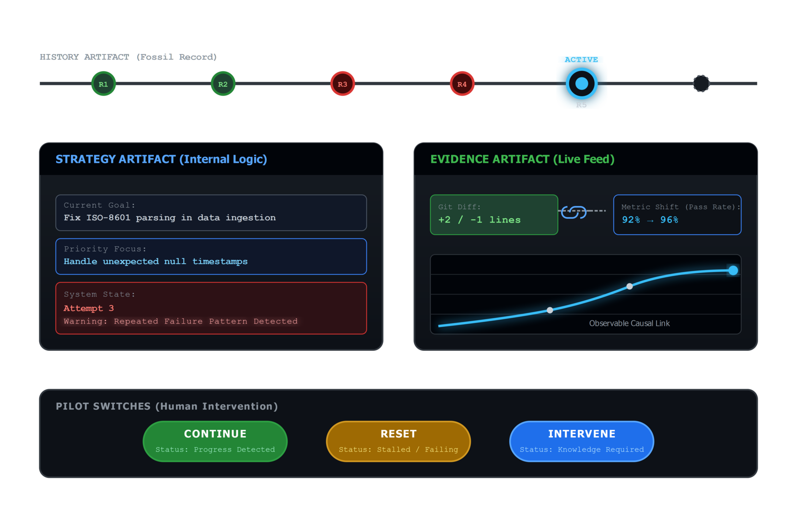
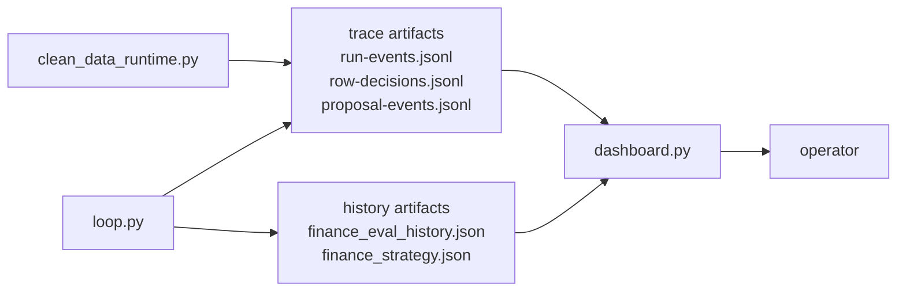

# Lesson 04 — Observability and the Feedback Signal

Lesson 04 explains how CleanLoop turns hidden state into visible artifacts.

The example does not rely on intuition or console noise. It writes history,

For the artifact-focused slice that maps runtime events to the stored files, see
[execution-flow.md](../architecture/execution-flow.md) under `Lesson 04 Slice — Artifact Feedback`.
strategy, and trace artifacts so the learner can inspect not only whether a run
improved, but also why specific rows and proposals took the paths they did.

## Feedback Diagram





## Theory To Learn

### 1. Observability is external memory

The loop and runtime make many small decisions. If those decisions stay only in
process memory, the learner cannot audit them after the run ends. Structured
artifacts turn ephemeral control flow into something durable and inspectable.

### 2. Score and trace answer different questions

The score answers, "Did this run improve?" The trace answers, "What actually
happened to this row or proposal?" You need both. Score without trace is blind.
Trace without score is noise.

### 3. Row-level traces make the pipeline legible

A row decision record shows where a record was scanned, normalized, repaired,
or rejected. That means the learner can follow one invoice through the pipeline
instead of guessing from the final CSV alone.

### 4. Missing artifacts are also feedback

If history or traces are absent, that tells you the run never reached the stage
you expected. Observability is useful even when the answer is, "this part never
executed."

## What The Feedback Signal Is Teaching You

When two runs have the same score, they can still teach different lessons.

- One run may be stuck in the same failure mode again.
- One run may fix a row type but regress elsewhere.
- One trace file can reveal whether the pipeline is deterministic, repairable,
  or still routing rows into failure.

## What To Inspect

- `.output/finance_eval_history.json`
- `.output/finance_strategy.json`
- `.output/traces/run-events.jsonl`
- `.output/traces/row-decisions.jsonl`

## Code Anchors

- [Dashboard history loader](../../dashboard.py#L58)
- [Shared history store](../../history_store.py#L10)
- [Trace recorder](../../tracing.py#L19)

## Feedback Signal

The learner should read both the referee score and the trace records. The score says whether the run improved. The trace says why one row took one path.

## Inline Coding

```python
trace.record_row_decision(
	stage="mutation-playbook",
	decision="mutation_fixed",
	invoice_id=record["invoice_id"],
	source_file=record["source_file"],
)
```

That trace call is what turns one hidden row decision into a durable teaching artifact.

## Run

### Commands

```powershell
python util.py status
python util.py verify
python util.py reset
python util.py loop --max-iterations 1
python util.py dashboard
```

### Output

```text
$ python util.py loop --max-iterations 1
[FRESH_START] Starting from the immutable starter genome for dataset finance
[CURRENT_SCORE] Score 13/14
[METACOGNITION] Focus row_reconciliation: Compare missing and unexpected rows to see which transformations are still dropping or inventing records.
[REVERT_MUTATION] Reverted mutation with score 0/1

History saved to Y:\.sources\localm-tuts\courses\_examples\self-improving-agent\cleanloop\.output\finance_eval_history.json

$ python util.py dashboard
	You can now view your Streamlit app in your browser.
	Local URL: http://localhost:8501
```

### Explanation

1. `python util.py loop --max-iterations 1` is the artifact-producing step for this lesson. Validate that it finishes with `History saved to ...finance_eval_history.json` because that file feeds the dashboard and history views.
2. `python util.py dashboard` does not mutate the genome. It launches the observability surface. Validate that Streamlit prints a local URL, then inspect the history and trace tabs in the browser.
3. If the dashboard opens but tables are empty, the loop likely did not write the expected artifacts yet. That absence is itself the feedback signal Lesson 04 is teaching.

## Hands-On Exercises

### Exercise 1 - Surface focus area in the dashboard

- Difficulty: Easy
- Files: `dashboard.py`, `loop.py`
- Task: Add `focus_area` and `repeated_failure_count` to the main dashboard history rows so each round explains what it was trying to fix.
- Hints: Normalize `history_entry["metacognition"]` the same way the dashboard already normalizes LLM diagnostics.
- Done when: The history table shows strategy context, not only score movement.
- Stretch: Add a simple severity label when the repeated count is high.

### Exercise 2 - Build a decision breakdown table

- Difficulty: Medium
- Files: `dashboard.py`, `.output/traces/row-decisions.jsonl`
- Task: Parse the row-decision trace file and count rows by `stage` and `decision`.
- Hints: A small `pandas` group-by is enough. Keep the first version read-only and avoid changing the trace format.
- Done when: The dashboard can show how many rows were deterministic, repaired, and unresolved.
- Stretch: Add a filter for `source_file`.

### Exercise 3 - Add invoice drill-down

- Difficulty: Medium
- Files: `dashboard.py`
- Task: Let the operator enter one `invoice_id` and inspect every trace row for that record.
- Hints: Start from `INV-404` or `INV-112` because those are already called out in the docs.
- Done when: One invoice can be followed from input scan to final decision inside the dashboard.
- Stretch: Show the last trace event as a short summary card.

### Exercise 4 - Warn on missing artifacts

- Difficulty: Medium
- Files: `dashboard.py`, `history_store.py`
- Task: Show a visible warning when history, strategy, or trace artifacts are missing on a fresh repo.
- Hints: Reuse existing path helpers and keep the warning actionable by naming the next command to run.
- Done when: The dashboard still feels usable even before the learner has generated outputs.
- Stretch: Add one compact checklist of the commands that produce each missing artifact.
