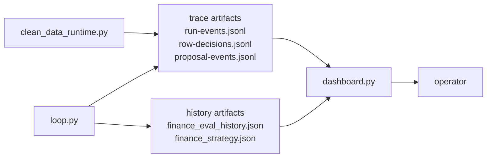

# Lesson 04 — Observability and the Feedback Signal

Lesson 04 shows how CleanLoop turns one run into durable evidence.

The loop does not only print a score. It writes history, strategy, and trace
artifacts so you can inspect what happened, why it happened, and which row or
proposal caused the next decision.

For the artifact path that maps runtime events to files on disk, see
[execution-flow.md](../architecture/execution-flow.md). For the operator view
that reads those files back, continue to [Lesson 08](./08-dashboard-human-oversight.md).

## Feedback Diagram



```mermaid
flowchart LR
		runtime[clean_data_runtime.py]
		loop[loop.py]
		traces[trace artifacts\nrun-events.jsonl\nrow-decisions.jsonl\nproposal-events.jsonl]
		history[history artifacts\nfinance_eval_history.json\nfinance_strategy.json]
		dashboard[dashboard.py]
		operator[operator]

		runtime --> traces
		loop --> traces
		loop --> history
		traces --> dashboard
		history --> dashboard
		dashboard --> operator
```

## What This Lesson Teaches

### 1. Observability is external memory

The loop makes many small decisions. If those decisions stay only in process
memory, you cannot audit them after the run ends. Artifacts make that state
durable.

### 2. The score and the trace answer different questions

The score answers, "Did this run improve?" The trace answers, "What happened to
this row or proposal?" You need both.

### 3. Row-level traces make the pipeline legible

`row-decisions.jsonl` shows where one invoice was scanned, normalized,
flagged for mutation, fixed, or left unresolved. That is much more useful than
guessing from the final CSV alone.

### 4. Missing artifacts are also feedback

If a trace or history file is missing, that means the run never reached that
stage. "This did not execute" is still useful information.

## What To Inspect

- `.output/finance_eval_history.json`
- `.output/finance_strategy.json`
- `.output/traces/run-events.jsonl`
- `.output/traces/row-decisions.jsonl`
- `.output/traces/proposal-events.jsonl`
- `.output/logs/finance_round_logs.jsonl`

## Code Anchors

- [Dashboard history loader](../../dashboard.py#L66)
- [Dashboard launcher](../../util.py#L811)
- [Trace recorder](../../tracing.py#L325)
- [Run-event writer](../../tracing.py#L325)
- [Row-decision writer](../../tracing.py#L333)
- [Proposal-event writer](../../tracing.py#L356)
- [Loop entrypoint](../../loop.py#L912)
- [Mutation summary printer](../../util.py#L661)
- [Immutable judge entrypoint](../../prepare.py#L1)

## The New Demo Flow

The easiest Lesson 04 demo now uses the normal commands.

1. Generate adversarial inputs.
2. Run `evaluate` or `loop`.
3. Read the `Mutation Summary` from the CLI.
4. Open `observe` or `dashboard` to inspect the artifacts behind that summary.

That matters because the learner sees the same signals in both places. The CLI
gives the short answer. The files and dashboard give the audit trail.

## Judge Evaluation Across Adversarial Levels

The judge lives in [prepare.py](../../prepare.py). It is fixed and immutable.
`challenge` changes the inputs. `evaluate` reruns the current genome against the
active input set. That means you evaluate the judge by widening the arena, not
by changing the judge itself.

One important detail: adversarial files stay active once they exist in
`.input/`. `python util.py reset` restores the starter genome, but it does not
remove those challenge files. If you want a clean, isolated judge pass for one
level, clear the old adversarial files first.

### Difficulty Ladder

| Level | What It Adds                                                           | What You Should Watch                                                |
| ----- | ---------------------------------------------------------------------- | -------------------------------------------------------------------- |
| 1     | currency symbols, one blank amount, clean ISO dates                    | basic numeric coercion and no-NaN checks                             |
| 2     | mixed date formats, whitespace, currency codes, adjusted amounts       | parseable dates and canonical normalization                          |
| 3     | FREE TRIAL, COMPLIMENTARY, disputed rows, resolution fields            | rows that need mutation playbook routing                             |
| 4     | negative reversals, FX HOLD, blank cancelled rows, quoted commas       | row classification under harder finance edge cases                   |
| 5     | null-like tokens, scientific notation, embedded notes, unresolved rows | whether the judge keeps true failures visible instead of hiding them |

When you include level 3 or higher, CleanLoop also adds a deterministic demo
CSV. That gives you stable rows such as `INV-DEMO-001` and `INV-DEMO-006` for
the observability walkthrough.

### Isolated Judge Pass By Level

Run these from inside `cleanloop/`.

```powershell
Remove-Item .input\adversarial_d*.csv -ErrorAction SilentlyContinue
Remove-Item .output\challenge_manifest.json -ErrorAction SilentlyContinue
python util.py challenge --levels 1
python util.py status
python util.py evaluate
```

Use that pattern again for `--levels 2`, `--levels 3`, or `--levels 5`.

What to look for:

- `status` shows which adversarial files are active.
- `evaluate` shows the immutable referee result.
- `Mutation Summary` shows whether rows only need mutation, were fixed, or are still unresolved.

### Mixed-Level Arena Pass

This is the best Lesson 04 demo because it produces both judge output and rich
trace artifacts.

```powershell
Remove-Item .input\adversarial_d*.csv -ErrorAction SilentlyContinue
Remove-Item .output\challenge_manifest.json -ErrorAction SilentlyContinue
python util.py challenge --levels 1 2 3
python util.py evaluate
python util.py observe
python util.py dashboard
```

What this teaches:

- `challenge --levels 1 2 3` widens the arena across easy, moderate, and hard cases.
- `evaluate` tells you how the current genome scores against that wider arena.
- `observe` and `dashboard` let you verify where the CLI summary came from.

### Compare Starter Genome vs Shipped Mutation Runtime

If you want to evaluate the judge with the same adversarial set but with two
different runtimes, compare these commands back to back:

```powershell
python util.py evaluate
python util.py evaluate --use-shipped-mutation-runtime
```

Read them this way:

- The first command shows how the current mutable genome behaves.
- The second shows how the shipped mutation runtime repairs known cases.
- The judge stays the same in both runs. Only the runtime changes.

That makes it easy to explain whether the failure is in the judge, in the
starter genome, or in the missing mutation logic.

## Recommended Demo Sequence

Use this when you want a clean lesson recording.

```powershell
python util.py status
Remove-Item .input\adversarial_d*.csv -ErrorAction SilentlyContinue
Remove-Item .output\challenge_manifest.json -ErrorAction SilentlyContinue
python util.py challenge --levels 1 2 3
python util.py evaluate
python util.py loop --max-iterations 1
python util.py observe
python util.py dashboard
```

Why this sequence works:

1. `status` shows the learner the current arena before anything changes.
2. `challenge --levels 1 2 3` adds a visible mix of difficulty and the curated level-3 demo rows.
3. `evaluate` prints the referee result and the `Mutation Summary`.
4. `loop --max-iterations 1` creates round history, strategy, and proposal artifacts.
5. `observe` and `dashboard` read those same artifacts back.

## Example Output Traits

Your exact counts may change because generated adversarial files vary, but the
shape of the output should now look like this:

```text
$ python util.py evaluate
Ran genome. Output: ...\.output\finance_master.csv

==================================================
	CleanLoop Evaluation: 13/14
==================================================

	FAILED:
		[FAIL] matches_reference_output: ...

Mutation Summary:
	Fixed rows: 0
	Still needing mutation: <some count>
	- INV-105 from finance_invoices.csv -> requires_mutation_playbook
	Still unresolved after mutation: <some count>
```

If you run `python util.py evaluate --use-shipped-mutation-runtime`, the same
summary should usually show some `Fixed rows` from the demo playbook file.

## Inline Coding

```python
trace.record_row_decision(
		stage="mutation-playbook",
		decision="mutation_fixed",
		invoice_id=record["invoice_id"],
		source_file=record["source_file"],
)
```

That one trace call turns a hidden row repair into a durable teaching artifact.

## Read This In Order

1. Read [tracing.py#L325](../../tracing.py#L325) to see the recorder surface.
2. Read [tracing.py#L333](../../tracing.py#L333) because row decisions are the key Lesson 04 artifact.
3. Read [prepare.py#L1](../../prepare.py#L1) to understand the fixed judge boundary.
4. Read [util.py#L661](../../util.py#L661) to see how the CLI prints the mutation summary.
5. Finish with [dashboard.py#L66](../../dashboard.py#L66) and [util.py#L562](../../util.py#L562) so you know how the read side works.

## Hands-On Exercises

### Exercise 1 - Surface focus area in the dashboard

- Difficulty: Easy
- Files: `dashboard.py`, `loop.py`
- Task: Add `focus_area` and `repeated_failure_count` to the main dashboard history rows.
- Hints: Normalize `history_entry["metacognition"]` the same way the dashboard already normalizes LLM diagnostics.
- Done when: The history table explains what each round was trying to fix.
- Stretch: Add a simple severity label when the repeated count is high.

### Exercise 2 - Build a decision breakdown table

- Difficulty: Medium
- Files: `dashboard.py`, `.output/traces/row-decisions.jsonl`
- Task: Parse the row-decision trace file and count rows by `stage` and `decision`.
- Hints: A small `pandas` group-by is enough. Keep the first version read-only.
- Done when: The dashboard shows how many rows were deterministic, repaired, and unresolved.
- Stretch: Add a filter for `source_file`.

### Exercise 3 - Add invoice drill-down

- Difficulty: Medium
- Files: `dashboard.py`
- Task: Let the operator enter one `invoice_id` and inspect every trace row for that record.
- Hints: Start from `INV-DEMO-001` or `INV-DEMO-006` because those rows are stable in the level-3 demo path.
- Done when: One invoice can be followed from input scan to final decision inside the dashboard.
- Stretch: Show the last trace event as a short summary card.

### Exercise 4 - Warn on missing artifacts

- Difficulty: Medium
- Files: `dashboard.py`, `history_store.py`
- Task: Show a visible warning when history, strategy, or trace artifacts are missing.
- Hints: Reuse existing path helpers and keep the warning actionable by naming the next command to run.
- Done when: The dashboard still feels usable even before the learner has generated outputs.
- Stretch: Add one compact checklist of the commands that produce each missing artifact.
