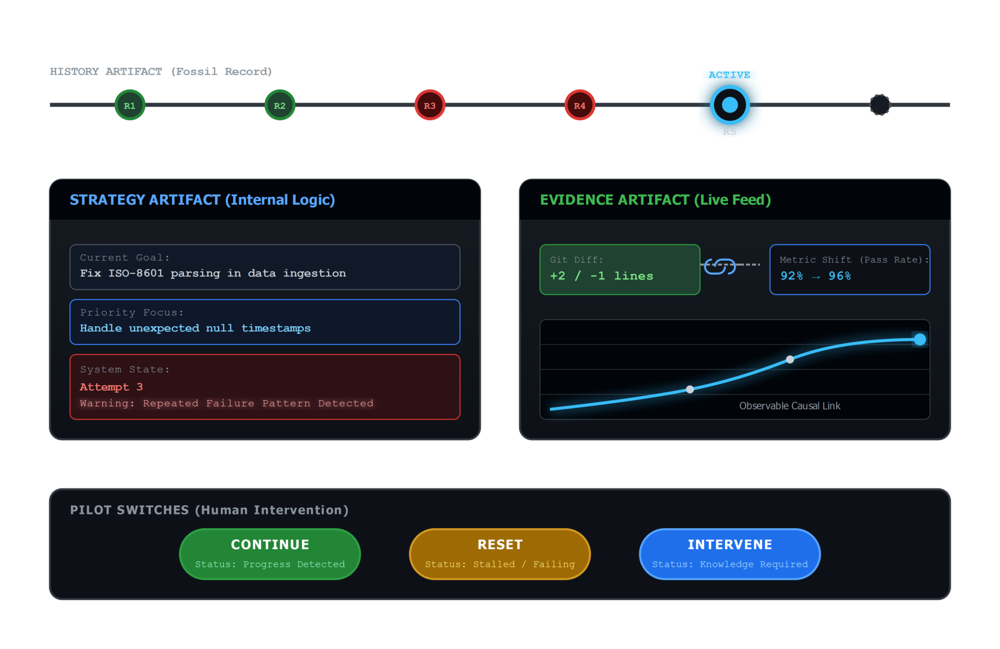
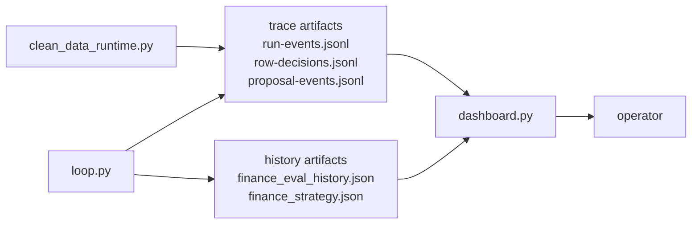

# Lesson 04 — Observability and the Feedback Signal

Lesson 04 shows how CleanLoop turns one run into durable evidence.

The loop does not only print a score. It writes history, strategy, round logs,
and trace artifacts so you can inspect what happened, why it happened, and
which row or proposal caused the next decision.

For the artifact path that maps runtime events to files on disk, see
[execution-flow.md](../architecture/execution-flow.md). For the operator view
that reads those files back, continue to
[Lesson 08](./08-dashboard-human-oversight.md).

If you want to widen the arena with adversarial levels or compare the judge
against harder data, that belongs in
[Lesson 05](./05-judge-self-challenging.md).

## Feedback Diagram




```mermaid
flowchart LR
		runtime[clean_data_runtime.py]
		loop[loop.py]
		traces[trace artifacts\nrun-events.jsonl\nrow-decisions.jsonl\nproposal-events.jsonl]
		history[history artifacts\nfinance_eval_history.json\nfinance_strategy.json]
		dashboard[dashboard.py]
		operator[operator]

		runtime --> traces
		loop --> traces
		loop --> history
		traces --> dashboard
		history --> dashboard
		dashboard --> operator
```

## What This Lesson Teaches

### 1. Observability is external memory

The loop makes many small decisions. If those decisions stay only in process
memory, you cannot audit them after the run ends. Artifacts make that state
durable.

### 2. The score and the trace answer different questions

The score answers, "Did this run improve?" The trace answers, "What happened to
this row or proposal?" You need both.

### 3. Row-level traces make the pipeline legible

`row-decisions.jsonl` shows where one invoice was scanned, normalized,
flagged for mutation, fixed, or left unresolved. That is much more useful than
guessing from the final CSV alone.

### 4. Missing artifacts are also feedback

If a trace or history file is missing, that means the run never reached that
stage. "This did not execute" is still useful information.

## What To Inspect

- `.output/finance_eval_history.json`
- `.output/finance_strategy.json`
- `.output/traces/run-events.jsonl`
- `.output/traces/row-decisions.jsonl`
- `.output/traces/proposal-events.jsonl`
- `.output/logs/finance_round_logs.jsonl`

## Code Anchors

- [Dashboard history loader](../../dashboard.py#L66)
- [Status command](../../util.py#L510)
- [Observe command](../../util.py#L562)
- [Mutation summary printer](../../util.py#L661)
- [Evaluate command](../../util.py#L719)
- [Loop command](../../util.py#L755)
- [Dashboard launcher](../../util.py#L811)
- [Run-event writer](../../tracing.py#L325)
- [Row-decision writer](../../tracing.py#L333)
- [Proposal-event writer](../../tracing.py#L356)

## What The Demo Should Prove

The Lesson 04 demo should prove one thing: the same run can be inspected in
more than one way.

- The CLI gives the short summary.
- The history and trace files preserve the full audit trail.
- `observe` and `dashboard` read those same artifacts back for the operator.

That is the feedback signal. The learner should be able to move from one line
of output to the exact file that explains it.

## Artifact-First Demo Flow

Run these commands from inside `cleanloop/`.

```powershell
python util.py status
python util.py verify
python util.py evaluate
python util.py loop --max-iterations 1
python util.py observe
python util.py dashboard
```

Why this sequence works:

1. `status` tells you what inputs and outputs are present before the run.
2. `evaluate` refreshes the output CSV and prints the current referee result.
3. `loop --max-iterations 1` creates the richest artifact set because it adds
   history, strategy, round logs, and proposal traces.
4. `observe` gives the read-only artifact summary in the terminal.
5. `dashboard` reads the same files in a browser surface.

If active adversarial files already exist in `.input/`, the CLI may also print
`Mutation Summary`. That is still useful for Lesson 04 because it is a readout
over row-decision traces. Generating or comparing adversarial levels belongs in
Lesson 05.

## Example Output Traits

Your exact scores and counts may vary, but the output shape should look like
this:

```text
$ python util.py loop --max-iterations 1
[FRESH_START] Starting from the immutable starter genome for dataset finance
[CURRENT_SCORE] Score 13/14
[FAILED_ASSERTION] matches_reference_output: ...
[REQUESTING_LLM_PROPOSAL] Requesting mutation proposal from model ...
...
History saved to ...\.output\finance_eval_history.json

Mutation Summary:
	Fixed rows: ...
	Still needing mutation: ...
	Still unresolved after mutation: ...
```

What matters in Lesson 04 is not the exact score. What matters is that the run
leaves behind artifacts you can inspect and that the CLI summary lines map back
to those artifacts.

## How To Read The Artifacts

Use this reading order after one loop run:

1. Open `.output/finance_eval_history.json` to see the round summary.
2. Open `.output/finance_strategy.json` to see what the loop thought mattered.
3. Open `.output/traces/row-decisions.jsonl` to follow one invoice through the
   pipeline.
4. Open `.output/traces/proposal-events.jsonl` to see the proposal side of the
   same round.
5. Use `python util.py observe` or `python util.py dashboard` to confirm those
   files are what the read side is using.

## Inline Coding

```python
trace.record_row_decision(
		stage="mutation-playbook",
		decision="mutation_fixed",
		invoice_id=record["invoice_id"],
		source_file=record["source_file"],
)
```

That one trace call turns a hidden row repair into a durable teaching artifact.

## Read This In Order

1. Read [tracing.py#L325](../../tracing.py#L325) to see the recorder surface.
2. Read [tracing.py#L333](../../tracing.py#L333) because row decisions are the
   key Lesson 04 artifact.
3. Read [util.py#L661](../../util.py#L661) to see how the CLI prints the short
   mutation summary.
4. Read [util.py#L562](../../util.py#L562) to see how the terminal read side
   summarizes artifact health.
5. Finish with [dashboard.py#L66](../../dashboard.py#L66) and
   [util.py#L811](../../util.py#L811) so you know how the browser read side
   opens and loads those same files.

## Hands-On Exercises

### Exercise 1 - Surface focus area in the dashboard

- Difficulty: Easy
- Files: `dashboard.py`, `loop.py`
- Task: Add `focus_area` and `repeated_failure_count` to the main dashboard
  history rows.
- Hints: Normalize `history_entry["metacognition"]` the same way the dashboard
  already normalizes LLM diagnostics.
- Done when: The history table explains what each round was trying to fix.
- Stretch: Add a simple severity label when the repeated count is high.

### Exercise 2 - Build a decision breakdown table

- Difficulty: Medium
- Files: `dashboard.py`, `.output/traces/row-decisions.jsonl`
- Task: Parse the row-decision trace file and count rows by `stage` and
  `decision`.
- Hints: A small `pandas` group-by is enough. Keep the first version read-only.
- Done when: The dashboard shows how many rows were deterministic, repaired,
  and unresolved.
- Stretch: Add a filter for `source_file`.

### Exercise 3 - Add invoice drill-down

- Difficulty: Medium
- Files: `dashboard.py`
- Task: Let the operator enter one `invoice_id` and inspect every trace row for
  that record.
- Hints: Start from one invoice id printed in `Mutation Summary` or one row you
  notice in `row-decisions.jsonl`.
- Done when: One invoice can be followed from input scan to final decision
  inside the dashboard.
- Stretch: Show the last trace event as a short summary card.

### Exercise 4 - Warn on missing artifacts

- Difficulty: Medium
- Files: `dashboard.py`, `history_store.py`
- Task: Show a visible warning when history, strategy, or trace artifacts are
  missing.
- Hints: Reuse existing path helpers and keep the warning actionable by naming
  the next command to run.
- Done when: The dashboard still feels usable even before the learner has
  generated outputs.
- Stretch: Add one compact checklist of the commands that produce each missing
  artifact.
