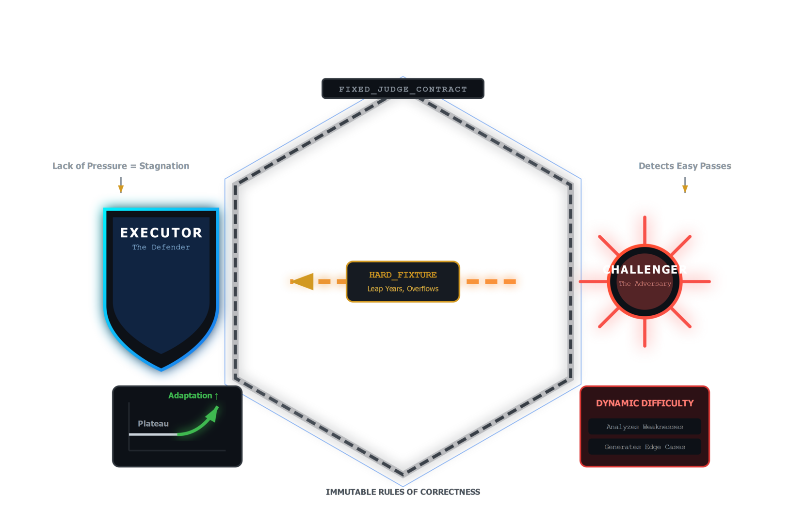
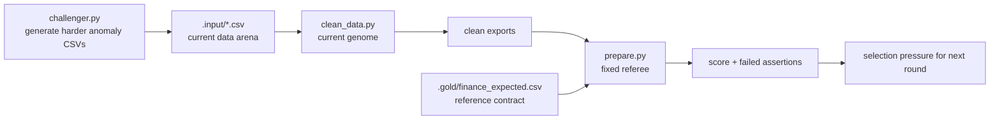

# Lesson 05 — The Judge and Self-Challenging Loops

Lesson 05 explains why the fixed judge and the challenger belong together.

These two parts do opposite jobs on purpose. The judge stabilizes selection
pressure. The challenger raises difficulty. Together they create a loop that
can improve against harder data without letting the model redefine success.

## Pressure Diagram





## Theory To Learn

### 1. The judge and challenger are not the same tool

The judge decides whether the current output satisfies the contract. The
challenger creates new messy inputs that target known weaknesses. If one tool
did both jobs, it would be too easy to confuse "harder data" with "easier
grading."

### 2. Fixed selection pressure is what makes improvement meaningful

`prepare.py` and the reference output stay fixed while the genome changes. That
means score improvements still mean something even after the data becomes more
adversarial.

### 3. Good challenge data is targeted, not random

The challenger is useful when it creates realistic anomalies that stress the
current repair rules. Random corruption is easy to generate, but it teaches far
less than a precise finance-flavored failure mode.

For the architecture slice that separates fixed judging from harder input
generation, see [execution-flow.md](../architecture/execution-flow.md) under
`Lesson 05 Slice — Fixed Judge And Harder Arena`.

### 4. Self-challenging creates curriculum pressure

As the genome gets better, easy fixtures stop teaching much. Harder anomaly
sets restore learning pressure without changing the success contract.

## What This Pairing Is Teaching You

When challenge inputs get harder but the judge stays fixed, the loop reveals two
separate facts.

- How robust the genome already is.
- Which failure modes the current playbook still misses.
- Whether score changes reflect real capability rather than looser grading.

## What Learners Follow

- re-run the fixed judge before making the arena harder
- separate judge logic from challenger logic instead of treating both as one surface
- inspect which assertion fails first on the harder arena
- remove temporary adversarial files when you want to return to the shipped fixture
- compare harder input pressure against the same reference contract

## Actual Files To Trace

- `.gold/finance_expected.csv`
- `.input/finance_*.csv`
- `.input/adversarial_d1_01.csv`
- `.output/finance_master.csv`
- `.output/finance_mutation_failures.csv`

## Judge Rule

The model does not grade itself. `prepare.py` and the reference export stay fixed.

## Challenger Rule

The challenger generates harder anomaly inputs when the loop becomes too comfortable.

## Code Anchors

- [Fixed referee](../../prepare.py#L327)
- [Reference metrics](../../prepare.py#L212)
- [Binary checks registry](../../prepare.py#L239)
- [Difficulty ladder](../../challenger.py#L69)
- [Challenger generator](../../challenger.py#L106)
- [Challenger CLI](../../challenger.py#L137)

## Inline Coding

```python
results = prepare.evaluate(output)
```

That line matters because the loop never grades itself. The scorer stays fixed, even when the genome changes.

## Read This In Order

1. Read [prepare.py#L327](../../prepare.py#L327) to see the fixed evaluation entrypoint.
2. Step into [prepare.py#L239](../../prepare.py#L239) so you can see the exact assertions the genome cannot move.
3. Read [challenger.py#L69](../../challenger.py#L69) to understand the difficulty ladder before you generate new files.
4. Finish with [challenger.py#L106](../../challenger.py#L106) and [challenger.py#L137](../../challenger.py#L137) so you can connect the prompt surface to the generated CSVs.

## Run

### Commands

```powershell
python util.py status
python util.py verify
python util.py reset
python util.py evaluate
python util.py challenge --difficulty 1 --count 1
Remove-Item ".input\adversarial_d1_01.csv"
```

### Output

```text
$ python util.py evaluate
Ran genome. Output: Y:\.sources\localm-tuts\courses\_examples\self-improving-agent\cleanloop\.output\finance_master.csv
	CleanLoop Evaluation: 13/14
	[FAIL] matches_reference_output: matched=30, missing=48, unexpected=0, output_rows=30, reference_rows=78

$ python util.py challenge --difficulty 1 --count 1
Generating 1 adversarial CSVs at difficulty 1
C:\Program Files\Python311\Lib\asyncio\events.py:84: UserWarning: Resolved model mismatch: microsoft/Phi-4 != phi4. Model mapping in autogen_ext.models.openai may be incorrect. Set the model to phi4 to enhance token/cost estimation and suppress this warning.
	Created: adversarial_d1_01.csv
Done. Run `python util.py loop` to test the genome against new data.

$ Remove-Item ".input\adversarial_d1_01.csv"
```

### Explanation

1. Re-run the baseline judge first. Validate that the starter genome still scores `13/14` against the unchanged referee before you make the arena harder.
2. `python util.py challenge --difficulty 1 --count 1` exercises the challenger without changing the judge. Validate that it creates `adversarial_d1_01.csv` and notice that the output recommends the next step: run the loop against the harder arena.
3. The model-mismatch warning is diagnostic noise from client metadata, not a failed challenge generation. The useful signal is the created CSV.
4. Remove the generated adversarial file before Lesson 06 if you want the reranker transcript to stay on the original shipped finance fixture and keep the reference comparison stable.

## Hands-On Exercises

### Exercise 1 - Add a judge rule for failure quality

- Difficulty: Medium
- Files: `prepare.py`
- Task: Add one assertion that fails when a mutation-failure row is missing `anomaly_reason` or `mutation_hint`.
- Hints: Keep the check beside the other binary judge rules so the contract stays readable.
- Done when: Blank failure diagnostics make the fixed judge fail.
- Stretch: Also reject placeholder hints such as `unknown` or `todo`.

### Exercise 2 - Add a mutation coverage metric

- Difficulty: Medium
- Files: `prepare.py`
- Task: Compute how many rows ended in deterministic success, mutation success, and mutation failure, then expose that split in `results["metrics"]`.
- Hints: The judge already loads the optional success and failure exports. Reuse those counts instead of rescanning the inputs.
- Done when: The evaluation result includes a stable mutation-coverage view that later tools can print.
- Stretch: Surface the same numbers in the dashboard.

### Exercise 3 - Harden one challenger difficulty

- Difficulty: Hard
- Files: `challenger.py`
- Task: Strengthen one difficulty prompt so it produces finance-specific anomalies that the current playbook does not solve yet.
- Hints: Parentheses, blank cancellations, and mixed currency tokens are better targets than random CSV corruption.
- Done when: The challenger produces a new failure mode that is still understandable and debuggable.
- Stretch: Add a short note on which assertion you expect to fail first.

### Exercise 4 - Improve the genome without moving the goalposts

- Difficulty: Hard
- Files: `prepare.py`, `clean_data.py`, `.input/*.csv`
- Task: Run one challenge set, capture the baseline failure list, then improve only the genome-side handling against the same judge.
- Hints: Treat `prepare.py` as frozen once you record the baseline. The whole point is to keep selection pressure fixed.
- Done when: The score improves against the exact same judge contract.
- Stretch: Save a before-and-after note with the failing assertions that disappeared.
