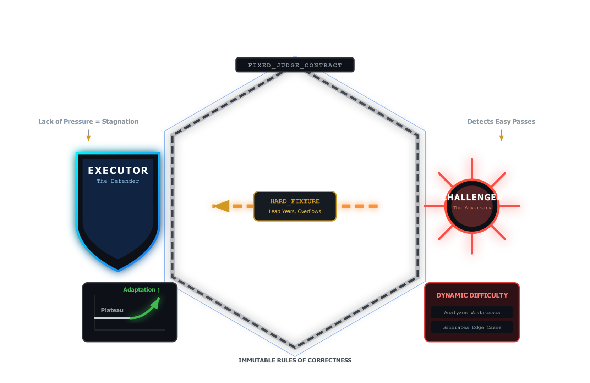
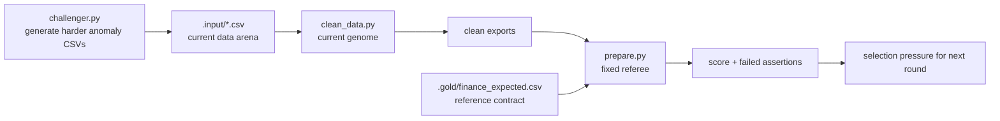

# Lesson 05 — The Judge and Self-Challenging Loops

Lesson 05 explains why the fixed judge and the challenger belong together.

These two parts do opposite jobs on purpose. The judge stabilizes selection
pressure. The challenger raises difficulty. Together they create a loop that
can improve against harder data without letting the model redefine success.

## Pressure Diagram




```mermaid
flowchart LR
	challenger[challenger.py\ngenerate harder anomaly CSVs]
	arena[.input/*.csv\ncurrent data arena]
	genome[clean_data.py\ncurrent genome]
	outputs[clean exports]
	judge[prepare.py\nfixed referee]
	gold[.gold/finance_expected.csv\nreference contract]
	score[score + failed assertions]
	next[selection pressure for next round]

	challenger --> arena
	arena --> genome --> outputs --> judge
	gold --> judge
	judge --> score --> next
```

## Theory To Learn

### 1. The judge and challenger are not the same tool

The judge decides whether the current output satisfies the contract. The
challenger creates new messy inputs that target known weaknesses. If one tool
did both jobs, it would be too easy to confuse "harder data" with "easier
grading."

### 2. Fixed selection pressure is what makes improvement meaningful

`prepare.py` and the reference output stay fixed while the genome changes. That
means score improvements still mean something even after the data becomes more
adversarial.

### 3. Good challenge data is targeted, not random

The challenger is useful when it creates realistic anomalies that stress the
current repair rules. Random corruption is easy to generate, but it teaches far
less than a precise finance-flavored failure mode.

For the architecture slice that separates fixed judging from harder input
generation, see [execution-flow.md](../architecture/execution-flow.md) under
`Lesson 05 Slice — Fixed Judge And Harder Arena`.

### 4. Self-challenging creates curriculum pressure

As the genome gets better, easy fixtures stop teaching much. Harder anomaly
sets restore learning pressure without changing the success contract.

## What This Pairing Is Teaching You

When challenge inputs get harder but the judge stays fixed, the loop reveals two
separate facts.

- How robust the genome already is.
- Which failure modes the current playbook still misses.
- Whether score changes reflect real capability rather than looser grading.

## What Learners Follow

- re-run the fixed judge before making the arena harder
- separate judge logic from challenger logic instead of treating both as one surface
- inspect which assertion fails first on the harder arena
- remove old adversarial files when you want one isolated judge pass
- compare harder input pressure against the same reference contract

## Actual Files To Trace

- `.gold/finance_expected.csv`
- `.input/finance_*.csv`
- `.input/adversarial_d*.csv`
- `.input/adversarial_d3_demo_playbook.csv`
- `.output/challenge_manifest.json`
- `.output/finance_master.csv`
- `.output/finance_mutation_success.csv`
- `.output/finance_mutation_failures.csv`

## Judge Rule

The model does not grade itself. `prepare.py` and the reference export stay fixed.

## Challenger Rule

The challenger generates harder anomaly inputs when the loop becomes too comfortable.

## Code Anchors

- [Fixed referee entrypoint](../../prepare.py#L326)
- [Reference metrics](../../prepare.py#L211)
- [Binary checks registry](../../prepare.py#L238)
- [Difficulty ladder](../../challenger.py#L90)
- [Challenge CSV validator](../../challenger.py#L153)
- [Challenger generator](../../challenger.py#L124)
- [Auto demo inclusion rule](../../challenger.py#L261)
- [Challenger CLI](../../challenger.py#L316)
- [Status command](../../util.py#L510)
- [Evaluate command](../../util.py#L719)

## Judge Evaluation Across Adversarial Levels

The judge lives in [prepare.py](../../prepare.py#L326). It is fixed and
immutable. `challenge` changes the inputs. `evaluate` reruns the current genome
against the active input set. That means you evaluate the judge by widening the
arena, not by changing the judge itself.

One important detail: adversarial files stay active once they exist in
`.input/`. `python util.py reset` restores the starter genome, but it does not
remove those challenge files. If you want a clean, isolated judge pass for one
level, clear the old adversarial files first.

### Difficulty Ladder

| Level | What It Adds                                                           | What You Should Watch                                                |
| ----- | ---------------------------------------------------------------------- | -------------------------------------------------------------------- |
| 1     | currency symbols, one blank amount, clean ISO dates                    | basic numeric coercion and no-NaN checks                             |
| 2     | mixed date formats, whitespace, currency codes, adjusted amounts       | parseable dates and canonical normalization                          |
| 3     | FREE TRIAL, COMPLIMENTARY, disputed rows, resolution fields            | rows that need mutation playbook routing                             |
| 4     | negative reversals, FX HOLD, blank cancelled rows, quoted commas       | row classification under harder finance edge cases                   |
| 5     | null-like tokens, scientific notation, embedded notes, unresolved rows | whether the judge keeps true failures visible instead of hiding them |

When you include level 3 or higher, CleanLoop also adds a deterministic demo
CSV. That gives you stable rows such as `INV-DEMO-001` and `INV-DEMO-006` for
repeatable judge and runtime comparisons.

### Isolated Judge Pass By Level

Run these commands from inside `cleanloop/`.

```powershell
Remove-Item .input\adversarial_d*.csv -ErrorAction SilentlyContinue
Remove-Item .output\challenge_manifest.json -ErrorAction SilentlyContinue
python util.py challenge --levels 1
python util.py status
python util.py evaluate
```

Use that same pattern again for `--levels 2`, `--levels 3`, or `--levels 5`.

What to look for:

- `status` shows which adversarial files are active.
- `evaluate` shows the immutable referee result.
- `Mutation Summary` shows whether rows only need mutation, were fixed, or are
  still unresolved.

### Mixed-Level Arena Pass

This is the best Lesson 05 demo because it widens the arena in a visible way.

```powershell
Remove-Item .input\adversarial_d*.csv -ErrorAction SilentlyContinue
Remove-Item .output\challenge_manifest.json -ErrorAction SilentlyContinue
python util.py challenge --levels 1 2 3
python util.py status
python util.py evaluate
```

What this teaches:

- `challenge --levels 1 2 3` widens the arena across easy, moderate, and hard
  cases.
- Level 3 automatically adds the deterministic playbook demo CSV.
- `evaluate` tells you how the current genome performs against that wider
  arena while the judge contract stays fixed.

### Compare Starter Genome vs Shipped Mutation Runtime

If you want to evaluate the same judge and the same adversarial set with two
different runtimes, compare these commands back to back:

```powershell
python util.py evaluate
python util.py evaluate --use-shipped-mutation-runtime
```

Read them this way:

- The first command shows how the current mutable genome behaves.
- The second shows how the shipped mutation runtime repairs known cases.
- The judge stays the same in both runs. Only the runtime changes.

That makes it easy to explain whether the limitation is in the judge, in the
starter genome, or in the missing mutation logic.

## Inline Coding

```python
results = prepare.evaluate(output)
```

That line matters because the loop never grades itself. The scorer stays fixed, even when the genome changes.

## Read This In Order

1. Read [prepare.py#L326](../../prepare.py#L326) to see the fixed evaluation
   entrypoint.
2. Read [prepare.py#L238](../../prepare.py#L238) so you can see the assertions
   the genome cannot move.
3. Read [challenger.py#L90](../../challenger.py#L90) to understand the
   difficulty ladder.
4. Read [challenger.py#L153](../../challenger.py#L153) to see how generated CSV
   files are validated before they become active inputs.
5. Finish with [challenger.py#L316](../../challenger.py#L316) and
   [util.py#L719](../../util.py#L719) so you can connect arena generation to
   referee evaluation.

## Run

### Commands

```powershell
python util.py status
Remove-Item .input\adversarial_d*.csv -ErrorAction SilentlyContinue
Remove-Item .output\challenge_manifest.json -ErrorAction SilentlyContinue
python util.py challenge --levels 1 2 3
python util.py status
python util.py evaluate
python util.py evaluate --use-shipped-mutation-runtime
```

### Output Traits

```text
$ python util.py challenge --levels 1 2 3
Generating 3 adversarial CSVs across levels: [1, 2, 3]
Adding deterministic playbook demo CSV
Manifest: ...\.output\challenge_manifest.json
Done. Run `python util.py evaluate` or `python util.py loop` to test the wider arena.

$ python util.py evaluate
Ran genome. Output: ...\.output\finance_master.csv
...
Mutation Summary:
  Fixed rows: 0
  Still needing mutation: ...
  Still unresolved after mutation: ...
```

Your exact counts may vary because generated adversarial files vary, but the
shape of the result should stay the same: harder inputs, same judge.

### Explanation

1. Clean up old adversarial files first so you know which arena you are
   testing.
2. `challenge --levels 1 2 3` widens the arena and writes a manifest that makes
   the active challenge set explicit.
3. `status` confirms the active files before you evaluate.
4. `evaluate` runs the current genome against the fixed judge on that wider
   arena.
5. `evaluate --use-shipped-mutation-runtime` is the control comparison. It uses
   the same judge and the same inputs, but a stronger runtime.

### Current Implementation Notes

Challenge generation is finance-aware. `challenger.py` validates the required
invoice columns before saving a generated file, and the accepted files become
active inputs for `evaluate`, `loop`, and `sandbox`.

Artifacts to inspect:

- `.input/adversarial_d*.csv`
- `.input/adversarial_d3_demo_playbook.csv`
- `.output/challenge_manifest.json`

Use `python util.py status` after a challenge run to see shipped input rows,
challenge input rows, whether the challenge manifest exists, and which files
are active.

## Hands-On Exercises

### Exercise 1 - Add a judge rule for failure quality

- Difficulty: Medium
- Files: `prepare.py`
- Task: Add one assertion that fails when a mutation-failure row is missing `anomaly_reason` or `mutation_hint`.
- Hints: Keep the check beside the other binary judge rules so the contract stays readable.
- Done when: Blank failure diagnostics make the fixed judge fail.
- Stretch: Also reject placeholder hints such as `unknown` or `todo`.

### Exercise 2 - Add a mutation coverage metric

- Difficulty: Medium
- Files: `prepare.py`
- Task: Compute how many rows ended in deterministic success, mutation success, and mutation failure, then expose that split in `results["metrics"]`.
- Hints: The judge already loads the optional success and failure exports. Reuse those counts instead of rescanning the inputs.
- Done when: The evaluation result includes a stable mutation-coverage view that later tools can print.
- Stretch: Surface the same numbers in the dashboard.

### Exercise 3 - Harden one challenger difficulty

- Difficulty: Hard
- Files: `challenger.py`
- Task: Strengthen one difficulty prompt so it produces finance-specific anomalies that the current playbook does not solve yet.
- Hints: Parentheses, blank cancellations, and mixed currency tokens are better targets than random CSV corruption.
- Done when: The challenger produces a new failure mode that is still understandable and debuggable.
- Stretch: Add a short note on which assertion you expect to fail first.

### Exercise 4 - Improve the genome without moving the goalposts

- Difficulty: Hard
- Files: `prepare.py`, `clean_data.py`, `.input/*.csv`
- Task: Run one challenge set, capture the baseline failure list, then improve only the genome-side handling against the same judge.
- Hints: Treat `prepare.py` as frozen once you record the baseline. The whole point is to keep selection pressure fixed.
- Done when: The score improves against the exact same judge contract.
- Stretch: Save a before-and-after note with the failing assertions that disappeared.
