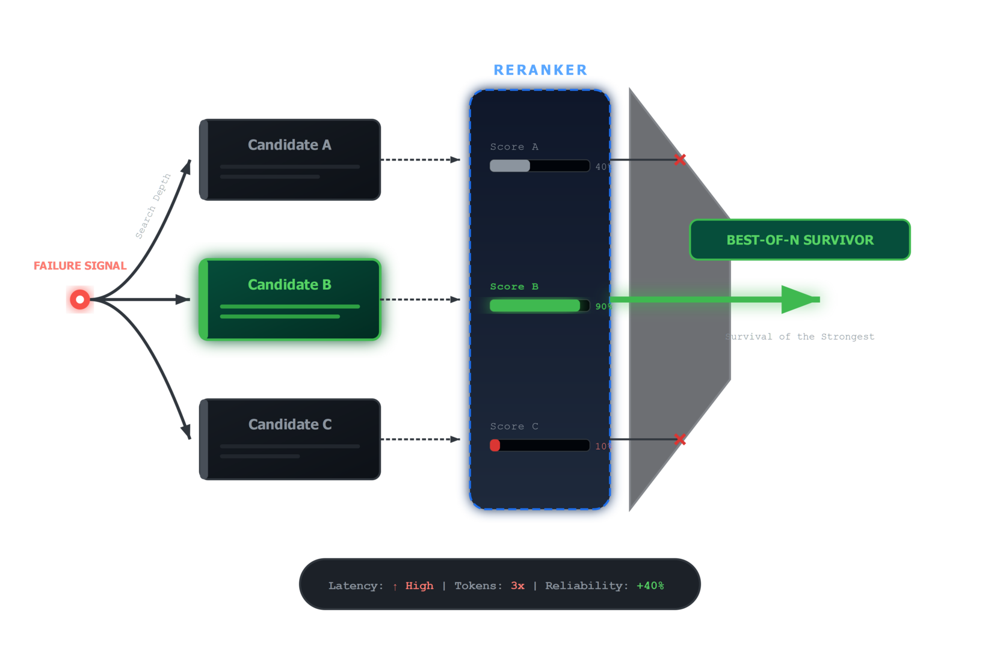
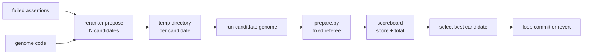

# Lesson 06 — Test-Time Search and Re-Ranking

Lesson 06 explains how best-of-N mutation search works.

The loop does not need a better trained model to search better. It can spend
more inference-time budget on the same round by generating several bounded
candidates, scoring each one, and selecting the best survivor.

## Search Diagram





## Theory To Learn

### 1. Test-time search spends compute on selection, not training

Best-of-N reranking does not teach the model new weights. It gives the loop a
chance to compare multiple candidate mutations inside one round before it makes
a survival decision.

### 2. Isolation is part of the search contract

Each candidate is run in a temp directory. That matters because the search
process should not corrupt the real genome or leak partial artifacts into the
working output directory.

### 3. The fixed referee makes reranking meaningful

If every candidate is scored by the same judge, the winner is selected by a
stable contract rather than by the model's own preference for its prose or
style.

For the search-path architecture slice, see
[execution-flow.md](../architecture/execution-flow.md) under
`Lesson 06 Slice — Re-Ranker Search Path`.

### 4. Search width trades token cost for better odds

More candidates can improve the chance of finding a better mutation, but they
also cost more time and tokens. Lesson 06 teaches that search width is an
engineering knob, not free magic.

## What Best-of-N Is Teaching You

When reranking helps, it reveals that the first candidate was not the only
plausible move.

- Candidate diversity can uncover a better fix in the same round.
- The scoreboard exposes whether the extra search budget paid off.
- The winner still has to survive the same judge as every rejected option.

## Core Idea

Instead of trusting the first candidate, the loop can generate several proposals and compare them before commit.

## Code Anchors

- [Best-of-N proposal](../../reranker.py#L67)
- [Candidate evaluation](../../reranker.py#L118)
- [Loop caller](../../loop.py#L617)

## Inline Coding

```python
code, hyp, diagnostics = propose(
	client,
	model,
	genome_code,
	results["failed"],
	args.candidates,
)
```

That call matters because test-time search is still bounded. The loop asks for several candidates, but the fixed judge still decides which one survives.

## Run

### Commands

```powershell
python util.py status
python util.py verify
python util.py reset
python util.py evaluate
python util.py loop --max-iterations 1 --rerank --candidates 2
```

### Output

```text
$ python util.py loop --max-iterations 1 --rerank --candidates 2
[FRESH_START] Starting from the immutable starter genome for dataset finance
[CURRENT_SCORE] Score 13/14
[FAILED_ASSERTION] matches_reference_output: matched=30, missing=25, unexpected=0, output_rows=30, reference_rows=55
[REQUESTING_LLM_PROPOSAL] Requesting mutation proposal from model microsoft/Phi-4
	Reranker: generating 2 candidates...
[LLM_ATTEMPT] Attempt 1/2: AutoGen candidate 1: conservative
[LLM_ATTEMPT] Attempt 2/2: AutoGen candidate 2: value-first
[HYPOTHESIS_SELECTED] Enhance the deterministic cleaning process to ensure all expected rows are processed and output.
[MUTATION_SCORE] Candidate scored 13/14
[REVERT_MUTATION] Reverted mutation with score 13/14
History saved to Y:\.sources\localm-tuts\courses\_examples\self-improving-agent\cleanloop\.output\finance_eval_history.json
```

### Explanation

1. The preflight, reset, and evaluate steps recreate the same baseline that Lesson 03 used. That keeps the search comparison fair.
2. `python util.py loop --max-iterations 1 --rerank --candidates 2` spends extra inference budget on two candidates in the same round. Validate that the output explicitly says `Reranker: generating 2 candidates...` and shows both attempt labels.
3. The important result is that the selected candidate still scored only `13/14`, so the loop reverted it. That is the test-time search lesson: more candidates can improve odds, but they still have to beat the same fixed judge.

## Hands-On Exercises

### Exercise 1 - Save candidate scoreboards

- Difficulty: Medium
- Files: `reranker.py`, `loop.py`
- Task: Persist every candidate score, total assertion count, and hypothesis to one JSON artifact for each reranked round.
- Hints: The cleanest first version writes the scoreboard right after the reranker returns, before commit or revert logic starts.
- Done when: One reranked run leaves a readable candidate scoreboard beside the other output artifacts.
- Stretch: Include token usage for each candidate when it is available.

### Exercise 2 - Add a tie-break rule

- Difficulty: Hard
- Files: `reranker.py`, `autogen_runtime.py`
- Task: Break equal scores with a deterministic secondary rule such as lower token cost or smaller response size.
- Hints: Do not hide the tie-break inside print-only output. Make it part of selection logic and explain it in logs.
- Done when: Equal-score candidates no longer produce ambiguous winners.
- Stretch: Log the exact tie-break reason in the proposal trace.

### Exercise 3 - Make search width visible end to end

- Difficulty: Medium
- Files: `loop.py`, `reranker.py`, `dashboard.py`
- Task: Thread `n_candidates` through console logs, history entries, and any scoreboard artifact so operators can see how wide the search really was.
- Hints: The loop already knows the requested width at startup. Reuse that fact instead of recomputing it downstream.
- Done when: A saved round explains both its winning score and how many candidates were considered.
- Stretch: Warn when reranking is enabled with only one candidate.

### Exercise 4 - Add a safe ceiling for candidate count

- Difficulty: Hard
- Files: `reranker.py`, `util.py`
- Task: Cap `n_candidates` at a practical maximum and explain the clamp in CLI output.
- Hints: The cap protects both token budget and runtime. Keep the first version simple and explicit.
- Done when: Oversized reranker requests are clamped instead of flooding the model with work.
- Stretch: Make the ceiling configurable through one environment variable.
