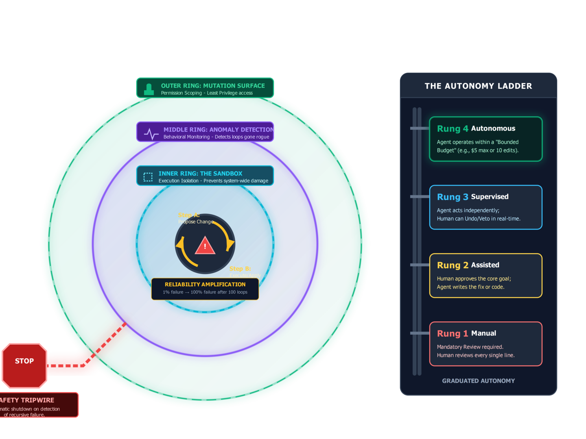
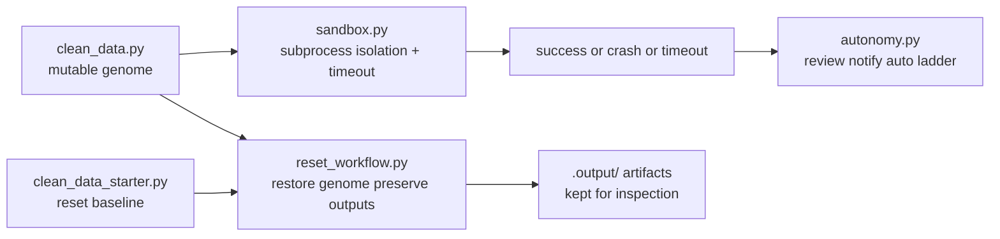

# Lesson 07 — Production Safety

Lesson 07 closes the course with containment, trust policy, and recovery.

This lesson makes one practical claim: a self-improving loop is only usable if
it can contain bad code, scale trust gradually, and recover to a known baseline
without destroying the evidence that explains what happened.

For a focused deep dive on the trust policy itself, continue to
[Lesson 09](./09-autonomy-ladder.md) after you finish this lesson.

## Safety Diagram





## Theory To Learn

### 1. Safety starts with containment

The genome is rewritten code. That means try/except alone is not enough. The
sandbox runs the genome in a separate subprocess so crashes, hangs, and stderr
stay contained instead of taking down the loop with them.

### 2. Trust should rise and fall with evidence

The autonomy ladder models a simple rule: good recent performance can earn more
freedom, and bad evidence should demote that freedom quickly. Trust is not a
binary flag. It is a policy shaped by observed outcomes.

### 3. Reset is a control, not a convenience

`reset_to_starter()` restores `clean_data.py` from `clean_data_starter.py`
without deleting `.output/`. That split matters because recovery should not
erase the artifacts that explain the current contract and recent failures.

For the containment and recovery architecture slice, see
[execution-flow.md](../architecture/execution-flow.md) under
`Lesson 07 Slice — Safety, Trust, And Recovery`.

### 4. Safe loops need explicit operator modes

Review, notify, and auto-approve modes make the trust policy legible. The
learner can see not only what the system did, but what level of human oversight
was expected.

## What Production Safety Is Teaching You

When a candidate fails, the safety surface should still leave the system in a
readable state.

- Sandboxing separates code failure from loop failure.
- Trust policy tells you how much autonomy a result has earned.
- Reset gives you a clean starting point without wiping the evidence.

## What Learners Follow

- run the genome in a subprocess before trusting it in the main loop
- separate timeout, crash, and judged failure as different outcomes
- inspect the trust ladder as a policy surface, not just a printed table
- verify that reset restores the starter genome without deleting `.output/`
- treat recovery artifacts as evidence you may need after a bad candidate

## Actual Artifacts To Trace

- `.output/finance_master.csv`
- `.output/finance_mutation_success.csv`
- `.output/finance_mutation_failures.csv`
- `clean_data.py`
- `clean_data_starter.py`

## Controls

- [Sandbox runner](../../sandbox.py#L56) isolates the genome in a subprocess.
- [Sandbox CLI](../../sandbox.py#L129) exposes timeout control from the command line.
- [Autonomy simulator](../../autonomy.py#L148) models the trust ladder.
- [Trust state](../../autonomy.py#L78) holds the policy logic that drives review, notify, and auto modes.
- [Reset workflow](../../reset_workflow.py#L9) restores the starter genome without deleting the shipped sample outputs.

## Why Recovery Matters

A self-improving loop without reset is hard to trust. A learner needs a reliable path back to the deterministic baseline.

## Inline Coding

```python
return reset_to_starter(
	output_dir=OUTPUT_DIR,
	genome_path=GENOME_PATH,
	starter_genome_path=STARTER_GENOME_PATH,
)
```

That call keeps recovery explicit. The learner can see the exact handoff from the CLI to the reset logic.

## Read This In Order

1. Read [sandbox.py#L56](../../sandbox.py#L56) to see the containment boundary.
2. Step into [sandbox.py#L129](../../sandbox.py#L129) to connect the timeout flag to the actual subprocess run.
3. Read [autonomy.py#L78](../../autonomy.py#L78) and [autonomy.py#L148](../../autonomy.py#L148) to see how trust policy is computed and demonstrated.
4. Finish with [reset_workflow.py#L9](../../reset_workflow.py#L9) so the recovery path is explicit before you trust the loop.

## Run

### Commands

```powershell
python util.py status
python util.py verify
python util.py reset
python util.py sandbox --timeout 10
python util.py autonomy --rounds 5
python util.py reset
```

### Output

```text
$ python util.py sandbox --timeout 10
Running genome in sandbox for finance (timeout=10s)...
	[OK] Genome completed successfully
	CleanLoop Evaluation: 13/14
	[FAIL] matches_reference_output: matched=30, missing=48, unexpected=0, output_rows=30, reference_rows=78

$ python util.py autonomy --rounds 5
Graduated Autonomy Simulation
Round   Rate     Level          Action                           Mode
	5     0.64     SUPERVISED     HOLD                             [REVIEW]
Final: SUPERVISED (score: 0.48)

$ python util.py reset
Preserved cleanloop/.output sample artifacts
Restored clean_data.py from clean_data_starter.py
Ready to re-run: python util.py loop
```

### Explanation

1. `python util.py sandbox --timeout 10` validates containment. The useful check is that the genome ran in isolation and the process returned a normal result instead of crashing or hanging.
2. `python util.py autonomy --rounds 5` demonstrates the trust ladder. Validate that the simulation keeps the system in `SUPERVISED` mode and ends with an explicit final score.
3. Finish with `python util.py reset`. Validate that recovery restores the starter genome while preserving `.output`. Lesson 07 is complete only when you can both inspect the evidence and return to a known safe baseline.
4. After reset, verify both `clean_data.py` and the three exported CSVs. Safe recovery is not only a console message. It is a file-system state you can inspect.

## Hands-On Exercises

### Exercise 1 - Persist sandbox outcomes

- Difficulty: Medium
- Files: `sandbox.py`
- Task: Write each sandbox result dict to a small JSON or JSONL artifact so the learner can inspect past isolation runs.
- Hints: `run_sandboxed()` already returns everything you need. Keep the artifact append-only and easy to diff.
- Done when: Repeated sandbox runs leave a short audit trail under `.output/`.
- Stretch: Include elapsed runtime in the saved payload.

### Exercise 2 - Make timeout failures obvious

- Difficulty: Easy
- Files: `sandbox.py`, `util.py`
- Task: Try a tiny timeout and then improve the operator-facing message so it is obvious whether the genome crashed or simply hung.
- Hints: The result dict already separates `timed_out`, `stderr`, and `return_code`.
- Done when: The learner can tell timeout from Python exception at a glance.
- Stretch: Surface the same distinction in one dashboard note or trace event.

### Exercise 3 - Enrich the trust ladder

- Difficulty: Medium
- Files: `autonomy.py`
- Task: Add one more trust-state field such as `consecutive_success_rounds` or `last_transition_reason` and print it in the simulation output.
- Hints: Derive the field where promotion and demotion already happen so it stays truthful.
- Done when: The simulation explains why a level changed, not only which level won.
- Stretch: Save the simulation rounds to CSV for later plotting.

### Exercise 4 - Add reset safety notes

- Difficulty: Medium
- Files: `reset_workflow.py`
- Task: Improve the reset output so it names exactly which artifacts are preserved and which file is restored.
- Hints: Keep behavior unchanged for the first pass. This exercise is about operator trust, not new mutation logic.
- Done when: `python util.py reset` reads like a safe recovery step instead of a risky destructive command.
- Stretch: Add a dry-run mode that reports actions without writing files.
