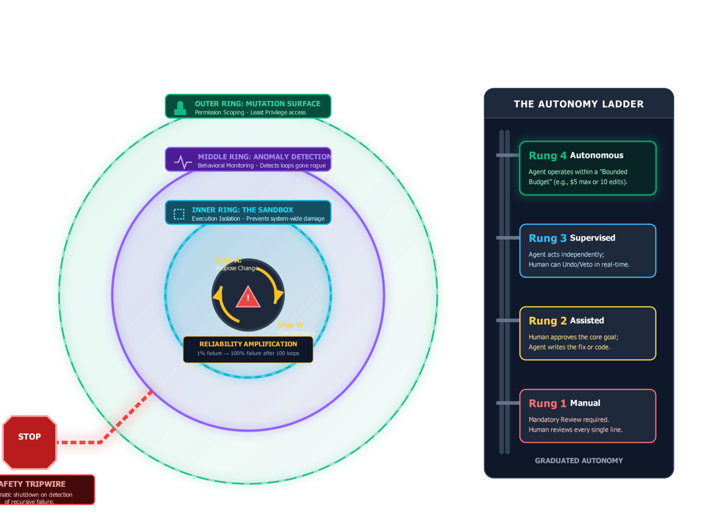
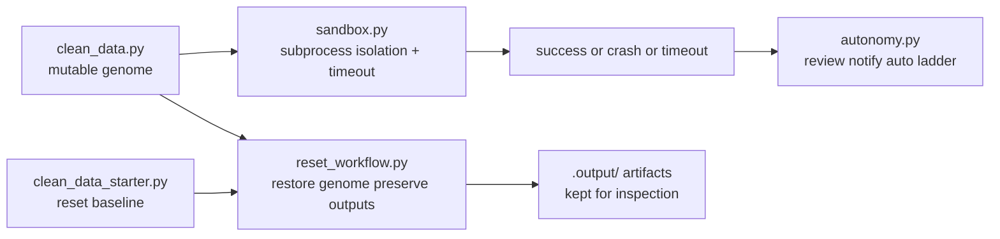
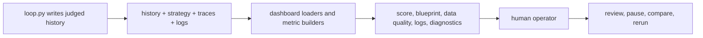
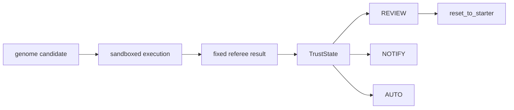

# Lesson 07 — Conclusion: Safety, Oversight, and Autonomy

Lesson 07 closes the course.

This conclusion combines three ideas into one operator story:
contain bad code, inspect the saved evidence, and decide how much autonomy the
system has earned.

The practical claim stays simple. A self-improving loop is only usable if it
can recover to a known baseline, show a human what happened, and scale trust
with current evidence instead of old wins.

## Safety Diagram




```mermaid
flowchart LR
	genome[clean_data.py\nmutable genome]
	sandbox[sandbox.py\nsubprocess isolation + timeout]
	result[success or crash or timeout]
	trust[autonomy.py\nreview notify auto ladder]
	starter[clean_data_starter.py\nreset baseline]
	reset[reset_workflow.py\nrestore genome preserve outputs]
	artifacts[.output/ artifacts\nkept for inspection]

	genome --> sandbox --> result --> trust
	starter --> reset
	genome --> reset
	reset --> artifacts
```

## Oversight Diagram


```mermaid
flowchart LR
		loop[loop.py writes judged history]
		artifacts[history + strategy + traces + logs]
		loader[dashboard loaders and metric builders]
		panels[score, blueprint, data quality, logs, diagnostics]
		operator[human operator]
		action[review, pause, compare, rerun]

		loop --> artifacts --> loader --> panels --> operator --> action
```

## Trust Diagram


```mermaid
flowchart LR
		candidate[genome candidate]
		sandbox[sandboxed execution]
		judge[fixed referee result]
		trust[TrustState]
		review[REVIEW]
		notify[NOTIFY]
		auto[AUTO]
		reset[reset_to_starter]

		candidate --> sandbox --> judge --> trust
		trust --> review
		trust --> notify
		trust --> auto
		review --> reset
```

## Theory To Learn

### 1. Safety starts with containment

The genome is rewritten code. That means try/except alone is not enough. The
sandbox runs the genome in a separate subprocess so crashes, hangs, and stderr
stay contained instead of taking down the loop with them.

### 2. Human oversight starts from stored evidence

The dashboard should not guess from live memory. It reads saved history,
metrics, traces, and logs. That keeps operator review grounded in durable
artifacts instead of one terminal scrollback.

### 3. Trust should rise and fall with evidence

The autonomy ladder models a simple rule: good recent performance can earn more
freedom, and bad evidence should demote that freedom quickly. Trust is not a
binary flag. It is a policy shaped by observed outcomes.

### 3. Reset is a control, not a convenience

`reset_to_starter()` restores `clean_data.py` from `clean_data_starter.py`
without deleting `.output/`. That split matters because recovery should not
erase the artifacts that explain the current contract and recent failures.

For the containment and recovery architecture slice, see
[execution-flow.md](../architecture/execution-flow.md) under
`Lesson 07 Slice — Safety, Trust, And Recovery`.

### 4. Safe loops need explicit operator modes

Review, notify, and auto-approve modes make the trust policy legible. The
learner can see not only what the system did, but what level of human oversight
was expected.

## What This Conclusion Is Teaching You

When this conclusion works, the system stays readable even when the candidate
fails.

- Sandboxing separates code failure from loop failure.
- Dashboard review turns saved evidence into an operator workflow.
- Trust policy tells you how much autonomy a result has earned.
- Reset gives you a clean starting point without wiping the evidence.

## What Learners Follow

- run the genome in a subprocess before trusting it in the main loop
- run one judged loop round before opening the dashboard
- compare score movement with row-gap metrics instead of reading only logs
- separate timeout, crash, and judged failure as different outcomes
- inspect the trust ladder as a policy surface, not just a printed table
- use the dashboard to decide the next command, not to replace file inspection
- verify that reset restores the starter genome without deleting `.output/`
- treat recovery artifacts as evidence you may need after a bad candidate

## Actual Artifacts To Trace

- `.output/finance_master.csv`
- `.output/finance_mutation_success.csv`
- `.output/finance_mutation_failures.csv`
- `.output/finance_eval_history.json`
- `.output/finance_strategy.json`
- `.output/logs/finance_round_logs.jsonl`
- `.output/traces/run-events.jsonl`
- `.output/traces/row-decisions.jsonl`
- `.output/traces/proposal-events.jsonl`
- `.output/sandbox_runs.jsonl`
- `clean_data.py`
- `clean_data_starter.py`

## Controls

- [Sandbox runner](../../sandbox.py#L56) isolates the genome in a subprocess.
- [Sandbox CLI](../../sandbox.py#L129) exposes timeout control from the command line.
- [Autonomy simulator](../../autonomy.py#L148) models the trust ladder.
- [Trust state](../../autonomy.py#L78) holds the policy logic that drives review, notify, and auto modes.
- [Reset workflow](../../reset_workflow.py#L9) restores the starter genome without deleting the shipped sample outputs.
- [Dashboard launcher](../../util.py#L458) opens the read-only oversight surface.
- [History loader](../../dashboard.py#L66) reads judged history for the dashboard.
- [Artifact bundle load](../../dashboard.py#L162) loads trace, log, and strategy files.
- [Judge metric rows](../../dashboard_metrics.py#L47) turns judged history into comparison tables.
- [Attempt outcome rows](../../dashboard_metrics.py#L105) summarizes selected attempts and token cost.
- [Artifact readers](../../dashboard_artifacts.py#L28) load trace and log rows for operator review.

## Why Recovery Matters

A self-improving loop without reset is hard to trust. A learner needs a reliable path back to the deterministic baseline.

## Why Oversight Matters

The dashboard answers a different question than the score.

The score tells you whether the judged result moved. The tables and traces tell
you what changed, what cost tokens, and why the loop committed, reverted, or
skipped. You need both views together.

## Why The Autonomy Ladder Matters

Trust should never feel magical.

The operator should be able to explain why the system is in `[REVIEW]`,
`[NOTIFY]`, or `[AUTO]`. Hidden trust transitions are hard to debug and even
harder to trust.

## Example Approach

Use this conclusion lesson as one operator walkthrough.

1. Reset to the starter baseline.
2. Run one loop round so CleanLoop writes judged history and traces.
3. Open the dashboard or run `observe` to inspect the saved evidence.
4. Run the sandbox to confirm containment still works.
5. Run the autonomy ladder to see what oversight mode the latest evidence has earned.
6. Reset again so you end the lesson on a known baseline.

## Inline Coding

```python
if trust.needs_human_review():
	mode = "[REVIEW]"
elif trust.needs_notification():
	mode = "[NOTIFY]"
elif trust.should_auto_approve():
	mode = "[AUTO]"
```

That branch is the operator contract. It turns judged performance into a
visible oversight mode instead of hiding the trust policy behind one summary
line.

## Read This In Order

1. Read [sandbox.py#L56](../../sandbox.py#L56) to see the containment boundary.
2. Step into [sandbox.py#L129](../../sandbox.py#L129) to connect the timeout flag to the actual subprocess run.
3. Read [util.py#L458](../../util.py#L458), [dashboard.py#L66](../../dashboard.py#L66), and [dashboard.py#L162](../../dashboard.py#L162) to see how the oversight surface loads saved evidence.
4. Read [dashboard_metrics.py#L47](../../dashboard_metrics.py#L47) and [dashboard_metrics.py#L105](../../dashboard_metrics.py#L105) to see how raw history becomes comparison tables.
5. Read [autonomy.py#L78](../../autonomy.py#L78), [autonomy.py#L127](../../autonomy.py#L127), and [autonomy.py#L148](../../autonomy.py#L148) to see how trust policy is computed and demonstrated.
6. Finish with [reset_workflow.py#L9](../../reset_workflow.py#L9) so recovery is explicit before you trust the loop.

## Run

### Commands

```powershell
python util.py status
python util.py verify
python util.py reset
python util.py loop --max-iterations 1
python util.py observe
python util.py dashboard
python util.py sandbox --timeout 10
python util.py autonomy --rounds 5
python util.py autonomy --from-history
python util.py reset
```

### Output

```text
$ python util.py loop --max-iterations 1
[FRESH_START] Starting from the immutable starter genome for dataset finance
[CURRENT_SCORE] Score 13/14
[METACOGNITION] Focus row_reconciliation: Compare missing and unexpected rows to see which transformations are still dropping or inventing records.
[REVERT_MUTATION] Reverted mutation with score 0/1
History saved to Y:\.sources\localm-tuts\courses\_examples\self-improving-agent\cleanloop\.output\finance_eval_history.json

$ python util.py observe
History path: Y:\.sources\localm-tuts\courses\_examples\self-improving-agent\cleanloop\.output\finance_eval_history.json
Rounds: 1
Latest score: 13/14
Latest action: revert

$ python util.py dashboard
	You can now view your Streamlit app in your browser.
	Local URL: http://localhost:8501

$ python util.py sandbox --timeout 10
Running genome in sandbox for finance (timeout=10s)...
	[OK] Genome completed successfully
	CleanLoop Evaluation: 13/14
	[FAIL] matches_reference_output: matched=30, missing=48, unexpected=8, output_rows=38, reference_rows=78

$ python util.py autonomy --rounds 5
Graduated Autonomy Simulation
Round   Rate     Level          Action                           Mode
	5     0.64     SUPERVISED     HOLD                             [REVIEW]
Final: SUPERVISED (score: 0.48)

$ python util.py autonomy --from-history
Latest judged history -> mode [REVIEW]
Reason: baseline did not earn promotion

$ python util.py reset
Preserved cleanloop/.output sample artifacts
Restored clean_data.py from clean_data_starter.py
Ready to re-run: python util.py loop
```

### Explanation

1. `python util.py loop --max-iterations 1` creates the judged artifact set. Validate that the history file is saved before you open any oversight surface.
2. `python util.py observe` or `python util.py dashboard` is the human review step. Validate that the score, artifact state, and selected-attempt details are readable from saved files.
3. `python util.py sandbox --timeout 10` validates containment. The useful check is that the genome ran in isolation and the process returned a normal result instead of crashing or hanging.
4. `python util.py autonomy --rounds 5` and `python util.py autonomy --from-history` demonstrate the trust ladder. Validate the mode labels, the final score, and the transition reason.
5. Finish with `python util.py reset`. Validate that recovery restores the starter genome while preserving `.output`. The conclusion is complete only when you can inspect the evidence and return to a known safe baseline.

### Current Implementation Notes

Sandbox runs now append an audit row to `.output/sandbox_runs.jsonl`. Each row
records timeout, output path, success, timeout state, return code, and a short
stderr preview.

Use `python util.py observe` when you need a fast terminal summary and
`python util.py dashboard` when you need the richer comparison view.

The autonomy simulation prints a transition reason, and
`python util.py autonomy --from-history` derives the trust mode from saved
judged history instead of synthetic pass rates.

## Hands-On Exercises

### Safety Exercises

#### Exercise 1 - Persist sandbox outcomes

- Difficulty: Medium
- Files: `sandbox.py`
- Task: Write each sandbox result dict to a small JSON or JSONL artifact so the learner can inspect past isolation runs.
- Hints: `run_sandboxed()` already returns everything you need. Keep the artifact append-only and easy to diff.
- Done when: Repeated sandbox runs leave a short audit trail under `.output/`.
- Stretch: Include elapsed runtime in the saved payload.

#### Exercise 2 - Make timeout failures obvious

- Difficulty: Easy
- Files: `sandbox.py`, `util.py`
- Task: Try a tiny timeout and then improve the operator-facing message so it is obvious whether the genome crashed or simply hung.
- Hints: The result dict already separates `timed_out`, `stderr`, and `return_code`.
- Done when: The learner can tell timeout from Python exception at a glance.
- Stretch: Surface the same distinction in one dashboard note or trace event.

#### Exercise 3 - Add reset safety notes

- Difficulty: Medium
- Files: `reset_workflow.py`
- Task: Improve the reset output so it names exactly which artifacts are preserved and which file is restored.
- Hints: Keep behavior unchanged for the first pass. This exercise is about operator trust, not new mutation logic.
- Done when: `python util.py reset` reads like a safe recovery step instead of a risky destructive command.
- Stretch: Add a dry-run mode that reports actions without writing files.

### Oversight Exercises

#### Exercise 4 - Add a stalled-focus badge

- Difficulty: Medium
- Files: `dashboard.py`, `dashboard_metrics.py`
- Task: Show a visible badge when the same `focus_area` repeats without a positive score delta.
- Hints: The history rows already contain the pieces you need. Compute the signal in `dashboard_metrics.py` first.
- Done when: The dashboard makes repeated non-progress obvious without opening raw JSON.
- Stretch: Add the same badge to the round blueprint table.

#### Exercise 5 - Surface trace file health

- Difficulty: Easy
- Files: `dashboard_artifacts.py`, `dashboard.py`
- Task: Add one compact panel that says which expected artifact files are missing.
- Hints: Keep the first version read-only and path-based. Do not add mutation controls.
- Done when: An empty dashboard clearly explains what is missing.
- Stretch: Add the exact command that would regenerate each missing file.

#### Exercise 6 - Show per-round token efficiency

- Difficulty: Medium
- Files: `dashboard_metrics.py`, `dashboard.py`
- Task: Add one derived field that compares total tokens to recall delta for each round.
- Hints: Handle zero-delta rounds explicitly so the result stays readable.
- Done when: Expensive low-value rounds stand out in the UI.
- Stretch: Color-code the best and worst rounds.

#### Exercise 7 - Add invoice drill-down from dashboard state

- Difficulty: Hard
- Files: `dashboard.py`, `dashboard_artifacts.py`
- Task: Let the operator type one invoice id and inspect the matching row decisions and proposal context.
- Hints: Start from `row-decisions.jsonl` and keep the first version read-only.
- Done when: One invoice can be traced without leaving the dashboard.
- Stretch: Link the drill-down to the latest failure export row when one exists.

### Autonomy Exercises

#### Exercise 8 - Explain trust transitions

- Difficulty: Medium
- Files: `autonomy.py`
- Task: Add one `last_transition_reason` field so the simulation explains why a level changed.
- Hints: Update the field inside `record_round()` where the policy already promotes or demotes.
- Done when: A promotion or demotion prints both the action and the reason.
- Stretch: Include the rolling score and threshold in the reason text.

#### Exercise 9 - Add a safe review override

- Difficulty: Hard
- Files: `autonomy.py`, `util.py`
- Task: Add a small CLI switch that forces review mode regardless of trust level.
- Hints: Keep the first version explicit and local. This is an operator override, not a hidden policy change.
- Done when: The simulation can be forced into `[REVIEW]` without editing the trust thresholds.
- Stretch: Print that override state in the final summary line.

#### Exercise 10 - Join trust and recovery in one summary

- Difficulty: Hard
- Files: `autonomy.py`, `reset_workflow.py`
- Task: Add one short operator summary that says when a critical failure should trigger reset.
- Hints: Keep behavior unchanged at first. Make the rule visible before you automate anything.
- Done when: A critical failure produces a clear next-step message instead of only a demotion line.
- Stretch: Surface the same summary in a future dashboard panel.
