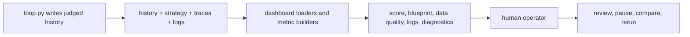

# Lesson 08 — Dashboard and Human Oversight

Lesson 08 turns the observability artifacts into an operator workflow.

Lesson 04 explained how CleanLoop writes traces, history, and strategy files.
This companion note focuses on the read side. The dashboard is where a human
checks whether the loop is learning, stalling, burning too many tokens, or
repeating the same weak idea under a new label.

## Oversight Diagram



## Theory To Learn

### 1. Human oversight starts from stored evidence

The dashboard should not infer state from live memory. It reads the stored
history, metrics, traces, and logs that the loop already exported. That keeps
operator review grounded in durable artifacts instead of transient console text.

### 2. The scoreboard and the artifact tables answer different questions

The score timeline answers, "Did the judged result move?" The blueprint, log,
and diagnostics tables answer, "What changed, what cost tokens, and why did the
loop commit, revert, or skip?" You need both views together.

### 3. Oversight is a comparison task

A single round rarely tells the whole story. The dashboard matters because it
lets the operator compare before-score, after-score, token usage, missing rows,
unexpected rows, and selected attempts across rounds.

### 4. A read-only control surface is safer than ad-hoc mutation controls

The dashboard is intentionally observational. It helps the operator decide when
to rerun, reset, or inspect one trace file, but it does not mutate the genome.
That split keeps oversight separate from code generation.

## What This Surface Is Teaching You

When the dashboard is useful, it exposes a pattern rather than one data point.

- repeated reverts can still show improved hypothesis quality
- rising token cost without recall gain is a real failure mode
- one stalled focus area can explain several weak rounds in a row
- empty tables usually mean missing artifacts, not hidden success

## What Learners Follow

- run one judged loop round before opening the dashboard
- confirm which artifact files the dashboard actually reads
- compare score movement with row-gap metrics instead of reading only logs
- inspect attempt diagnostics when a selected hypothesis still reverts
- use the dashboard to decide the next command, not to replace file inspection

## Actual Artifacts To Trace

- `.output/finance_eval_history.json`
- `.output/finance_strategy.json`
- `.output/logs/finance_round_logs.jsonl`
- `.output/traces/run-events.jsonl`
- `.output/traces/row-decisions.jsonl`
- `.output/traces/proposal-events.jsonl`

## Code Anchors

- [Dashboard launcher](../../util.py#L458)
- [Page configuration](../../dashboard.py#L50)
- [History loader](../../dashboard.py#L66)
- [Artifact bundle load](../../dashboard.py#L162)
- [Judge metric rows](../../dashboard_metrics.py#L47)
- [Attempt outcome rows](../../dashboard_metrics.py#L105)
- [Structured log rows](../../dashboard_metrics.py#L132)
- [Artifact readers](../../dashboard_artifacts.py#L28)

## Inline Coding

```python
judge_df = pd.DataFrame(dashboard_metrics.build_judge_metric_rows(history))
```

That line matters because it converts judged round history into the operator's
comparison table instead of leaving the metrics trapped in raw JSON.

## Read This In Order

1. Read [util.py#L458](../../util.py#L458) to see how the CLI launches the dashboard.
2. Read [dashboard.py#L66](../../dashboard.py#L66) and [dashboard.py#L162](../../dashboard.py#L162) to see which files are loaded before any panel renders.
3. Step into [dashboard_metrics.py#L47](../../dashboard_metrics.py#L47) and [dashboard_metrics.py#L105](../../dashboard_metrics.py#L105) to see how raw history becomes operator-facing tables.
4. Finish with [dashboard_artifacts.py#L28](../../dashboard_artifacts.py#L28) so you know where the trace and log panels get their rows.

## Run

### Commands

```powershell
python util.py reset
python util.py loop --max-iterations 1
python util.py dashboard
```

### Output

```text
$ python util.py loop --max-iterations 1
[FRESH_START] Starting from the immutable starter genome for dataset finance
[CURRENT_SCORE] Score 13/14
[METACOGNITION] Focus row_reconciliation: Compare missing and unexpected rows to see which transformations are still dropping or inventing records.
[REVERT_MUTATION] Reverted mutation with score 0/1
History saved to Y:\.sources\localm-tuts\courses\_examples\self-improving-agent\cleanloop\.output\finance_eval_history.json

$ python util.py dashboard
	You can now view your Streamlit app in your browser.
	Local URL: http://localhost:8501
```

### Explanation

1. `python util.py loop --max-iterations 1` creates the artifact set the dashboard needs. Validate that the history file is saved before you open the UI.
2. `python util.py dashboard` is the read-only oversight step. Validate that Streamlit prints a local URL and then inspect the score, blueprint, and diagnostics tabs together.
3. If the dashboard opens with sparse tables, check whether the exported logs and trace files exist beside the history file. Missing files are a real operator signal.

### Current Implementation Notes

Use `python util.py observe` when you need a non-UI artifact summary. It prints
history path, round count, latest score, latest action, missing rows,
unexpected rows, and artifact health counts. Missing artifacts include the
command that regenerates each file.

The Streamlit dashboard remains the rich read-only view. The CLI `observe`
command is the fast terminal view for the same operator workflow.

## Hands-On Exercises

### Exercise 1 - Add a stalled-focus badge

- Difficulty: Medium
- Files: `dashboard.py`, `dashboard_metrics.py`
- Task: Show a visible badge when the same `focus_area` repeats without a positive score delta.
- Hints: The history rows already contain the pieces you need. Compute the signal in `dashboard_metrics.py` first.
- Done when: The dashboard makes repeated non-progress obvious without opening raw JSON.
- Stretch: Add the same badge to the round blueprint table.

### Exercise 2 - Surface trace file health

- Difficulty: Easy
- Files: `dashboard_artifacts.py`, `dashboard.py`
- Task: Add one compact panel that says which expected artifact files are missing.
- Hints: Keep the first version read-only and path-based. Do not add mutation controls.
- Done when: An empty dashboard clearly explains what is missing.
- Stretch: Add the exact command that would regenerate each missing file.

### Exercise 3 - Show per-round token efficiency

- Difficulty: Medium
- Files: `dashboard_metrics.py`, `dashboard.py`
- Task: Add one derived field that compares total tokens to recall delta for each round.
- Hints: Handle zero-delta rounds explicitly so the result stays readable.
- Done when: Expensive low-value rounds stand out in the UI.
- Stretch: Color-code the best and worst rounds.

### Exercise 4 - Add invoice drill-down from dashboard state

- Difficulty: Hard
- Files: `dashboard.py`, `dashboard_artifacts.py`
- Task: Let the operator type one invoice id and inspect the matching row decisions and proposal context.
- Hints: Start from `row-decisions.jsonl` and keep the first version read-only.
- Done when: One invoice can be traced without leaving the dashboard.
- Stretch: Link the drill-down to the latest failure export row when one exists.
