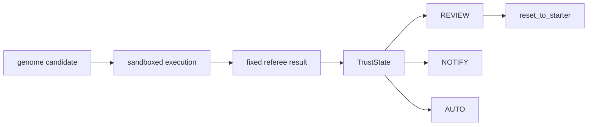

# Lesson 09 — The Autonomy Ladder

Lesson 09 isolates the trust policy from the broader production-safety story.

Lesson 07 covered containment, reset, and safe recovery. This companion note
focuses on the decision policy that sits after judged results: when a change
still needs review, when a human only gets notified, and when the system has
earned enough trust to auto-approve.

## Trust Diagram



## Theory To Learn

### 1. Containment happens before trust

The system should not ask whether a candidate deserves autonomy until the code
has already survived process isolation and judged evaluation. Sandbox first,
trust decision second.

### 2. Trust is a rolling policy, not a lifetime badge

`TrustState` uses recent rounds, not the whole history, to decide promotion.
That keeps the policy sensitive to recent regressions instead of hiding them
behind ancient wins.

### 3. Critical failures must demote fast

The ladder is conservative on purpose. One zero-pass round can drop the system
back to `SUPERVISED`. That is a safety choice, not a fairness choice.

### 4. Approval modes must stay legible

The operator should always be able to tell why the system is in `[REVIEW]`,
`[NOTIFY]`, or `[AUTO]`. Hidden trust transitions are hard to debug and even
harder to trust.

## What This Policy Is Teaching You

When the ladder is doing its job, it makes oversight proportional to evidence.

- low trust means a human approves every change
- medium trust can reduce friction without removing accountability
- high trust still depends on current performance, not old wins
- critical failures should reset confidence faster than success builds it

## What Learners Follow

- sandbox the mutable genome before reasoning about approval modes
- treat pass rate as one safety signal, not the whole story
- read the trust helpers directly instead of inferring policy from console text
- compare promotion thresholds with demotion behavior in the simulation
- keep reset ready as the recovery path when trust evidence collapses

## Actual Signals To Trace

- sandbox `success`, `stderr`, `return_code`, and `timed_out`
- autonomy mode labels: `[REVIEW]`, `[NOTIFY]`, `[AUTO]`
- rolling score in the final simulation line
- `clean_data.py` and `clean_data_starter.py`
- preserved `.output/` artifacts after reset

## Code Anchors

- [Sandbox runner](../../sandbox.py#L56)
- [Sandbox CLI](../../sandbox.py#L129)
- [Trust state](../../autonomy.py#L78)
- [Auto-approve gate](../../autonomy.py#L127)
- [Human-review gate](../../autonomy.py#L131)
- [Notification gate](../../autonomy.py#L135)
- [Trust simulation](../../autonomy.py#L148)
- [Reset handoff](../../reset_workflow.py#L9)

## Inline Coding

```python
if trust.needs_human_review():
	mode = "[REVIEW]"
elif trust.needs_notification():
	mode = "[NOTIFY]"
elif trust.should_auto_approve():
	mode = "[AUTO]"
```

That branch is the operator contract. It turns recent judged performance into a
visible oversight mode instead of leaving the trust policy implicit.

## Read This In Order

1. Read [sandbox.py#L56](../../sandbox.py#L56) to see the containment boundary that runs before any trust decision.
2. Step into [autonomy.py#L78](../../autonomy.py#L78) to see the policy state and promotion or demotion rules.
3. Read [autonomy.py#L127](../../autonomy.py#L127), [autonomy.py#L131](../../autonomy.py#L131), and [autonomy.py#L135](../../autonomy.py#L135) to see how review, notify, and auto modes are chosen.
4. Finish with [autonomy.py#L148](../../autonomy.py#L148) and [reset_workflow.py#L9](../../reset_workflow.py#L9) so the trust demo and recovery path stay connected.

## Run

### Commands

```powershell
python util.py sandbox --timeout 10
python util.py autonomy --rounds 5
python util.py reset
```

### Output

```text
$ python util.py sandbox --timeout 10
Running genome in sandbox for finance (timeout=10s)...
	[OK] Genome completed successfully
	CleanLoop Evaluation: 13/14
	[FAIL] matches_reference_output: matched=30, missing=48, unexpected=0, output_rows=30, reference_rows=78

$ python util.py autonomy --rounds 5
Graduated Autonomy Simulation
Round   Rate     Level          Action                           Mode
	5     0.64     SUPERVISED     HOLD                             [REVIEW]
Final: SUPERVISED (score: 0.48)

$ python util.py reset
Preserved cleanloop/.output sample artifacts
Restored clean_data.py from clean_data_starter.py
Ready to re-run: python util.py loop
```

### Explanation

1. `python util.py sandbox --timeout 10` proves that the mutable genome can be contained before the trust policy is even relevant.
2. `python util.py autonomy --rounds 5` demonstrates the ladder. Validate the mode labels and the final rolling score rather than reading only the action text.
3. `python util.py reset` closes the loop by restoring a known baseline while keeping the evidence that explained the last trust outcome.

## Hands-On Exercises

### Exercise 1 - Explain trust transitions

- Difficulty: Medium
- Files: `autonomy.py`
- Task: Add one `last_transition_reason` field so the simulation explains why a level changed.
- Hints: Update the field inside `record_round()` where the policy already promotes or demotes.
- Done when: A promotion or demotion prints both the action and the reason.
- Stretch: Include the rolling score and threshold in the reason text.

### Exercise 2 - Persist sandbox outcomes

- Difficulty: Medium
- Files: `sandbox.py`
- Task: Save each sandbox result dict to one append-only artifact under `.output/`.
- Hints: The result already has the useful fields. Keep the first version JSONL and read-only from the dashboard side.
- Done when: Repeated sandbox runs leave an inspectable audit trail.
- Stretch: Add elapsed runtime to the saved payload.

### Exercise 3 - Add a safe review override

- Difficulty: Hard
- Files: `autonomy.py`, `util.py`
- Task: Add a small CLI switch that forces review mode regardless of trust level.
- Hints: Keep the first version explicit and local. This is an operator override, not a hidden policy change.
- Done when: The simulation can be forced into `[REVIEW]` without editing the trust thresholds.
- Stretch: Print that override state in the final summary line.

### Exercise 4 - Join trust and recovery in one summary

- Difficulty: Hard
- Files: `autonomy.py`, `reset_workflow.py`
- Task: Add one short operator summary that says when a critical failure should trigger reset.
- Hints: Keep behavior unchanged at first. Make the rule visible before you automate anything.
- Done when: A critical failure produces a clear next-step message instead of only a demotion line.
- Stretch: Surface the same summary in a future dashboard panel.
