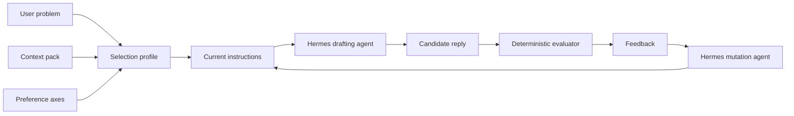

# Prompt Evolution Studio

This example evolves a customer-support instruction prompt instead of mutating
Python code. You pick a predefined service context, select multiple response
preferences, and enter a live customer problem. Hermes drafts a reply, a
deterministic evaluator scores it, and Hermes refines the instructions for the
next round.



## Start Here

Run from inside `prompt_evolution/`:

```bash
python util.py scenarios
python util.py status
python util.py loop --scenario makerspace_missing_booking
python util.py dashboard
```

The local runner loads `prompt_evolution/.env` first and then falls back to the
shared parent `../.env`. It also reuses the shared parent `.venv` when that
virtual environment exists, so the project stays runnable from this folder.

Use `--named-instance` when you want a stable trace folder for a demo run:

```bash
python util.py loop --scenario makerspace_missing_booking \
  --named-instance workshop-demo
```

## Docs Map

All deeper notes now live under `docs/`.

- architecture: `docs/architecture/system-overview.md`
- scenarios: `docs/data/scenario-catalog.md`
- tracing: `docs/operations/tracing.md`
- tests: `docs/testing/test-map.md`
- code map: `docs/reference/code-map.md`
- lesson layout: `docs/lessons/`

## Data Scenarios

Prompt Evolution Studio simulates a small support desk for experience-led
businesses. Each context pack contains brand voice, policy points, forbidden
promises, and reference terms. The mutable artifact is the instruction prompt
that tells the model how to answer.

Named scenario files live in `.data/scenarios/`. A scenario adds a customer
problem, default preferences, customer facts, risk flags, expected policy slugs,
and success criteria. That makes the support desk feel like a real exercise,
not just a free-form prompt box.

Shipped scenarios:

| Scenario                     | Context                   | What It Exercises                                    |
| ---------------------------- | ------------------------- | ---------------------------------------------------- |
| `makerspace_missing_booking` | Makerspace front desk     | Booking window, certification gate, direct next step |
| `coworking_guest_refund`     | Coworking membership desk | Guest hold, attendance check, refund restraint       |
| `hotel_late_credit`          | Boutique hotel guest desk | Late check-in note, credit review, staff handoff     |
| `pet_medication_update`      | Pet boarding guest desk   | Signed note, care lead handoff, checklist structure  |

## Mutable Instructions

```text
You are a response strategist for a customer-support team.
Write one customer-ready reply that sounds human, follows the selected
preferences, and stays grounded in the provided context pack.
Use relevant policy points without inventing new rules.
If a refund or escalation is not approved yet, explain the review path instead
of promising an outcome.
Be specific about the next action the customer can take.
Keep the reply ready to send without meta commentary.
```

## Output Artifacts

The loop writes these runtime files to `.output/`:

- `latest_session.json` — round history, scores, issues, and selected profile
- `best_instructions.md` — the highest-scoring instruction prompt
- `best_response.md` — the highest-scoring customer reply
- `latest_mutation.diff` — unified diff showing how the instruction artifact changed

The trace layer writes these additional files:

- `traces/run_events.jsonl` — loop, round, mutation, and completion events
- `traces/llm_requests.jsonl` — draft and mutation request summaries
- `traces/evaluator_events.jsonl` — deterministic score events
- `traces/otel_spans.jsonl` — OTEL-shaped spans
- `traces/otel_events.jsonl` — OTEL-shaped events
- `traces/otel_logs.jsonl` — OTEL-shaped logs
- `traces/runs/<run-instance>/` — per-run copies for named or generated runs

If you keep iterating in the terminal review flow, later rounds also record the
exact `user_feedback` string that caused the revision.

Each saved round now also records verbose `logs`, `llm` request metadata, and
the mutation diff for the changed instruction artifact when a new revision is
prepared.

## Verbose Execution Trace

The CLI now prints a CleanLoop-style trace while the loop runs. You see:

- round start markers
- explicit LLM request lines for draft and mutation calls
- per-round scores
- unified text diff output when the mutable instructions change

That makes it obvious when the example is actually calling the LLM and what the
instruction artifact changed between rounds.

## Dashboard

Launch the dashboard with:

```bash
python util.py dashboard
```

The dashboard shows:

- per-round scores and user feedback
- scenario facts, risk flags, and success criteria
- run events and evaluator trace rows
- raw response text and instructions for each round
- logged LLM request metadata
- the latest unified diff for the instruction mutation

## Interactive Review

In a normal terminal session, the loop now shows the current best draft first,
then asks for more input until you accept the result.

The CLI asks two follow-up questions after the intermediate output:

```text
Are you happy with this output? [Y/n]
What should change next?
```

Use the second prompt to describe the exact adjustment you want. Good feedback
usually targets one of these levers:

- Tone: warmer, calmer, more direct, less formal
- Structure: bullets, checklist, short paragraphs
- Context grounding: mention a policy earlier, cite one service term, avoid a forbidden promise
- Closing move: ask one confirmation question, offer two options, name the next owner

Examples:

- If you say "make it warmer and shorter," expect softer wording and less setup.
- If you say "mention tool certification earlier," expect the next draft to move that policy closer to the top.
- If you say "end with one clear question," expect a tighter next-step close.
- If you say "offer two options," expect the response to branch the next action.

You can also provide feedback on this line: "Keep the same direct tone, but add one sentence that explains the 24-hour booking rule before the question."

## Command Flow

```bash
python util.py catalog
python util.py scenarios
python util.py status
python util.py loop --scenario makerspace_missing_booking
python util.py loop --context coworking_membership \
  --preference tone=warm \
  --preference structure=bullets \
  --preference initiative=next_step \
  --problem "A member says their guest booking vanished before tonight's workshop."
python util.py challenge --scenario makerspace_missing_booking --levels 1 2 3
python util.py sandbox --scenario makerspace_missing_booking --timeout 30
python util.py autonomy --scenario makerspace_missing_booking --rounds 3
python util.py evaluate --scenario makerspace_missing_booking \
  --candidate .output/best_response.md
python util.py dashboard
python util.py reset
```

Suggested demo path:

1. Start with a baseline problem and let the loop produce the first best draft.
2. When the review prompt appears, ask for one targeted change.
3. Check the new intermediate output.
4. Keep iterating until the reply matches the adaptation you want to demonstrate.
