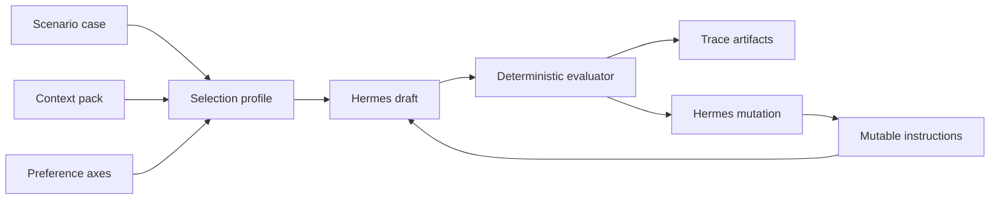

# Prompt Evolution System Overview

Prompt Evolution is the support-desk version of the self-improving loop. The
mutable artifact is not Python code. The mutable artifact is the instruction
prompt that tells Hermes how to answer a customer.

The example keeps the same bounded shape as CleanLoop:

| Role         | File                                  | Mutable |
| ------------ | ------------------------------------- | ------- |
| Referee      | `evaluator.py`                        | No      |
| Genome       | `README.md` mutable instruction block | Yes     |
| Orchestrator | `loop.py`                             | No      |

The loop starts with a context pack, a scenario, selected preferences, and one
customer problem. Hermes drafts a customer-ready reply. The deterministic
evaluator checks policy coverage, context grounding, forbidden promises, and
preference fit. If the reply misses the target, Hermes mutates the instruction
prompt for the next round.

## Boundaries

Hermes handles language generation and instruction mutation. The example code
owns the catalog, the scoring contract, output persistence, and trace files.
That keeps the model interaction real while keeping the lesson deterministic
enough to inspect.

The evaluator does not decide whether the answer is beautiful. It checks a
small set of observable behaviors. That is the point of the example. A
self-improving support agent needs a narrow scoreboard before it can improve.
