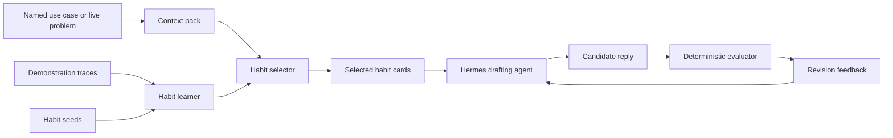

# Skill Mastery Studio

This example learns reusable support habits from successful traces, then
recombines those habits for a new issue. It is a lightweight adaptation of the
MaestroMotif idea: learn small skills, decide when they apply, and compose them
zero-shot for a fresh task.



## Scenario

Skill Mastery Studio models a shared service desk across several real-world
operations contexts. Instead of mutating one large instruction prompt, it learns
small reusable habits that appear again and again in strong responses.

The shipped use cases make the demo repeatable. Each use case names the context,
customer problem, expected habit cards, risk flags, and success criteria. You can
still pass a live `--context` and `--problem`, but `--usecase` gives the loop a
known service case that behaves like a small CleanLoop data arena.

## MaestroMotif Mapping

This example keeps the surface intentionally small, but it mirrors the four
phase logic from MaestroMotif:

1. Score evidence from prior traces.
2. Distill reusable habit cards.
3. Select the habits that fit the new problem.
4. Compose a reply with those habits zero-shot.

## Output Artifacts

The loop writes these files to `.output/`:

- `latest_session.json` — round history, scores, selected habits, and context
- `learned_habits.json` — the reusable habits promoted from the shipped traces
- `selected_habits.md` — the small habit set used for the current issue
- `best_response.md` — the highest-scoring customer reply
- `latest_mutation.diff` — unified diff showing how the reply artifact changed
- `traces/` — JSONL and OTEL-shaped run, habit, LLM, and evaluator events

If you keep iterating in the terminal review flow, later rounds also record the
exact `user_feedback` string that triggered the revision.

Each saved round now also records verbose `logs`, `llm` request metadata, and
the mutation diff for the changed reply artifact when a revision lands. Named
use case runs also store `usecase` and `trace` metadata in `latest_session.json`.

## Verbose Execution Trace

The CLI now prints a CleanLoop-style trace while the loop runs. You see:

- round start markers
- explicit LLM request lines for draft and revision calls
- per-round scores
- unified text diff output when the reply changes
- selected habit-card traces and deterministic evaluator events

That makes it obvious when the example is actually calling the LLM and how the
customer-facing reply changed after each revision.

Trace files are written to `.output/traces/`:

```text
skill_mastery/.output/traces/
  run_events.jsonl
  habit_events.jsonl
  llm_requests.jsonl
  evaluator_events.jsonl
  otel_spans.jsonl
  otel_events.jsonl
  otel_logs.jsonl
  runs/<run-instance>/
```

## Dashboard

Launch the dashboard with:

```bash
python util.py -e skill_mastery dashboard
```

The dashboard shows:

- per-round scores and user feedback
- named use case facts, risk flags, and expected habits
- learned and selected habit trace rows
- run and evaluator trace rows
- raw reply text for each round
- logged LLM request metadata
- the latest unified diff for the reply mutation

## Docs Map

- [System overview](docs/architecture/system-overview.md)
- [Use case catalog](docs/data/usecase-catalog.md)
- [Tracing guide](docs/operations/tracing.md)
- [Test map](docs/testing/test-map.md)
- [Code map](docs/reference/code-map.md)

## Interactive Review

In a normal terminal session, the loop now shows the current best reply first,
then asks for more feedback until you accept the result.

The CLI asks two follow-up questions after the intermediate output:

```text
Are you happy with this output? [Y/n]
What should change next?
```

Use the second prompt to steer the habit composition. Good feedback usually
targets one of these moves:

- Problem mirroring: lead with the customer issue faster
- Policy grounding: cite the rule earlier or more directly
- Checkpoint design: ask one clear question or name one next step
- Tone: more direct, more human, less formal, shorter

Examples:

- If you ask "lead with the missing booking," expect the mirror habit to appear earlier.
- If you ask "mention certification before the reassurance," expect the gate or policy to move higher in the reply.
- If you ask "end with one confirmation question," expect a sharper checkpoint.
- If you ask "sound more human but keep the policy," expect less formal phrasing without dropping the rule.

You can also provide feedback on this line: "Keep the same structure, but make the first sentence more direct and end by asking for the badge number."

## Command Flow

```bash
python util.py -e skill_mastery catalog
python util.py -e skill_mastery usecases
python util.py -e skill_mastery loop --usecase makerspace_access_checkpoint
python util.py -e skill_mastery loop --context makerspace_frontdesk \
  --problem "A member's laser cutter booking disappeared before open lab tonight."
python util.py -e skill_mastery dashboard
python util.py -e skill_mastery reset
```

### Advanced Commands (CleanLoop Parity)

These commands match the depth and shape of the CleanLoop sub-commands while
keeping Skill Mastery's habit composition semantics intact.

```bash
# Sandbox: run one habit-composition round in an isolated subprocess
# with a hard wall-clock cap and clamped Hermes iterations.
python util.py -e skill_mastery sandbox --usecase makerspace_access_checkpoint \
  --timeout 30

# Autonomy: simulate a graduated trust ladder across N sandbox rounds and
# decide SUPERVISED / HUMAN_GATED / AUTONOMOUS based on score and stability.
python util.py -e skill_mastery autonomy --usecase makerspace_access_checkpoint \
  --rounds 5 --timeout 30

# Challenge: generate adversarial use case variants in three escalation tiers
# (urgency, financial stakes, safety sensitive).
python util.py -e skill_mastery challenge --levels 1 2 3 \
  --usecase makerspace_access_checkpoint

# Evaluate: deterministic-score a candidate reply file against one use case
# and compare against the gold reference reply when available.
python util.py -e skill_mastery evaluate \
  --usecase makerspace_access_checkpoint \
  --candidate skill_mastery/.gold/makerspace_access_checkpoint.md

# Verify: pre-flight check (Python, packages, env, catalog).
python util.py -e skill_mastery verify

# Status: catalog, environment, output, and trace summary.
python util.py -e skill_mastery status

# Loop with reranker: draft N candidates and keep the best by deterministic
# score (tie-break favours the earliest candidate).
python util.py -e skill_mastery loop \
  --usecase makerspace_access_checkpoint \
  --rerank --candidates 3
```

### Gold Reference Replies

`skill_mastery/.gold/<usecase_slug>.md` stores reference replies that score
the maximum on the deterministic evaluator. Use `evaluate` to compare a
candidate against the gold reference. Reset preserves `.gold/` so you can
re-run trust experiments without losing the references.

### Mutation Playbook

When the loop revises a reply, `mutation_playbook` selects directives based on
the evaluator's issue phrases ("Missing policy coverage:", "Missing habit
signal:", "Forbidden promise detected:", "Missing grounding from the selected
service context.") and emits a numbered brief. The brief drives the
`user_feedback` of the revision call so revisions stay grounded in evaluator
findings rather than ad-hoc retries.

### Durable Round History

Pass `history_store` (or rely on the auto-attached store inside the loop) to
append every round to `round_history.jsonl` keyed by `session_id` and
`usecase_slug`. Use `select_best` and `filter_by_session` from
`skill_mastery.history_store` to query across sessions.

Suggested demo path:

1. Let the first reply show which habits were selected for the baseline issue.
2. Ask for one concrete revision in the review prompt.
3. Show how the next reply changes while the learned habit set stays stable.
4. Stop when the user-facing draft demonstrates the adaptation you want.
