# Skill Mastery System Overview

Skill Mastery turns prior support traces into reusable habits. The loop does not
rewrite a global prompt. It learns compact habit cards, selects the cards that
fit the current service case, and asks Hermes to compose a customer-ready reply.

```mermaid
flowchart TD
    Usecase[Named use case] --> Profile[SkillMasteryProfile]
    Context[Context pack] --> Profile
    Demonstrations[Demonstration traces] --> Learner[Habit learner]
    Seeds[Habit seeds] --> Learner
    Learner --> Habits[Promoted habits]
    Profile --> Selector[Habit selector]
    Habits --> Selector
    Selector --> Selected[Selected habit cards]
    Selected --> Hermes[Hermes drafting agent]
    Profile --> Hermes
    Hermes --> Reply[Candidate reply]
    Reply --> Evaluator[Deterministic evaluator]
    Evaluator --> Revision[Revision prompt]
    Revision --> Hermes
    Evaluator --> Trace[Trace files]
    Selector --> Trace
```

## Runtime Path

1. `config.py` loads context packs, habit seeds, demonstrations, and use cases.
2. `learner.py` promotes habits that show up in successful traces across more
   than one context.
3. `selector.py` chooses a small habit set for the active use case or live
   problem.
4. `loop.py` sends the selected habits and context to Hermes.
5. `evaluator.py` scores policy grounding, habit signals, and forbidden claims.
6. `tracing.py` writes run, habit, LLM, evaluator, and OTEL-shaped records.
7. `dashboard.py` reads the saved session and trace files for review.

## Design Boundary

This example stays true to Skill Mastery. Use cases provide repeatable inputs,
but they do not replace the learning flow. The core behavior remains habit
promotion, habit selection, composition, and revision.
